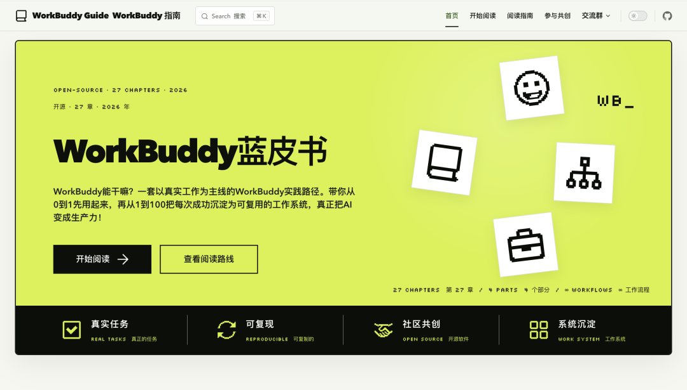
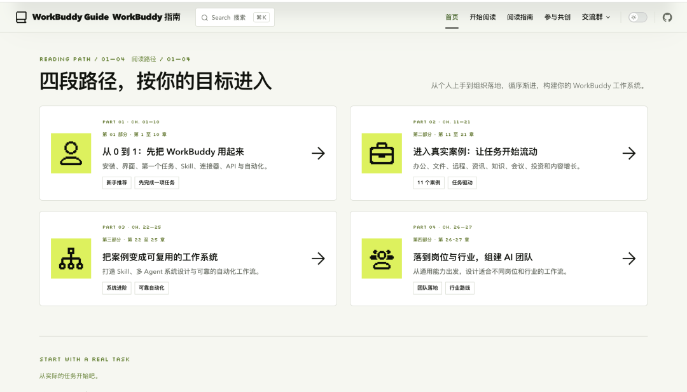
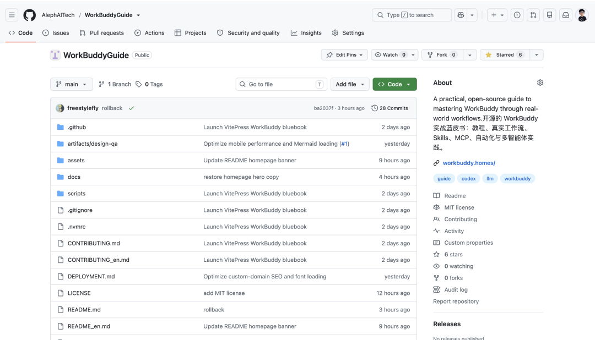
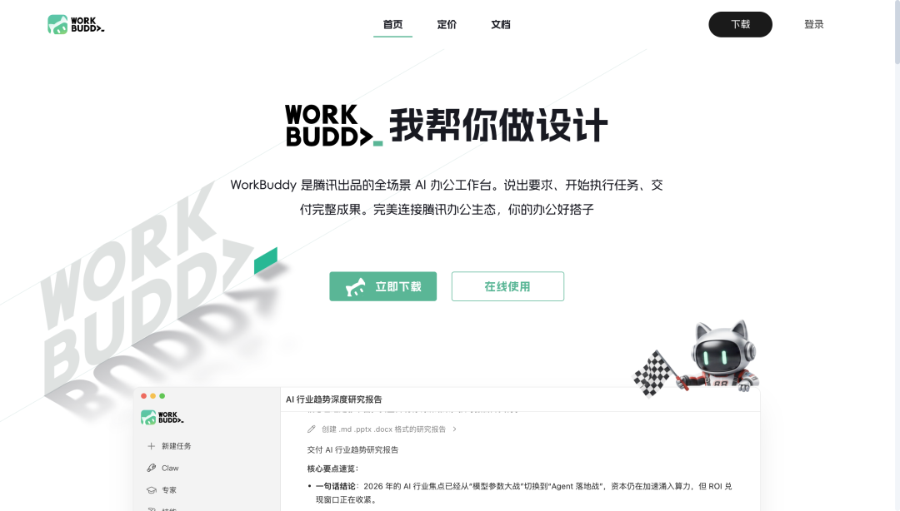
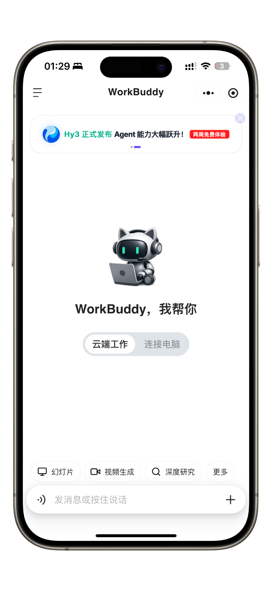
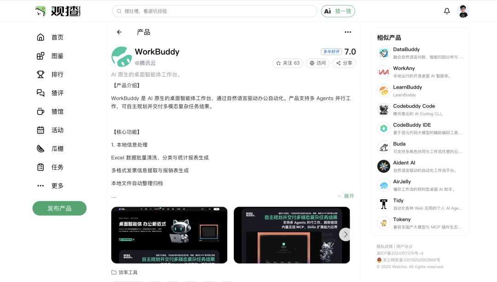
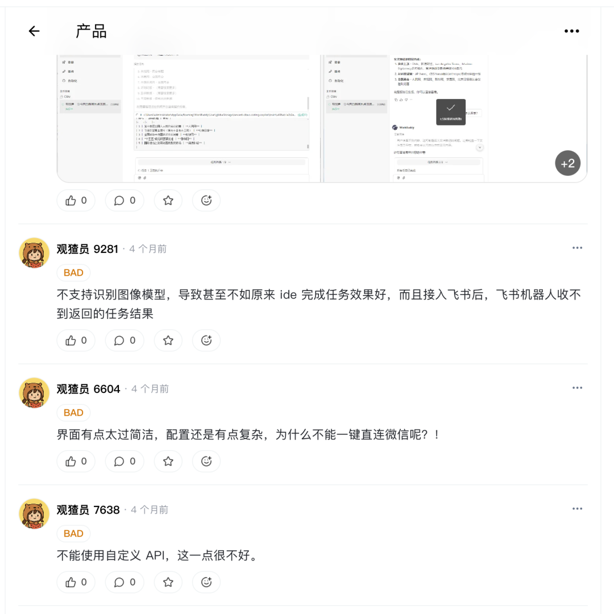
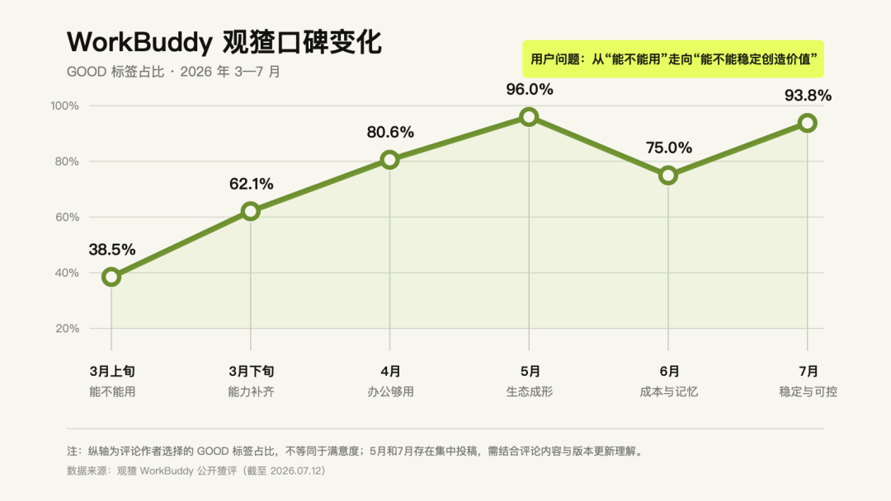
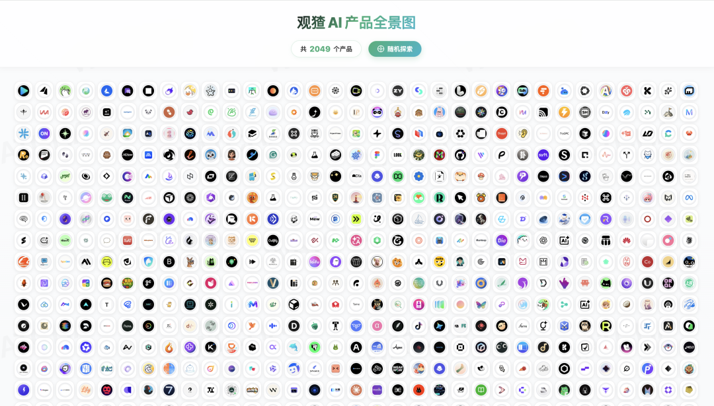

# 我们给腾讯“新太子”WorkBuddy，写了本27章实战蓝皮书｜已开源
> 公众号: 摸鱼小李
> 发布时间: 2026年7月13日 08:27
> 原文链接: https://mp.weixin.qq.com/s/LZ9MlY0wwsEPRf3lNpRcjQ

---

01开源个蓝皮书

几天前，我开源了一款[公众号排版Skill](https://mp.weixin.qq.com/s?__biz=MzA5OTIzMTE1OA==&mid=2247487848&idx=1&sn=c907d91c47f63f75c2c0f8be2357e593&scene=21#wechat_redirect)，看到大家都去实践起来了，都在转发分享，感谢大家，等我再做几个主题传上去。

在那篇文章里，我顺便推荐大家使用**WorkBuddy**来安装和运行这款Skill

但后来，我认真翻了翻评论区的几百条留言，发现仍然有一部分朋友不知道应该怎么开始。怎么安装，怎么在这个原有的基础上进行调试...

所以今天，我们决定再公开一件东西

内容

《WorkBuddy蓝皮书》

规模

总共27章节

作者

袋鼠帝/甲木/苍何/刘聪/摸鱼小李

阅读地址

workbuddy.homes

我们几个这几天晚上天天连线优化，跑case，求求大家给我们点个star

目前还是1.0版本，Agent变化得太快了，我们也会持续更新，欢迎大家一起共建

02这份蓝皮书是怎么来的？

前阵子，我和几位好朋友——袋鼠帝、甲木、刘聪、苍何——吃饭时聊到了国内外Agent产品。除了Codex/Claude...大家都不约而同地提到了**WorkBuddy**

身边人在日常工作中使用还是挺多的，我觉得有个很重要的原因，就是足够的低门槛，不需要复杂的网络、账号和支付条件，也不要求用户在十几款Agent之间反复比较，打开电脑或者小程序，就能帮我们完成一个工作任务

饭桌上，我们没有继续争论“到底哪个Agent产品最强”，我们开始讨论另一个想法：

有没有可能整理一套真正面向国内普通用户的方法，让一个从来没有接触过Agent的人，也可以从第一个任务开始，逐步建立自己的工作流？

只要第一次实践能够顺利完成，只要不断获得“我可以用它创造东西”的正反馈，他就有可能从一个偶尔尝鲜的普通用户，逐渐成长为未来真正懂得驾驭AI的人

“

蓝皮书的想法，就是从这里开始的

03在观猹上观察产品

写这篇文章时，我顺手去翻了翻**观猹**上workbuddy的评价

评价的变化其实挺有意思，早期的BAD挺多。

3月

刚上线时，用户讨论的还是登录失败、微信连不上、任务跑不完

4月

到了4月，大家开始用它整理文件、清洗表格、生成报告

5月+

5月以后，讨论又进一步转向Skill、专家、MCP、连接器和自动化

评价并不是一路上升。6月，当越来越多人把**WorkBuddy**放进真实工作，用户开始追问更深的问题：积分消耗是否透明、长任务是否稳定、记忆会不会丢失、最终结果是否准确

但这恰恰说明，它已经从一个被围观的新玩意儿，走进了真实的工作场景

所以我觉得，我们需要给国产模型和产品一些时间

给时间不是降低标准，更不是因为贴着"国产"就不许批评。真正有用的支持是：认真用，真实反馈，然后继续看——用户提的问题有没有被看见，批评有没有进到下一次更新里，产品有没有在真实需求里变得更好

这也是我想顺带推荐一下观猹的原因

“

官网告诉你产品想成为什么，评论区告诉你产品实际是什么

观猹被称为“AI产品的大众点评”，但我觉得它更有意思的地方在于，它把不同时间段的用户评价都留了下来，你能看到一款产品是怎么被用的、怎么被骂的、又怎么在骂声里一版一版改过来的。对于迭代速度很快的国产AI产品来说，有人持续记录这个过程，本身就挺有价值

04用什么工具

昨晚上我们打电话时，说明天这个workbuddy蓝皮书啥时候发时，伙伴提到到发这个会不会有人喷，这个担心并不是没有道理，国外Agent当然很强。

如果你能够稳定使用，而且它确实适合自己的工作，那就继续使用

但我们似乎太容易把“使用了什么工具”，当成了一个人能力的证明

工具本身并不能给你带来优越感，如果你追求最时髦的工具只是为了让别人高看你一眼，那么人家高看的是工具本身，而不是用工具的这个人——何况，这种心态是玩具，就像小孩子向同学炫耀的那种——

“

而用最大众化的、最朴实的工具真正创造出价值，才是在人这个意义上令人侧目的

再次欢迎大家阅读、实践、纠错，也欢迎一起参与共建

一起共建蓝皮书的好朋友们

袋鼠帝、刘聪、甲木、苍何 也都是超级优质的AI博主，推荐给大家，后期我们会一起整更多活：

真正有价值的支持，是认真使用、真实反馈，然后继续观察。