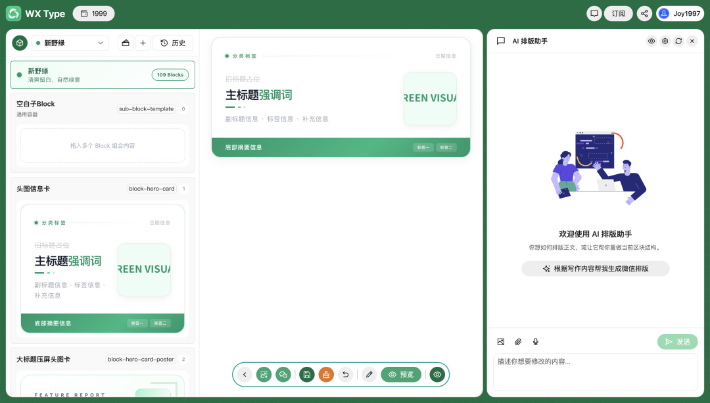
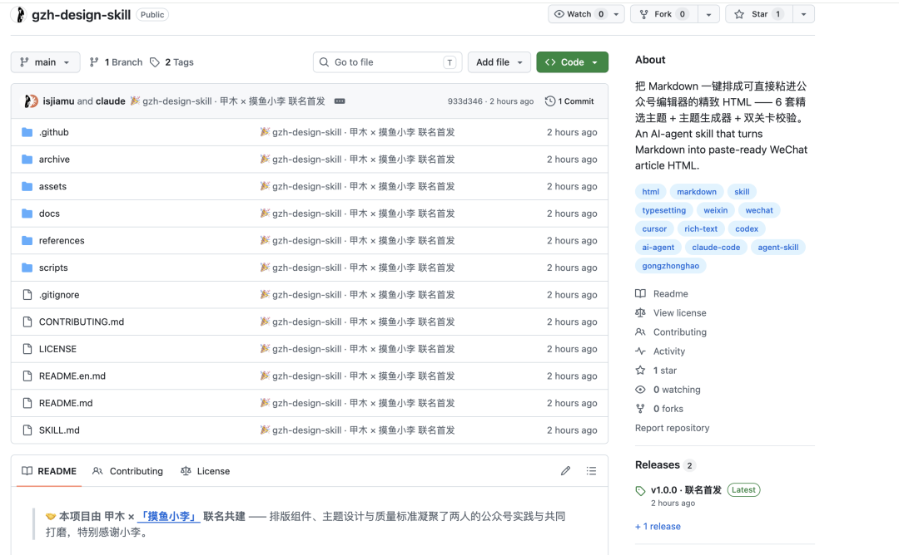
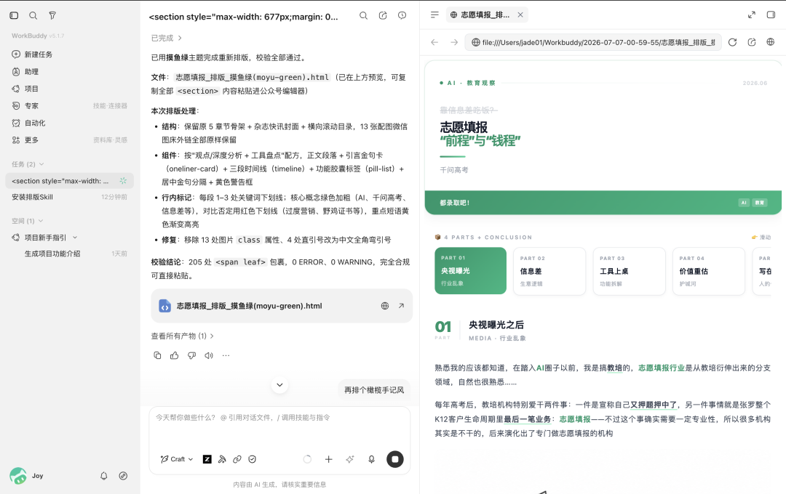
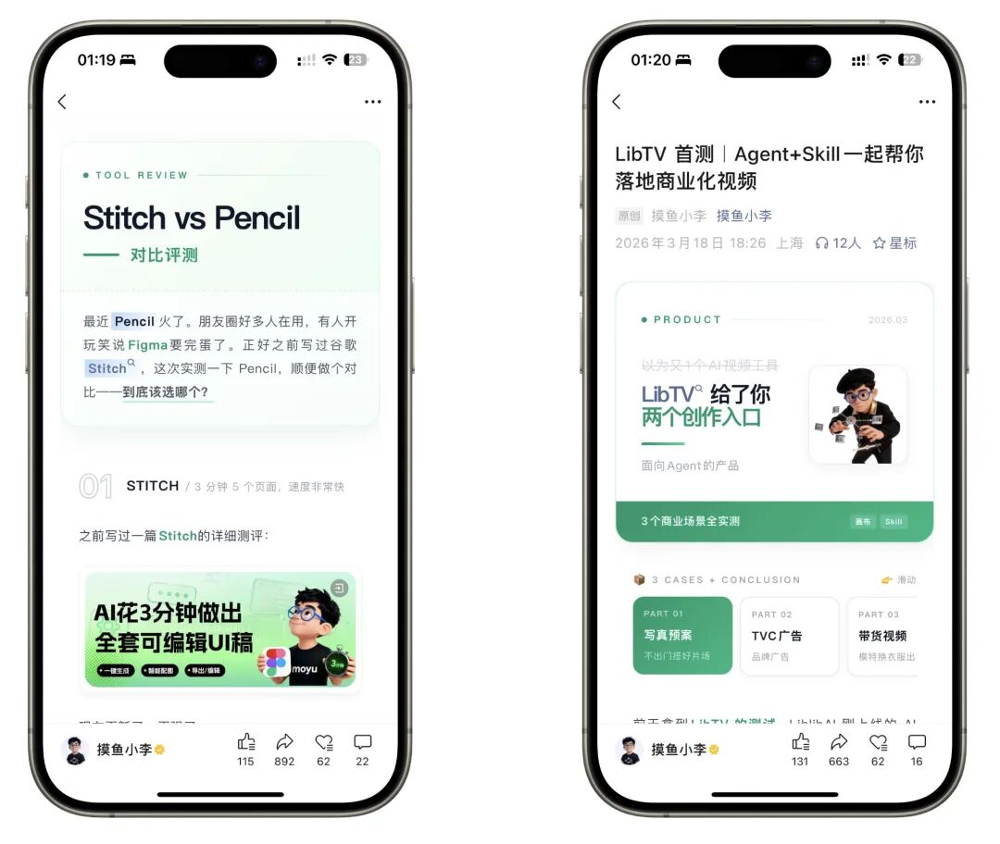
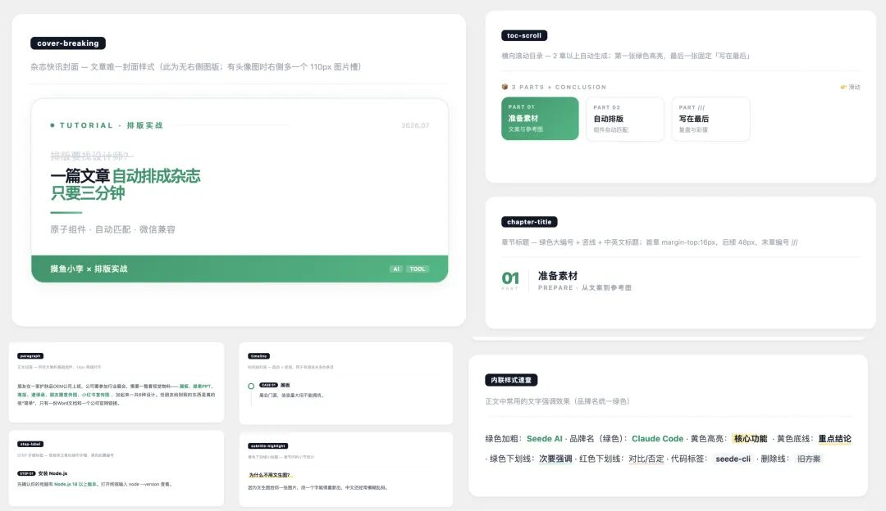
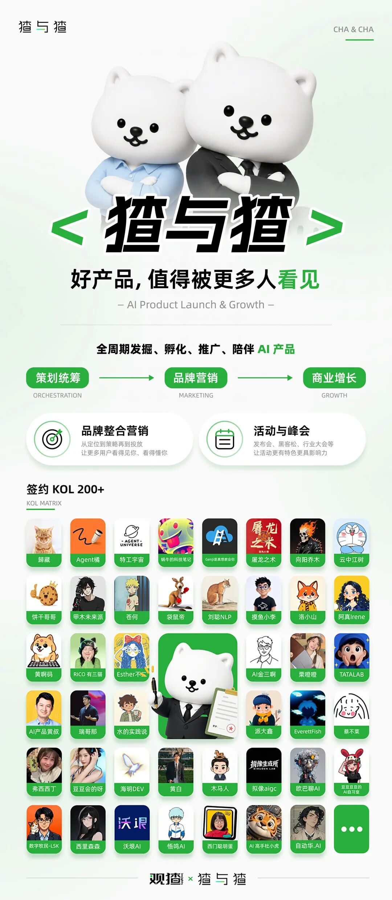

# 几千人催我做的公众号排版 Skill，开源了!
> 公众号: 摸鱼小李
> 发布时间: 2026年7月7日 08:19
> 原文链接: https://mp.weixin.qq.com/s/n1O6Td-9veeOYWS3R0tdFA

---

01不能再拖延了

大家好，我是**摸鱼小李**，每次发文章，都有读者问我这个公众号排版怎么做的，一直承诺给大家做一个公众号排版工具出来（其实真的做了）也能用，但是我自己不是很满意，最近几个月一直在忙**猹与猹**的事，也没时间重构....

不能再拖延了，刚好前天晚上和好朋友**甲木（甲木未来派）**聊天，聊到这个话题，想着要不做成skill吧，开源出来，大家可以自己根据已有的模版去泛化，这样更有趣好玩，于是我们一拍即合，做个公众号排版gzh-designskill。

该 skill 目前内置了 6 套主题模版（后续会持续更新），也可以自己设计主题模版。

这个skill，适配**WorkBuddy**/**Codex**/**Claude Code**等 Agent 工具，以下就是 WorkBuddy 安装gzh-designskill 排版出的效果。

02直接让 Agent 安装

1

使用最简单的方式

直接让你的**Agent**安装。

2

复制 README 里的安装 prompt

仓库 README 里有一段“给 AI 的安装prompt”，复制粘贴给你的**Claude Code**、**WorkBuddy**或其他 AI Agent，它会自动完成安装配置，使用引导直接问它即可。

具体的Skill设计大家可以看甲木的文章，或者让**Agent**去读仓库都行。跟大家简单聊聊另一件事——如何根据现有排版，设计自己独特的版式风格。

03排版也是一种产品设计

去年 9 月开始写公众号时，我就在思考一个问题：如何更省力、更好看地让 AI 帮我排版？

中间也迭代了一些版本，旧版本一路被淘汰，最后稳定用的就是**摸鱼绿**（也内置在 skill 主题中了）。

其实这套设计的思路很简单——组件库思维。正如我开头所说，公众号推文也应该有 UI 设计。「**摸鱼绿**」这套主题设计了26 个对应的组件，Agent 会根据不同文章类型去组合不同组件，并在现有组件基础上进行泛化，最终排版成一篇完整的文章。还有个好处是随时可以更新维护，想加新组件直接加，想优化某个组件单独改。

04欢迎来魔改

大家也可以尝试结合自己的特色 / IP去在这套组件主题上泛化，设计自己的排版组件库，形成自己的特色排版，欢迎大家来魔改gzh-designskill，沟通交流。

另外欢迎大家加入**猹与猹**一起来玩，一起交流创作经验。

