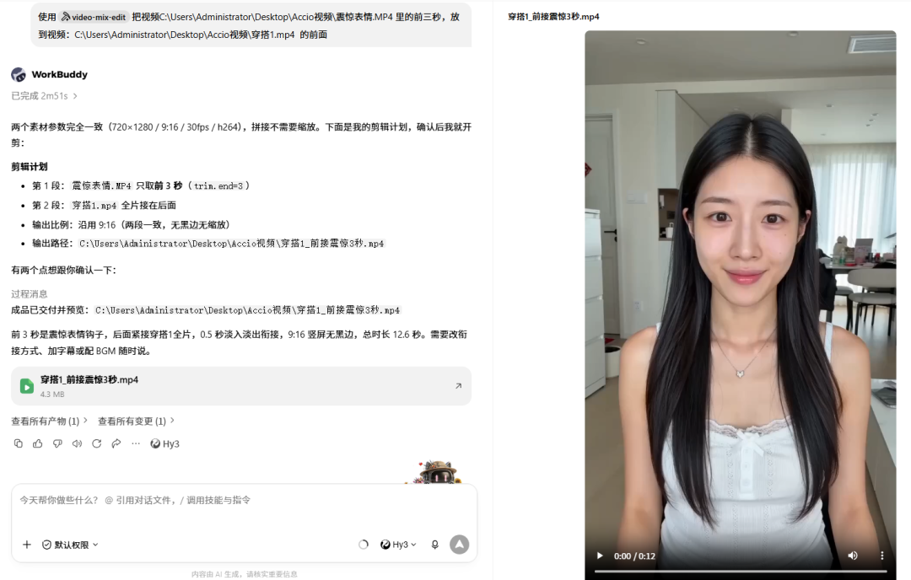
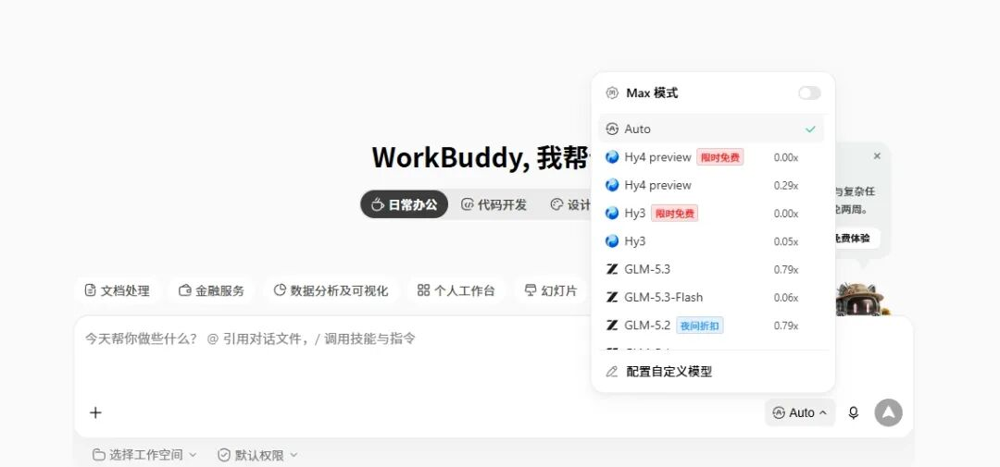
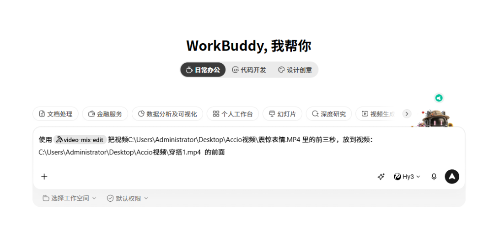

# 我用workbuddy做了一个自动混剪 skill，连剪映都不用开

> 公众号: 老艺搞AI
> 发布时间: 2026年8月29日 20:03
> 原文链接: https://mp.weixin.qq.com/s/HesWhEkHo8TmceK2o5rncw

---

大家好，我是老艺，AIP超级个体，专注AI创作实操分享。

前段时间我用 WorkBuddy 搓了一个自动混剪的 skill，跟之前分享的自动剪口播视频差不多同期完工的。

这玩意儿我觉得大多数行业都能用上。今天摊开来给你们看看，主打一个，**你做你也可以干出来**。



## 怎么剪的

流程简单到离谱。

你把自己的**原视频素材**丢进去，然后用**自然语言**告诉它怎么剪。哪段保留，哪段掐掉，从第几秒切到第几秒，加不加转场，配不配 BGM，全用说话解决。

它听完就自动执行。剪完直接出成片，**剪映都不用打开**。

上面这条视频，就是我之前用豆包生成的两条素材，丢给它混剪完成的。效果你们自己看。

## 零算力，干就完了

刚好这段时间，**WorkBuddy 的混元三模型免费使用时间又延长了**。也就是说，你每天剪多少条，都是**不消耗算力**的。



这个账很好算。以前剪一条混剪，找素材、对时间轴、加转场、调音频，少说半小时。现在丢素材、说句话、等它跑完，几分钟出片。省下来的时间，够你再产三条内容。

干就完了，真没什么门槛。

## 怎么搓一个同款

这个 skill 本身并不复杂，核心就是**基础混剪功能**。想要创建同款，把我下面这段内容发给 WorkBuddy，它就能帮你搭一个出来。

```yaml
---
name: video-mix-edit
agent_created: true
description: "通用视频混剪 skill。用户给 2 条及以上视频素材 + 用大白话说要求（顺序、每段保留前 N 秒 / 掐头去尾、转场特效、去气口、字幕、BGM、结尾 CTA），把它剪成一条视频。支持横竖混比例自动统一、xfade 转场、Whisper 自动字幕、可选 BGM。不含促销花字。全程本地 ffmpeg + Whisper，无需外部服务。触发词：把这几段拼成一条 / 合并这几段 / 按我的要求剪这几段 / 混剪。"
---
# video-mix-edit — 通用视频混剪
把 2 条及以上视频素材，按用户的自然语言要求，混剪成一条视频。
## 工作流（Agent 必须遵循）
用户给素材 + 要求后，**不要直接跑**，按下面四步走：
1. **解析需求** —— 从用户的话里拆出：
   - `segments`：每条素材的文件路径、拼接顺序
   - 每条是否需要 `trim`（保留前 N 秒 → `{"end": N}`；掐头 → `{"start": N}`；取区间 → `{"start": a, "end": b}`）
   - 转场：`transition`（xfade 类型）+ 是否每段不同
   - `resolution`：竖屏 9:16 / 横屏 16:9 / 不指定就用 `auto`（沿用首段）
   - 去气口：`strip_silence` 是否开（默认关）
   - 字幕：默认开；用户说"不要字幕"才 `enabled: false`
   - BGM：用户给了音频文件才加，否则不加
   - CTA：用户要结尾购买引导才加
2. **写 plan.json** —— 按下方字段契约，把需求翻译成结构化计划。
3. **先确认再跑** —— 视频重编码成本高，把"剪辑计划"用简洁列表列给用户确认（特别确认比例、转场、trim 区间、输出路径）。用户说"直接剪"或确认后才执行。
4. **执行并交付** —— 运行 build.py，交付成品路径，并提醒：Whisper 字幕需逐句人工修正繁体/错字。
## 调用方式
```bash
python "C:/Users/Administrator/.workbuddy/skills/video-mix-edit/scripts/build.py" --plan plan.json
```
`plan.json` 与素材放同一目录即可（相对路径基于 plan.json 所在目录解析）。输出路径 `output` 可写绝对路径。
## plan.json 字段契约
```jsonc
{
  "segments": [                 // 必填，≥2 条素材，按数组顺序拼接
    { "file": "clip1.mp4",
      "trim": { "end": 3 },     // 可选：保留前 3 秒（掐头去尾用 start+end）
      "strip_silence": false,   // 该段是否去静音气口（默认跟随全局）
      "transition": "slideup",  // 该段与前一段的转场类型
      "transition_duration": 0.5 // 转场时长（秒）；beat 模式忽略此值用 0.2
    },
    { "file": "clip2.mp4" }
  ],
  "resolution": "auto",         // auto 沿用首段；支持 9:16 / 16:9 / 1:1 / 4:3
  "crop_mode": "cover",         // cover=填满裁切不留黑边(默认)；letterbox=黑边补齐
  "strip_silence": false,       // 全局默认去气口（默认关，节奏紧可开）
  "silence_noise_db": -35,      // 静音判定阈值
  "silence_min_dur": 0.3,       // 静音最短时长（秒）
  "transition": "fade",         // 全局默认转场（段级可覆盖）
  "subtitle": {                 // 口播字幕；默认开
    "enabled": true,
    "language": "zh",
    "model": "base"
  },
  "cta": {                      // 可选：结尾引导文案（ASS 叠加，不含促销花字）
    "text": "点击下方小黄车 立即抢购",
    "duration": 3.0, "color": "red", "size": 72
  },
  "bgm": { "file": "bgm.mp3", "volume": 0.5 },  // 可选：提供了才加
  "output": "final.mp4"
}
```
## 转场类型（transition）
xfade 支持：`fade`(淡入淡出) / `beat`(卡点=短 fade 0.2s) / `slideleft` `slideright`
`slideup` `slidedown`(滑动) / `fadeblack` `fadewhite`(闪黑/闪白) / `circlecrop`
`rectcrop` `smoothleft` `smoothright` `wipeleft` `wiperight` 等。
## 每段精确裁剪（trim）
- `{"end": 3}` —— 只保留前 3 秒（最常见：开篇钩子）
- `{"start": 2}` —— 掐掉前 2 秒
- `{"start": 1, "end": 8}` —— 只取第 1~8 秒
- 不写 `trim` 则整段使用
## 结尾 CTA（cta，可选）
- 视频末尾居中红字，出现于最后 `duration` 秒
- 默认文案"点击下方小黄车 立即抢购"，可改
- 注意：本 skill **不含促销花字叠加**（不做"限时特惠 ¥99"那类飘字）
## 重要提醒
⚠️ Whisper base 中文转录**必有繁体 + 错字**，口播字幕交付前必须逐句人工修正。
脚本只负责生成与烧录，不修正语义错误。详见 `references/subtitle_style.md`。
```

你可以在这个基础上加自己的特定剪辑要求。比如你的行业需要固定片头片尾，或者某种特定的转场节奏，或者 BGM 必须从第几秒切入。这些全用**自然语言对话**就能调。

调完之后，提交你自己的原视频素材，看看剪出来的效果。不满意就再改，多调试几次，直到成品符合你的标准。然后把它**装进 skill**，以后只需要提供原视频，它就能按你最终定好的要求，自动完成混剪。

## 感兴趣的朋友都可以试试

先把自己的混剪视频需求，用 WorkBuddy 实现自动剪辑。跑通了之后，你会发现很多重复劳动根本没必要手动做。



我这次用的就是 **video-mix-edit** 这个 skill 当底座。它的能力就是，你把多条素材和剪辑意图丢给它，它自动拼接、转场、混音，出成片。你在这个基础上套自己的规则，就能变成专属于你的自动混剪流水线。

我是老艺，12年互联网运营人，正在用AI智能体做自媒体一人公司，实现产品打造、引流获客到销售转化全流程自动化。

如果你读到这里觉得有用，点个赞，分享给朋友，顺便关注老艺搞 AI，设个星标。新文章第一时间推给你。我们明天见~
