# 第一波闯进戛纳的AI动画电影，已经让评委审视电影标准了​
> 公众号: wuhu动画人空间
> 发布时间: 2026年7月23日 22:48
> 原文链接: https://mp.weixin.qq.com/s/YWkSW2pFmduAgvSfyrqSIw

---

**wuh****u专题**

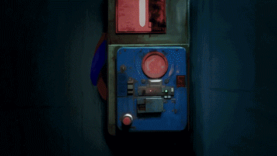

文 | 敏 糸

还记得那部用**15人、14天、不到50万美元就砸出来的95分钟AI长片《Hell Grind》**吗？

它在戛纳电影节点燃过全场争议，也让**Variety**等外媒不得不正视一个事实：**AI电影，已经不是“能不能拍”的问题，而是“能拍得多疯”的问题。**

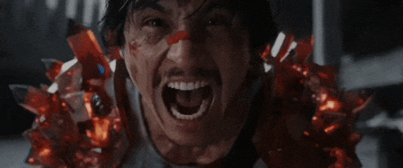

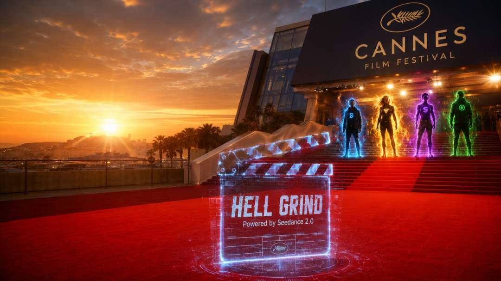

[要花5000万美元的好莱坞大片，被他们用14天50万美元做出95分钟干进了戛纳！](https://mp.weixin.qq.com/s?__biz=MzAwNjAyMzczNQ==&mid=2651417030&idx=1&sn=d6cdf197c63c2dea8f785583f1bdb952&scene=21#wechat_redirect)

在这之前，还是同一家公司**——Higgsfield**，曾用Seedance 2.0搞出了更炸场的**《Zephyr》**：**K-pop女团机甲打怪兽**，全套视觉奇观混搭在一起，火到让网友忍不住为真人演员“流汗”——“演员怪不得要开面馆了。”

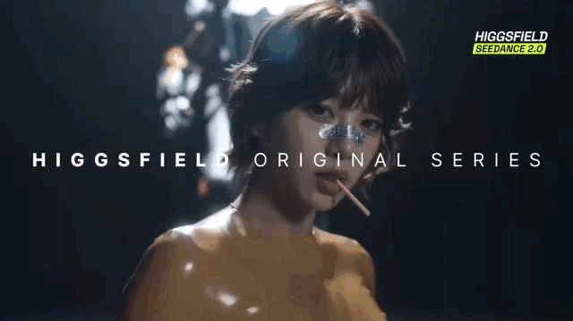

[你是说，一家在美国的哈萨克斯坦公司用中国AI做了个韩国虚拟女团打怪兽？](https://mp.weixin.qq.com/s?__biz=MzAwNjAyMzczNQ==&mid=2651414970&idx=1&sn=0385f70d892d33b7449cd064f9bce61d&scene=21#wechat_redirect)

连续两部作品，一部比一部炫技，一部比一部烧眼球。

所有人都笃定，Higgsfield的下一个脍炙人口的项目，一定是更大规模的CG特效轰炸，更逼真的AI摄影，更疯狂的视觉盛宴。

**他们偏不。**

这次，他们突然往回退了一步，不再让AI（Seedance 2.0）去复刻摄影机、真人演员和大特效场面，最后的最后，还是把镜头交还给画布。

于是有了这部最新的**二维动画预告****《Kok Boru》（中译：库克博鲁）。**

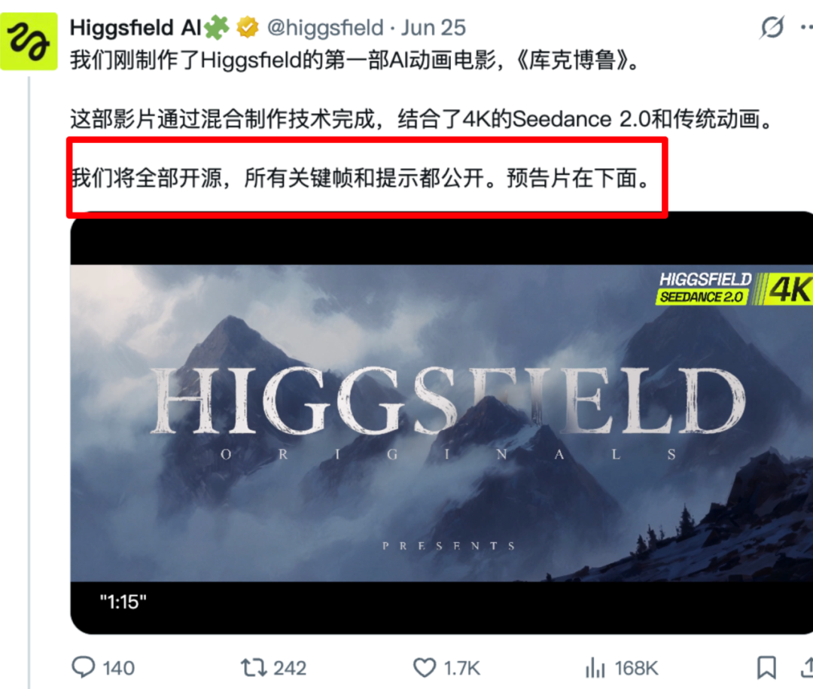

这是Higgsfield**第一部二维动画题材的作品****，****也是第一次手绘与AI深度结合的尝试，并且所有关键帧和提示词全部开源！**

一向口味挑剔的AI圈大佬**PJ Ace**，都罕见为它按下一键三连，在社交平台上留下少见的赞赏。

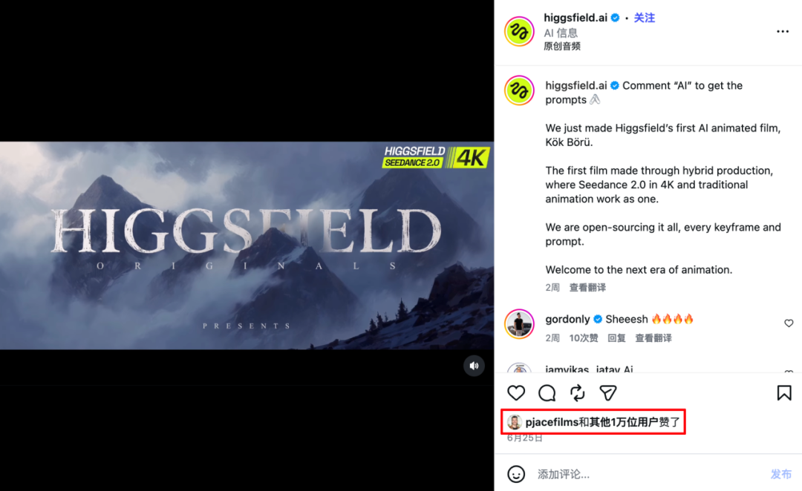

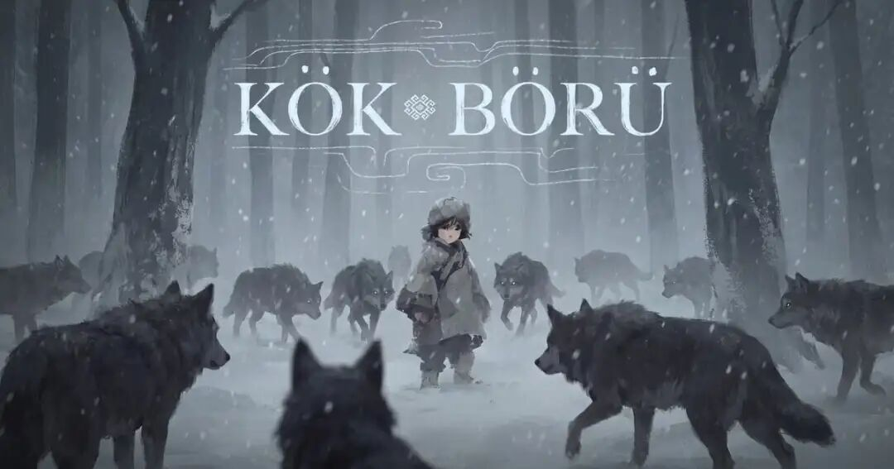

里面没有霓虹闪烁的赛博城市，没有机甲女团，没有狂飙的打斗。

你所看到的，是一片被风雪覆盖的**哈萨克草原**，一个被狼群带走的孩子，一位多年后仍无法放下女儿的母亲，还有全片像古典油画般厚重又苍凉的视觉质感。

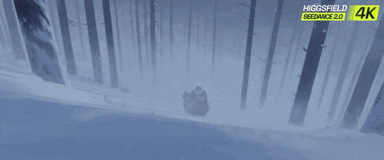

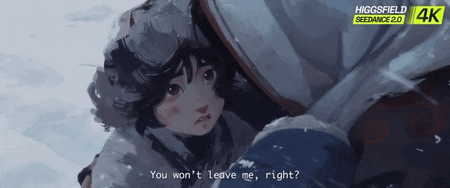

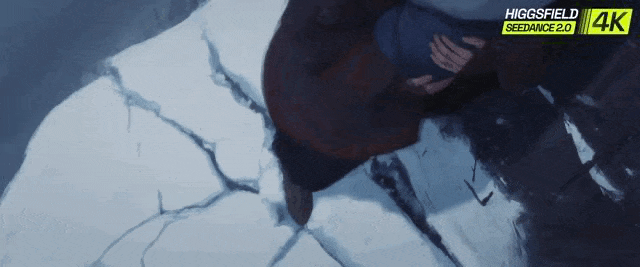

故事讲述了一位年轻的游牧母亲因暴风雪被迫只能从狼群中救出两个孩子中的一个，结果导致她的小女儿被“草原吞噬”——多年后，当她的村庄骑马出去屠杀一个与狼群一起奔跑的“恶魔”孩子时，她必须找到她失去的野性女儿，并决定是收养她还是放她自由。

这样一部题材安静到似乎“反流量”的短片，上线不久却悄悄击穿了圈层。

数十万网友沉入那片风雪与狼啸交织的草原，在女孩与母亲的遥远凝望中，思考人与自然之间那条被现代文明剪断、暗自生长的脐带。

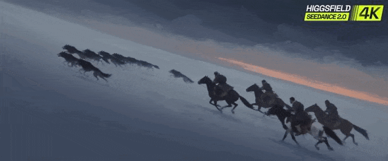

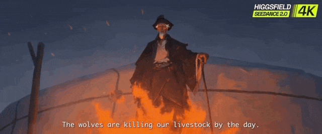

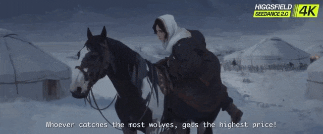

 预告欣赏

有中亚网友高呼：“代表全世界的土耳其人民，致敬 Seedance 2.0”（哈萨克斯坦与土耳其同属突厥文化区）**“作为一部手绘和AI结合的影片，这是一个慷慨的先例”。**

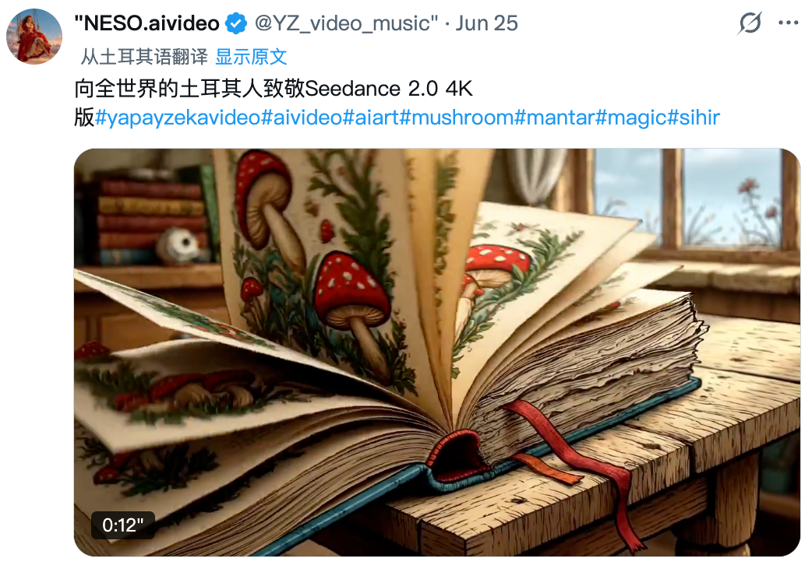

这部作品凭什么，让见惯了AI奇观的观众和挑剔的业内大咖同时沉默又动容？

也许背后，有一个更深的追问：当下，大多AI团队都在拼“更像真人”的时候，另一层问题**——****技术能不能不只生成画面，而是服务一种具体的、有棱有角的“个性”？**

他们把创作的视野挪回了故乡的褶皱里，哈萨克草原的夏季，草浪翻涌如金色兽脊，冬季的雪原，把天地压成一张灰白的羊皮纸，以这片旷野为摇篮，孵化出一个被狼群养大的女孩。

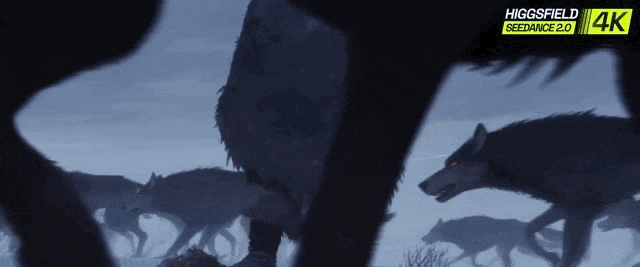

此时，AI褪去华丽的伪装，回归到一支画笔、一片草原、一个女孩与狼的故事时——它还能打动你吗？

答案，就在接下来的画面里。

（附有详细提示词，大家记得收藏+观看）

**01**

**狼、草原与哈萨克游牧记忆**

为什么是**“Kok Boru”**？

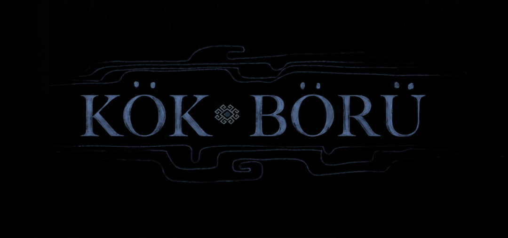

**“Kok Boru”或写作“Kök Börü”。**这个词，在中亚和泛突厥文化的语境里，往往与“苍狼”或“蓝狼”发生关联，也常常指向草原上古老的骑马竞技传统。

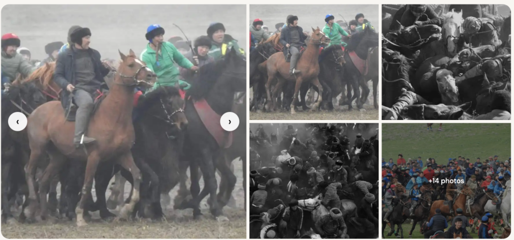

狼在这里不是危险的食肉动物，它更是草原的化身。野性、自由、残酷，带着某种祖灵般的神秘力量。

影片没有把狼简单处理成反派，也没把草原当作一个异域的风景底片。**它想呈现的，是两个母亲之间无声的对峙。**

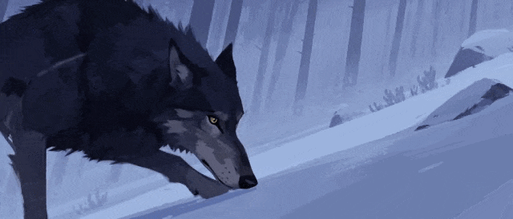

一位是失去女儿的人类母亲，多年后仍游走在风雪中寻找，一位，是收养了女孩的母狼，用乳汁和荒野的法则把她养大。

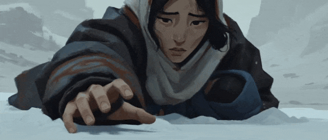

两位母亲之间没有刀剑相向，甚至连眼神都没有交汇，但整部片的张力就悬在这条看不见的线上。

这个孩子，属于谁？是生下她的人类母亲，还是养大她的荒野？她应该回到村庄、火炉和人类的秩序里，还是继续奔跑在狼群、风雪和草原的自由中？

就像作家**姜戎**在**《狼图腾》**里借毕利格老人之口所说的：**“狼是腾格里（天神）派下来保护草原的，狼没了，草原也保不住了；狼没了，蒙古人的灵魂也就上不了天了。”**

《Kok Boru》里的那匹母狼，正是这样的存在。她养大了一个人类女孩，对女孩来说，狼群是家庭，草原是塑造她本能与身份的世界。

▲ 哈萨克斯坦导演Aitore Zholdaskali

Higgsfield选择这样一个题材，这样看来也十分贴合。

他们以前做过K-pop机甲女团，做过在戛纳放映的AI长片，做过全球化类型片。但《Kok Boru》把镜头拉回哈萨克草原，拉回狼、马、风雪、迁徙和萨满精神世界。**对一家由哈萨克斯坦团队创办的AI影视公司来说，这更像一次文化回流。**

在AI工具已经能帮他们低成本搭建赛博城市和奇幻大片的情况下，他们终于拿它讲了一个更接近自身文化记忆的故事。

接下来，我们就看看这部作品是如何在画布上创作出来的。

**02**

**画布上的资产准备**

在正式进入生成之前，团队先搭建了一个按镜头组织的项目结构。

每个镜头都有独立文件夹，里面存放这个镜头探索过的多个版本。

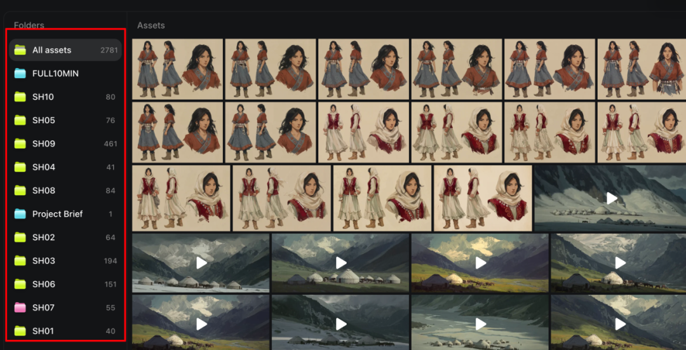

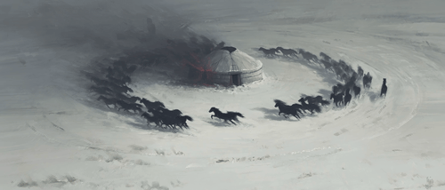

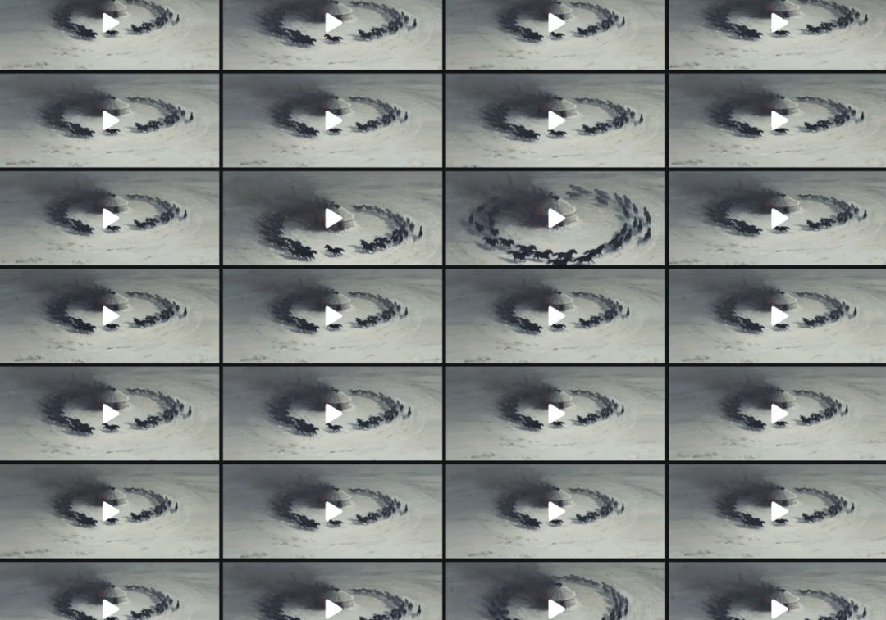

一方面这能保持项目条理清晰，另一方面又不会过早限制创作空间。

对AI资产来说，**“版本管理”比传统动画来的更重要。**因为AI的每一次生成都可能带来意外结果，只有把这些尝试系统性保存下来，团队才能从随机性中筛出真正可控的风格。

在官方透露中，还有一个值得关注的点，**项目中有一个专门存放早期测试的文件夹。**里面有最初看起来可能不成熟的实验片段，保留下来以便启发后续创作。

做好这些准备后，团队**制作了一张贯穿全片的风格基调图**，大家看到的油画笔触感，基本都是参考这张图中的表现细节而生成的。

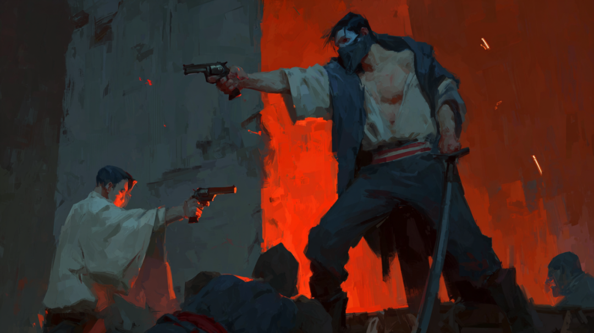

▲ 风格基调图

基于这张图，艺术家制作了一批可以在全片中反复使用的基础素材，包括角色设定图、母亲不同年龄阶段的造型、孩子的状态变化、母狼与狼群轮廓、马匹、服饰、道具、帐篷等等，以及关键情绪镜头的环境气氛图。

对二维动画来说，笔触也是表演的一部分。

一个母亲在雪地里回头的镜头，线条太过利落的话，情绪就会被摊薄，一群狼从暴风雪里冲出来，如果毛发和阴影被AI磨得太平滑，威压也会消失。

《Kok Boru》用AI还原手绘的纹理，刻意用画面的“不完美”，让每一幕都能有“情绪”。（以下内容为电影幕后技术资料，涉及激烈的戏剧冲突画面，旨在探讨AI动画的表现力边界，可能包含艺术化的暴力元素，请根据个人接受能力选择性阅读。）”

▲ “母亲”人物原图

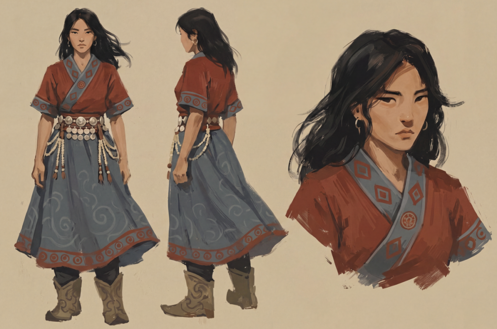

▲ Prompt：编辑图1中的角色设计稿。务必保持原图的完整性——同样的哈萨克族年轻女性的脸庞、同样的齐肩黑发、同样的身材比例、同样的三种姿势（全身正面、全身四分之三侧面和特写肖像）、同样的羊皮纸背景，最重要的是，要完全还原图1的原始绘画风格：流畅的油画和水粉笔触、厚重的笔触、同样的笔触质感、边缘处理、柔和的色彩渲染和光线。切勿进行平滑、锐化、降噪、重绘或添加任何照片细节——务必与图1的手绘概念图风格和分辨率完全一致。

只需将她的衣物换成图2所示的哈萨克族传统暖季服饰：一件锈红色短袖裹身长袍（kamzol），V领交叉于胸前，领口和袖口饰以石板灰色装饰带，上面点缀着赤陶色菱形和圆形图案；一条银色腰带，垂坠着米色珠串流苏，腰间系着深色皮革；一条飘逸的石板蓝灰色长裙，饰有淡淡的漩涡纹，裙摆饰以赤陶色圆形图案；深色紧身裤和橄榄棕色装饰皮靴；光头，黑色长发随风飘扬，戴着小巧的圈形耳环。轻薄的短袖叠穿，衣物轻柔地拂过，如同温暖的春风。

暖季色调——以板岩蓝灰色和铁锈红色为主，点缀以银奶油色硬币和赤陶装饰，引人注目——与 image\_1 保持了柔和的绘画色调和笔触。

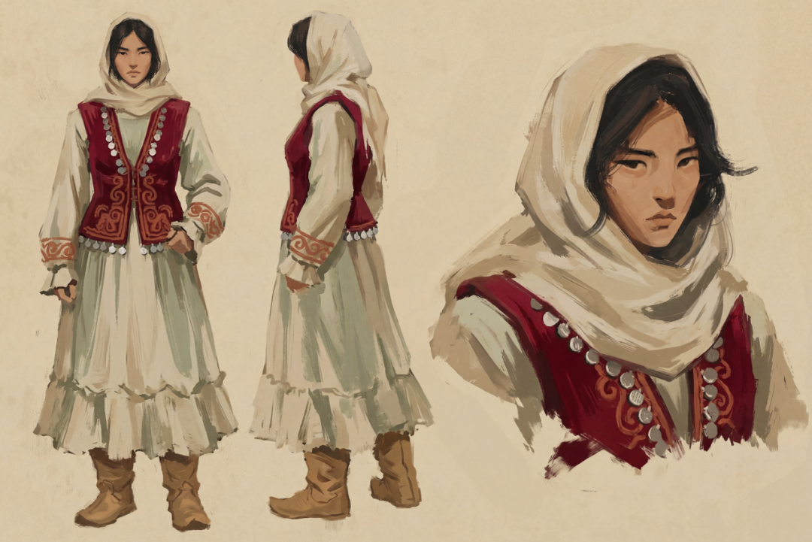

▲ Prompt：编辑这张角色设计图。务必保持原图的完整性——同样的哈萨克族年轻女性的脸庞，同样的齐肩黑发，同样的身材比例，三个角度（正面、四分之三侧面和特写肖像）的姿势都完全相同，同样的羊皮纸背景，最重要的是，要完全还原原作的绘画风格：流畅的油画和水粉笔触，厚重的笔触清晰可见，笔触质感、边缘处理、色彩渲染和光照都保持一致。请勿进行平滑、锐化、降噪、重绘或添加任何照片细节——务必与原作手绘概念图的风格和分辨率完全一致。

只需更换她的服装，从厚重的冬装换成轻盈的春装版哈萨克传统服饰：用一件合身的深石榴红色天鹅绒卡姆佐尔背心代替厚重的棉袄，背心饰以小银币和赤陶羊角（qoshqar-muyiz）刺绣，内搭一件飘逸的米色和鼠尾草色亚麻长裙，裙摆饰有荷叶边，袖口点缀着赤陶装饰；保留一条轻薄的米色丝绸头巾随意地披在头上，脚穿柔软的棕褐色皮靴。面料应显得更加轻盈飘逸，仿佛在温暖的春风中轻轻拂动。

色调应更符合春季的温暖氛围——以米色和燕麦色为主，搭配柔和的鼠尾草绿和暖棕色等中间色调，并以一抹鲜艳的石榴红色作为点缀，引人注目——同时保持与原作相同的柔和的绘画风格和笔触。

**每一项素材最初都会由AI生成一个方向性的初稿**，然后艺术家在Photoshop中进行修改、部分重绘，再结合Higgsfield插件做局部调整。

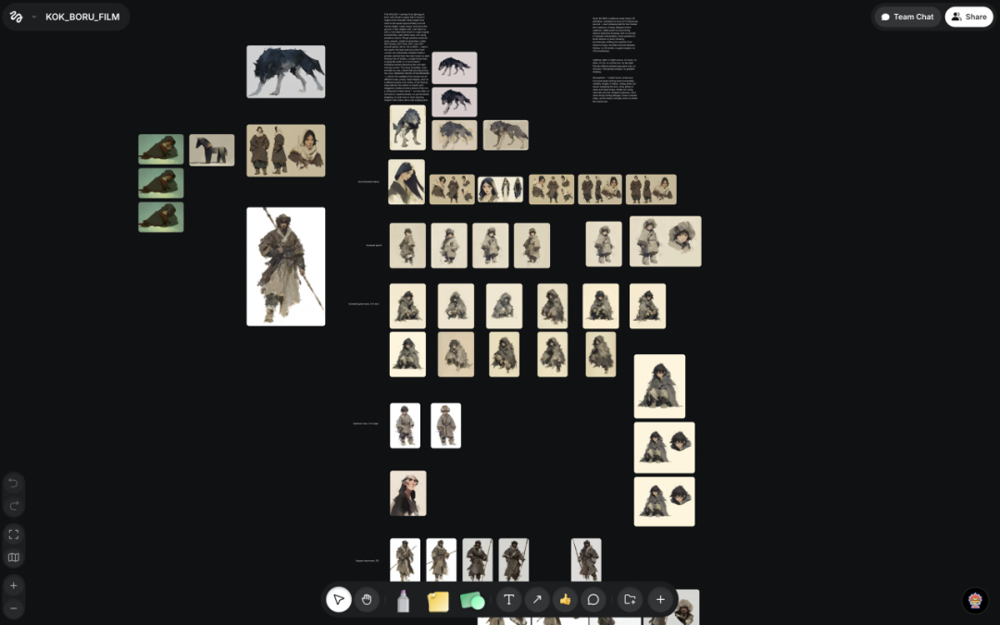

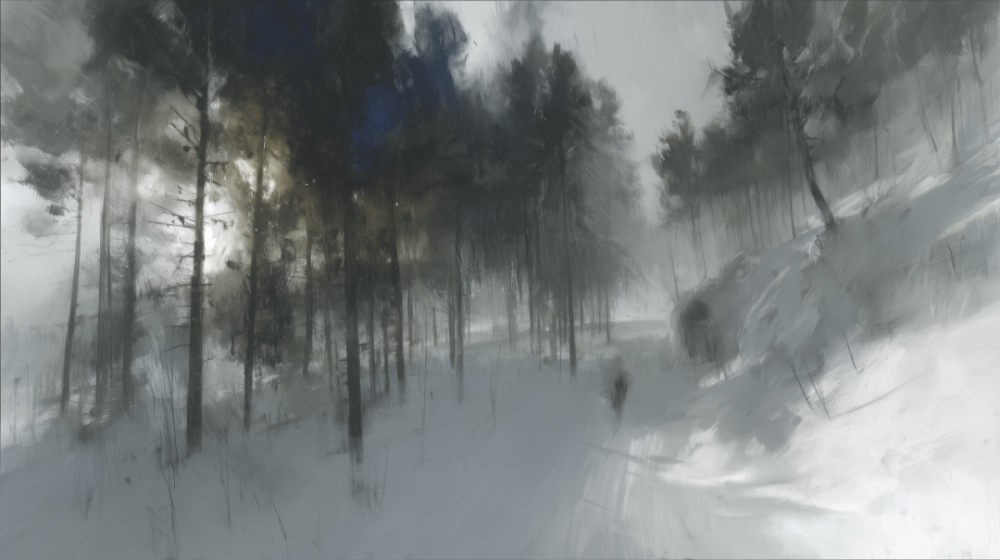

▲ 雪域树林场景原图

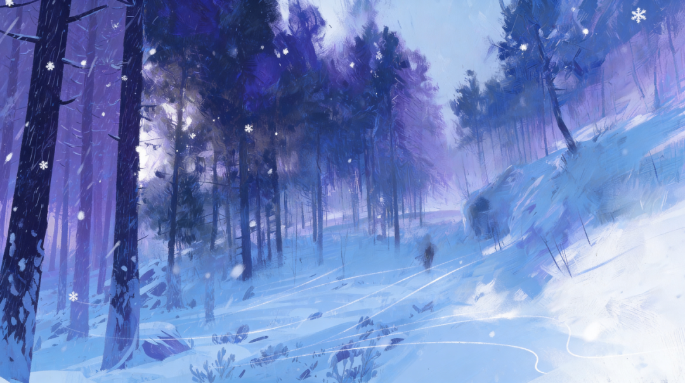

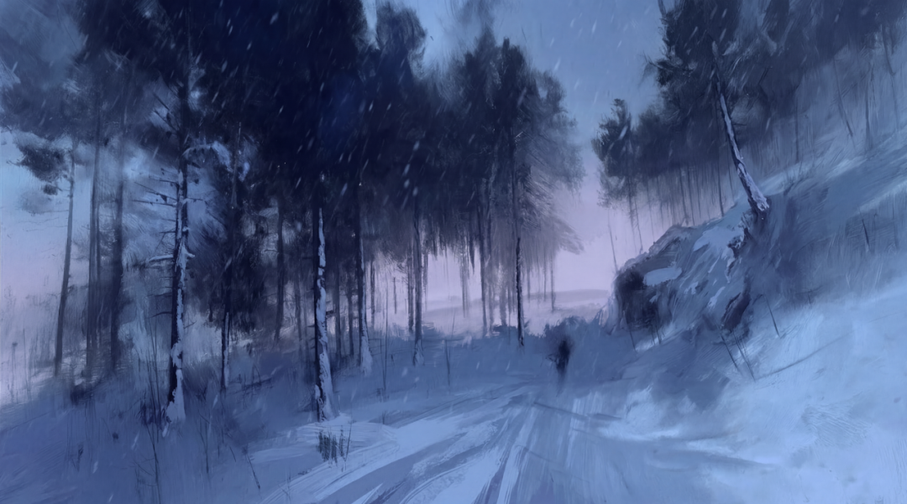

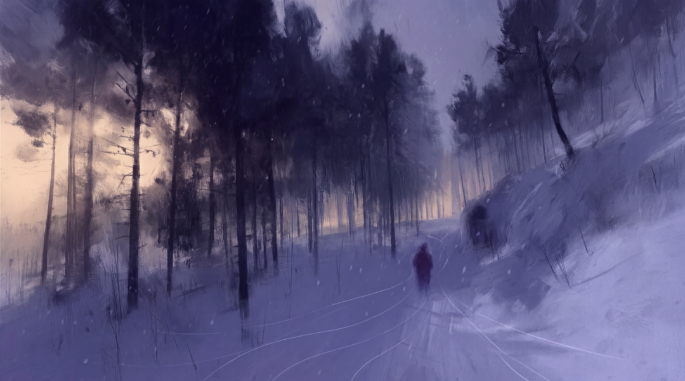

▲ Prompt：使图片 2 的氛围和色彩搭配与图片1相同

这一步很必要，因为像《Kok Boru》这样的题材对“文化真实性”要求很高。服饰的纹样、皮毛质感和游牧生活中的环境，都不能只是AI想象出来的“泛民族风”。它们需要被艺术家校准，最后给观众呈现的才是一个可信的文化世界。

下滑查看更多

▲《Kok Boru》部分人物设定图

当然，如果只依赖团队逐帧绘制，也难在短时间内完成电影级的宏大体量。

AI会承担另一部分工作，包括生成画面、补足中间帧、扩展环境、模拟狼群奔跑、处理战斗和暴风雪、快速迭代光影与氛围。

这个时候，导演写的提示词就显得格外重要了。

**03**

**堪比“论文”的提示词是如何构思的**

在《Kok Boru》的视频生成环节，团队**先建立了一套系统提示词**，当作影片的“风格定调”。它规定了画面的二质感，节奏等等，主要是圈划了AI应该和不应该做什么。

这里他们引入两个关键概念：

**Style Prefix：风格前缀**

**Constraints：约束条件**

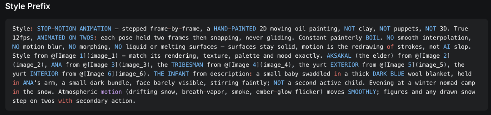

▲ 风格前缀

风格：定格动画（STOP-MOTION ANIMATION）—— 逐帧跳跃式动作，呈现为手绘2D动态油画质感；非粘土、非木偶、非3D。采用真实的每秒12帧（12fps）速率，按“隔帧动画（on twos）”方式制作：每个姿势保持两帧后瞬间切换，绝无平滑滑动。画面保持持续的油画笔触抖动感（painterly BOIL）。无平滑插帧，无动态模糊，无形态渐变（morphing），无液体或融化般的表面变形——物体表面保持固态，动作表现为笔触的重绘，而非AI生成的粗糙涂抹。风格参考 @\[Image 1\](image\_1) —— 需精准匹配其渲染效果、纹理、色调和氛围。角色/场景参考：@\[Image 2\](image\_2) 中的 AKSAKAL（长者），@\[Image 3\](image\_3) 中的 ANA，@\[Image 4\](image\_4) 中的 TRIBESMAN（部落成员），@\[Image 5\](image\_5) 中的蒙古包外观，@\[Image 6\](image\_6) 中的蒙古包内景。婴儿（THE INFANT）描述：包裹在厚实深蓝色羊毛毯中的小婴儿，由 ANA 抱在怀里，呈现为一个深色的小包裹，面部隐约可见，轻微蠕动；非第二个活跃的儿童角色。场景设定为冬日雪地里的游牧营地，时间为傍晚。环境动态（飘雪、呼出的哈气、烟雾、余烬闪烁）需平滑流畅；人物及绘制的雪花则采用“隔帧动画”节奏，并包含次要动作（secondary action）。

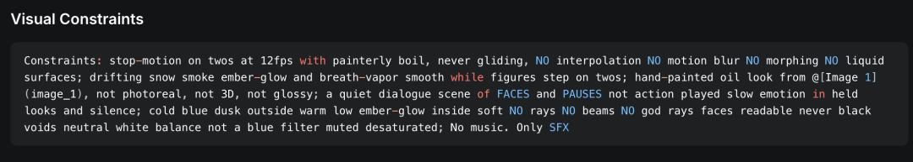

▲ 视觉约束条件：

约束条件：采用每秒12帧（12fps）的“隔帧动画”定格风格，伴随油画笔触抖动感，绝无滑动，无插帧，无动态模糊，无形态渐变，无液体表面效果；飘雪、烟雾、余烬光芒及呼出的哈气保持平滑，而人物动作则按“隔帧”节奏进行；呈现 @\[Image 1\](image\_1) 所示的手绘油画质感，非照片级写实，非3D，无光泽感；这是一场安静的对话场景，侧重于面部表情与停顿，而非动作戏；通过凝视与沉默来传达缓慢流露的情感；室外是冷蓝色的暮色，室内则是温暖低沉的余烬光辉；光线柔和，没有刺眼的光束或“神圣光芒”（god rays）；面部清晰可见，绝非漆黑一片；色调平衡自然中性，而非简单的蓝色滤镜效果；色彩柔和且饱和度较低；无背景音乐，仅有音效。

▲《Kok Boru》的风格前缀和约束条件

**Style Prefix负责锁定整体美术方向，Constraints则负责限制AI跑偏，之后团队所有的提示词编撰都会在此基础上叠加。**

具体来说，团队基于这个框架通过**Higgsfield Claude MCP**来处理和扩展其他提示词，再根据具体镜头需求微调。

▲ Higgsfield Claude MCP，可以简单理解成一种在Claude对话框内直接生成图片和影片的工具。

这是他们通过图片制作场景片段的过程：

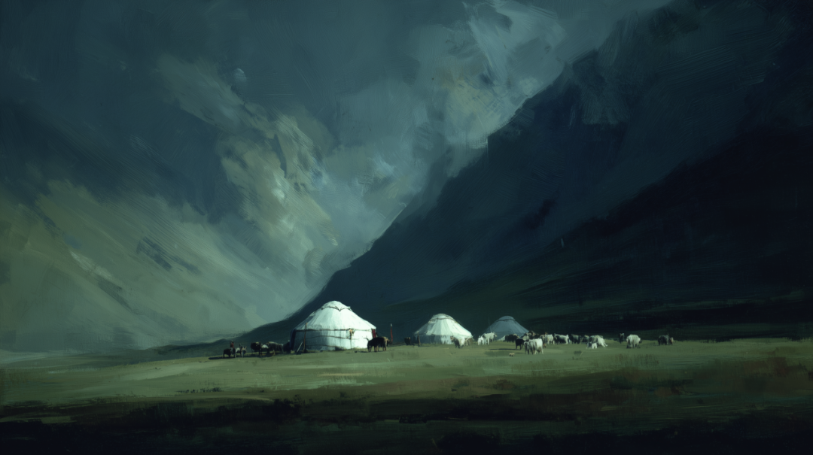

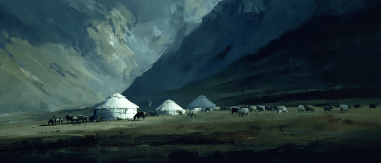

▲ Prompt：

风格和视觉效果参考附件图片 <<<image\_1>>>——与图片的绘画风格、纹理、色调和氛围完全一致。场景和地点参考 <<<image\_1>>>——与此处完全一致：左侧是散发着柔和光泽的浅色毡制蒙古包，右侧是一群散开的牲畜，背后是巍峨耸立的黑色山坡，阴沉的暴风雨天空，以及深沉忧郁的蓝绿色调。二维动画，采用 <<<image\_1>>> 的风格制作动态影像。动态效果说明：大气运动（暴风云、薄雾、云影、烟雾、草地）流畅自然；动物的动作栩栩如生；山脉和蒙古包保持静止。

导演笔记：

1\. 摄影——仅使用自然光，不使用人工抠像，展现场景中戏剧性的暴风雨日光，一束浅色光线照射在黑色山坡上的白色蒙古包上；广角变形镜头，左侧是近处的营地，背后是巍峨的群山；长镜头，一气呵成，摄影机如同活生生的人，在山谷中呼吸，而非一台机器。分解成具体的行为，而非电影化的标签。

2\. 手持拍摄——由人手轻柔地握持，充满生命力：缓慢而平静的呼吸式摇晃，轻微的自然漂移，细微的微调，摄影师站在草地上轻柔的重心转移。鲜活而细致，平静而不慌乱——不咄咄逼人，不抖动，不摇晃，绝不使用云台稳定器，绝不使用三脚架。视线水平。

3\. 整个场景都充满生机——草地上的草在风中不断起伏，在山谷中形成清晰可见的波浪；右侧成群的马匹和牲畜清晰地活着，在移动——吃草、转移重心、低头抬头、尾巴和鬃毛摆动、耳朵抖动，有些还在迈步转身；一两个渺小的人影缓缓走过蒙古包；营地里袅袅升起的炊烟随风飘荡；阴沉的暴风云在头顶缓缓翻滚。生机勃勃，充满活力，永不凝固，绝非静止的明信片。

4\. 变幻的天空与光线——厚重的暴风云在漆黑的天空和巨大的山坡上缓缓飘动翻滚，柔软的大片云影掠过草地和蒙古包，白色蒙古包上的微弱光线随着云层的移动而变幻闪烁，仿佛预示着天气即将到来。缓慢、持续、流畅。

5\. 坚实的物体静止不动——只有蒙古包、山脉和坚实的地面是静止的；所有有生命和有气息的事物都在流动。

场景：哈萨克游牧民族在高山牧场上的夏季营地（如图<<<image\_1>>>所示）——左侧簇拥着泛着淡淡光泽的毡房，在阳光的映衬下，映照着广袤无垠、阴沉陡峭的山坡；右侧草地上，一群马匹和牲畜悠闲地散布着；上方是阴云密布、暴风雨将至的天空；宽阔的山谷底部长满了青草。

光线：戏剧性的自然暴风雨日光，一缕淡淡的光线照射在白色毡房上，映衬着深色的山坡和云层；山谷上投下深邃而清冷的阴影；随着暴风云的移动，光线也随之变化。

氛围：暴风雨来临前，山间空气凉爽而充满张力；厚重的云层在山峰上翻滚；微风吹拂着青草；暴风雨来临前的平静令人感到压抑和紧张；山谷中弥漫着淡淡的烟雾和薄雾。

镜头1——广角镜头，手持拍摄，与参考画面构图一致。构图采用三分法，而非居中：左侧三分之一处，光线柔和的蒙古包在画面左侧的焦点上熠熠生辉，明亮的光团吸引着目光；一群牲畜从蒙古包间穿梭而过，横跨画面下方中心，延伸至右侧三分之一，引导视线向右移动；巨大的黑色山坡占据了画面的上方和右侧，气势磅礴，占据主导地位；左上方是阴沉的明暗交错的暴风雨天空；地平线较低，使得山峦和天空高耸于小小的营地之上。明暗对比：白色的蒙古包在广袤的黑色山坡映衬下熠熠生辉，大与小的对比，营地在巍峨的山峦和即将到来的暴风雨面前显得脆弱不堪。生机勃勃：草地上的青草随风摇曳，牲畜群吃草、迁徙，向右侧移动，烟雾袅袅升起，弯曲盘旋，暴风云缓缓翻滚，云影掠过营地。镜头轻柔地移动，仿佛在呼吸。

镜头一转至第二幕——中广角，手持拍摄，特写蒙古包和附近的马群。构图采用三分法：左侧三分之一处最大的白色蒙古包熠熠生辉，其昏暗的门洞成为视觉焦点；马群横跨画面下方偏右的位置；后方右上角是昏暗的山坡；营地位于左下角，右侧是开阔的草地。明亮的蒙古包与昏暗的山坡形成鲜明对比，动物们在绿色的草地上点缀着深色的线条。画面生动：马匹清晰地移动着——吃草、迈步、转弯、甩动尾巴和鬃毛、抖动耳朵，其中一匹还甩了甩头；一个矮小的身影从蒙古包旁走过；草地摇曳；烟雾升腾并向两侧飘散；云影掠过，光线在白色毡布上闪烁。镜头轻柔地移动，仿佛带着一丝生命的气息。

镜头硬切至第三张——超广角长镜头，手持拍摄。三分法构图，比例放大：营地位于左下角，显得渺小；发光的蒙古包如同苍白的小点；巨大的黑色山坡和翻腾的暴风雨天空占据了画面上方三分之二，高耸入云；牛群如同稀疏的细线散落在谷底，引导视线向右移动；地平线极低，山峦和暴风雨气势磅礴，营地在巨大的黑色山坡和即将到来的风暴面前显得渺小而脆弱。大小对比和明暗对比达到极致——渺小的营地是这片广袤黑暗中唯一的光亮。生机勃勃：狂风席卷广阔的草地，稀疏的牛群不断移动，烟雾袅袅升起，暴风云翻滚，巨大的云影笼罩着整座山脉和山谷。镜头轻柔地呼吸着，稳稳地托住这广阔的画面。

三个镜头的音效：无音乐、无配乐、无背景音乐、无任何乐器声——只有自然的环境音：山风拂过草地，牛群的叫声，远处马匹和牲畜的嘶鸣，暴风雨前山谷低沉而压抑的寂静，或许还有远处隐隐的雷声。无对白。无字幕。只有自然音效，绝对没有音乐。

限制条件：风格和地点均来自<<<image\_1>>>，三个镜头在约15秒内进行硬剪辑——广角镜头与参考画面一致，中广角镜头特写蒙古包和牛群，超广角极远景镜头展现被群山和风暴笼罩的渺小营地——这是一部电影风格的手持风景片，所有镜头均由手持拍摄，轻柔地摇晃，画面略带呼吸般的轻柔，并呈现出一种微妙的生命流动感。拍摄时不带任何冲击力、抖动或摇晃感，绝不使用稳定器，也绝不使用三脚架锁定，不使用快速摇摄、变焦或移动镜头，仅使用自然戏剧性的风暴光线，整个场景都栩栩如生——草地上的草在风中泛起涟漪，马群和牲畜清晰地移动和吃草，动作自然逼真，头、尾巴、耳朵都在移动并向右移动，一个渺小的人影在移动，烟雾缭绕，风暴云缓缓翻滚——动物们以自然生动的姿态活动，而大气也随之运动。云雾缭绕，云影缭绕，烟雾缭绕，青草轻柔流动，绝非静止的明信片，只有蒙古包、山峦和坚实的地面完全静止。构图遵循三分法，但并非居中——左侧闪耀的蒙古包是视觉焦点，右侧的羊群排列成一条动感的线条，深色的山坡占据了画面的上部和右部，地平线较低，浅色的蒙古包在明暗对比中闪耀，如同明亮的群像，而营地在巍峨的黑色山峦映衬下显得渺小，象征着大与小的对比，以及大自然对脆弱人类生命的漠然。占据主导地位的深色山坡和暴风雨般的天空构成了活跃的负空间。没有音乐，绝对没有音乐，只有自然环境音，营造出一种深沉而宏大的电影感。

下滑查看更多

下滑查看更多

▲《Kok Boru》部分场景片段素材

过程中，提示词并不是脱离故事单独存在的，据团队透露，《Kok Boru》这个项目结合了一份由内部编剧撰写的15页完整剧本。等于把“提示词撰写”上升到了一个“编剧”层面。**意味着每个镜头的生成，不只是知道“画面里有什么”，还知道“这个画面为什么而发生”。**

同样一个长者谈话的镜头，就做了很多个版本，因为人物在此情此景，能做出的反应也是会根据剧情推进，不会是一成不变，导演会在最后剪辑成片中找到最能衔接情感的那一个版本。

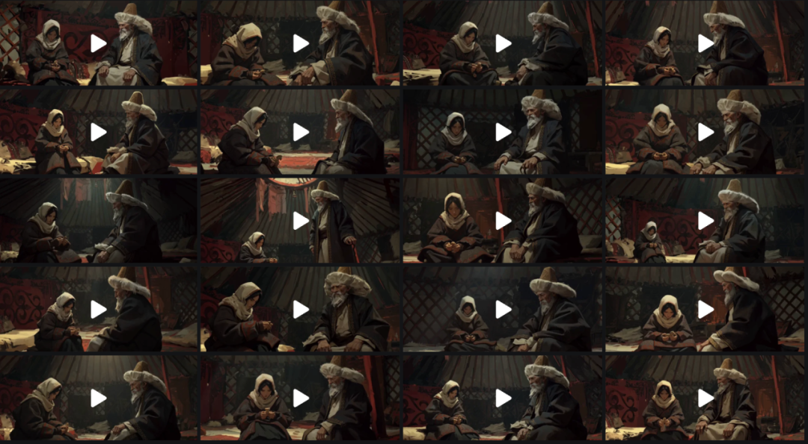

▲ 这一幕有400多个版本

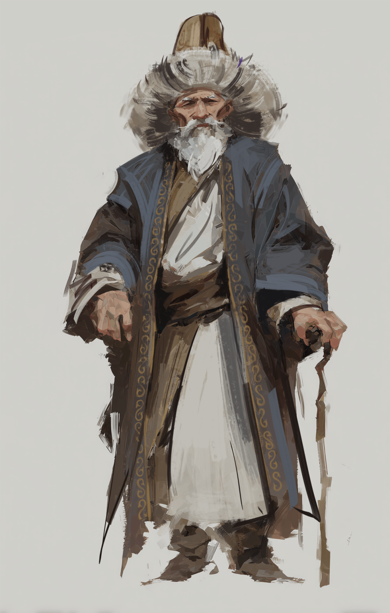

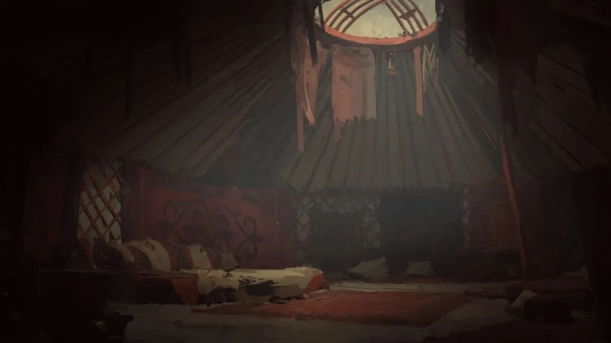

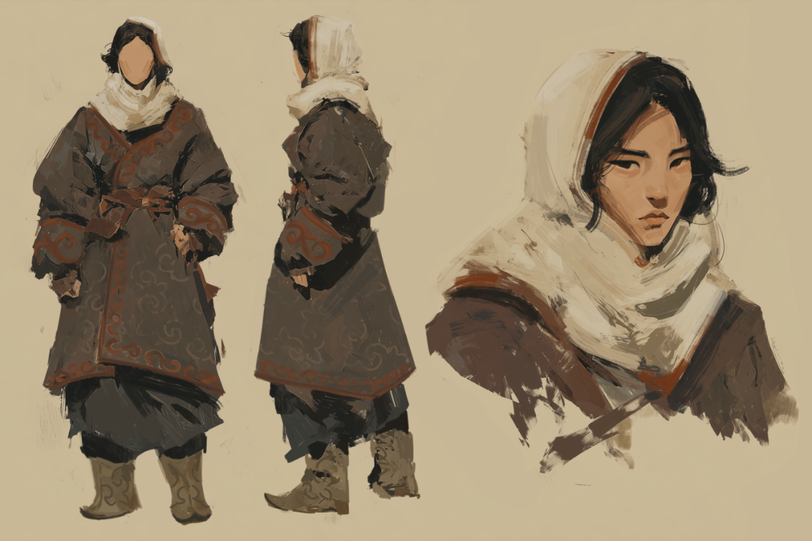

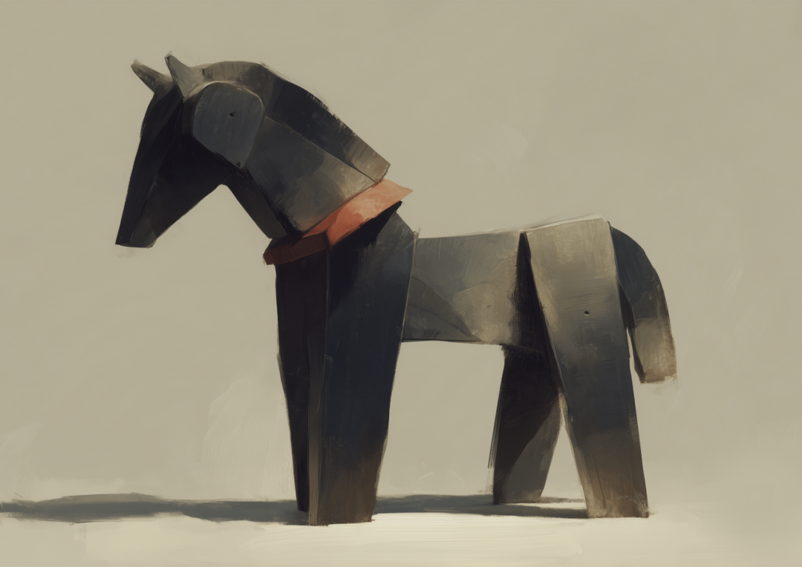

▲ 镜头素材

比如这一幕，环境光线更加明亮，角色手拿的道具是一条项链，这里导演写的是“柔和的光束、飘动的尘埃”“一遍又一遍地把玩着女儿的小项链”“老者祥和的语气”...这些关键词，导演希望构造的氛围是慈祥的老者在安慰和女儿走散的母亲的感觉。

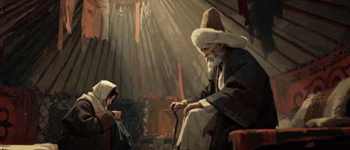

▲ Prompt：

风格：传统手绘二维动画，以每秒12帧的速度进行两帧动画——人物的每个画面保持两帧后被替换，人物动作节奏略显生硬，采用手绘油画质感，笔触清晰，未使用3D渲染、游戏引擎或CGI特效，呈现真正的手绘动画，而非AI生成的粗糙效果。人物风格参考附件图片<<<image\_3>>>和<<<image\_2>>>，室内场景参考附件图片<<<image\_1>>>——在绘画风格、质感、色调和氛围上完全一致。关于动作的说明：人物（长老和安娜，他们的面部表情和动作）以每秒12帧的速度进行两帧动画；氛围元素——柔和的光束、飘动的尘埃和淡淡的烟雾——以平滑缓慢的方式移动，而非生硬的跳跃式动作。安静私密的室内对话，一切都显得缓慢、沉重、静谧。

导演笔记：

1\. 场景——多年后，在哈萨克毡房内（图片1）。长老（图片2）轻声对安娜（图片3）说话，安娜是一位多年来一直在寻找失踪女儿的母亲，她从未放弃。他告诉她，孩子已经找不到了，狼群夺走了许多人的生命，她必须放手。安娜没有回答。她只是坐在那里，一遍又一遍地把玩着女儿的小项链。她的沉默和双手就是她的拒绝。场景就此结束，无言却坚定。

2\. 表演至关重要——这个场景完全依赖于表演、停顿和眼神。长老的话语之间是漫长而沉重的沉默，每个人的脸上都写满了多年的悲痛。克制，没有夸张的动作。让情感通过微表情、呼吸、眼眶含泪和凝视、下巴、双手缓慢而清晰地传递出来。让停顿显得真实自然——长者开口，然后是漫长的沉默，房间里弥漫着沉重的气氛，之后他再次开口。沉默与言语同样重要。微表情和眨眼以两帧为单位，以保持姿势的方式呈现，而非流畅地移动。

3\. 所有运动物体的辅助动作——后续动作和重叠动作以两帧为单位呈现，这是真实手工动画的标志：长者的白胡子、垂落的袖口、裙摆以及恰潘的装饰边饰随着他的呼吸和说话而缓缓移动和落下，他握着拐杖的手因年迈而微微颤抖；安娜的白色头巾、基梅舍克的末端以及恰潘的褶皱随着她的呼吸和细微的动作轻轻摆动，几缕散落的头发随风飘动；他们呼出的气息在寒冷昏暗的空气中微微卷曲，两股气流交织在一起；小链子随着她的手指转动，随着自身的重量缓缓摆动，最终稳定下来；尘埃在空中飘浮。一切都显得自然流畅，每一个动作都带有后续的衔接和重叠，鲜活而又仿佛是手工绘制而成。

4\. 长者的表演——他说话缓慢而沉重，带着深深的疲惫和爱意。他每说一句话都会停顿一下，低头，整理思绪，努力向自己所爱的人说出难以启齿的话。他眉头紧锁，眼神湿润而温柔，又带着一丝悲伤，下巴微微翕动，胡须也随之移动，双手沉重而颤抖地拄着拐杖。

5\. 安娜的表演——她没有看他，目光低垂在手中的链子上，饱经风霜、悲伤凹陷的脸上，她紧闭着双眼，一动不动。细微的表情变化：下巴微微紧绷，双眼紧闭却缓慢地眨动，眼珠闪烁却不流泪，呼吸一顿，头巾随呼吸微微翕动。她的手指不停地、缓慢地、无休止地转动着那条细小的链子——这就是她全部的回答。长老说出最难听的话时，她的手指握得更紧了。她始终保持沉默。

6\. 链子即是心——安娜的手指缓慢而持续地转动着女儿那条细小的链子，那是她珍藏的纪念品。链子轻轻摇晃，又缓缓地落下，带着一种延迟的、次要的动作。这细微的重复动作是她的拒绝，比任何言语都更有力。镜头和构图再次聚焦于此。

7\. 手持拍摄——由人手握持，轻柔平静的呼吸摇曳，微弱的有机流动，亲密而贴近，鲜活却又静谧，绝不咄咄逼人，绝不抖动，绝不像云台那样平稳，也绝不像三脚架那样僵硬。

8\. 光线——单一柔和的光源：一束苍白的日光从高高的圆形蒙古包顶棚开口处倾泻而下，轻柔地洒入昏暗的室内，沾染着尘埃和淡淡的烟雾，轻轻地洒落在人物和红毯上，蒙古包的其他部分则笼罩在温暖的阴影中。柔和而不刺眼，单一的光源来自上方，如<<<image\_1>>>所示。

9\. 口型同步——当长者说话时，他的脸清晰可见，嘴唇和下巴清晰地勾勒出每个哈萨克语音节的发音（双音节）；安娜则完全没有说话。

人物：

\- 长者（阿克萨卡尔）= 来自<<<image\_2>>>的哈萨克族老人，满脸皱纹，饱经风霜，留着白胡子，头戴饰有皮毛的高毡帽，身穿饰有金边的深色恰潘长袍，拄着拐杖，举手投足间既有领袖的威严，又透着一丝疲惫。

\- 安娜 = 来自<<<image\_3>>>的哈萨克族母亲，一位饱经风霜、面容憔悴的哈萨克族母亲，面容苍老，眼神深邃，头戴白色头巾，身穿基梅舍克长袍，身穿饰有金边的深色恰潘长袍，低坐。

光线：一束柔和的日光从上方的凉棚开口处倾泻而下，缓缓落入昏暗温暖的室内，沾染着尘埃和淡淡的烟雾，在人物和红地毯上汇聚成一片深沉温暖的阴影，营造出一种私密而封闭的氛围，柔和而不刺眼。

氛围：毡房内温暖昏暗的空气，上方一束柔和的光线夹杂着飘浮的尘埃和淡淡的烟雾，沉闷的沉默中弥漫着旧日的悲伤，营地外寂静无声。

声音——长者的声音：一位老人的声音，沙哑、嘶哑、低沉而粗粝，饱经岁月的洗礼，疲惫而沉重，却又温柔，每个字都缓慢而吃力，最终归于沉寂，如同饱经沧桑的喉咙发出沙哑的声响；用拉丁字母转写哈萨克语，发音与拼写完全一致，柔和自然的中亚口音，没有俄语口音。安娜全程保持沉默，只有呼吸声。

镜头一——中景双人镜头，手持拍摄，蒙古包内。构图采用三分法，非居中：长者坐在画面右侧三分之一处，端坐在折叠的垫子上，面向她；安娜坐在画面左侧三分之一处，位置较低，略微侧身，双手交叠，显得更小巧；从毡房透出的柔和光线落在他们之间，汇聚在画面下方中央的红色地毯上，弧形的格子墙和深深的阴影将他们笼罩其中。构图展现了他恳求与她封闭的悲伤之间的距离——他向她倾身，她却蜷缩起来。光线中扬起的尘埃缓缓飘散。长者抬起头，沉默良久，然后开口，声音沙哑而缓慢，胡须和头巾随着动作微微晃动，嘴唇在他露出的脸上勾勒出哈萨克语的字迹：

“Qyzym……”

一阵漫长而沉重的沉默。他低头，定了定神，握着拐杖的手微微颤抖。

“Biz ony izdedik. Köp izdedik.”

安娜没有抬头，双手轻轻抚过膝上的链子，头巾随着呼吸微微起伏。身影、布料和呼吸的蒸汽成双成对地流动，并伴有后续的动态效果，光束和尘埃缓缓飘动。镜头轻柔地呼吸着，营造出亲密的氛围。

镜头切换到第二个镜头——中近景，拍摄对象是老人，手持拍摄，低四分之三视角，柔和的光束从上方照射在他布满皱纹的脸上，他的眼神湿润、慈祥而又悲伤，白色的胡须，身后是深色的蒙古包。构图：他的脸位于画面右上三分之一处，目光向下偏左，看向画面下方的安娜。他说话缓慢、沙哑、断断续续，句子之间停顿很长，脸上写满了疲惫，嘴唇和下巴微微颤动，胡须随着他的话语缓慢地移动，呼出的气息也微微卷曲：

“Endi taba almaymyz.”

一阵长久的停顿。他的下巴微微颤动，眉头紧锁，悲伤和疲惫的神情以细微的表情掠过他的脸庞。

“Qansha jandy jogalttyq sol börilerden.”

他的声音嘶哑，渐渐消失在寂静中。他垂下眼帘，胡须也随之垂落。镜头聚焦在他疲惫的悲伤上，呼吸轻柔。人物动作缓慢而缓慢，尘土和光线柔和。

硬切至镜头3——特写镜头，手持拍摄，安娜的双手放在膝上，沐浴在柔和的光线中。构图：双手偏离中心，占据了画面下方，纤细的孩童项链在光束中闪烁着微光，她疲惫的手指一遍又一遍地转动着它，缓慢而持续，项链随着延迟的重量摆动又稳定下来，周围笼罩着温暖的阴影，项链是唯一明亮的闪光，也是视觉焦点。这就是她的回答。长老沙哑的声音在画面中持续低沉而遥远，经过一段漫长的停顿后：

“Qoy endi, qyzym。”

她的手指放慢了速度——然后紧紧地握住项链，没有停止。它们随着项链的摆动而交替移动。镜头靠近，轻柔地呼吸着。

镜头切至第四个镜头——特写镜头对准安娜的脸，手持拍摄，柔和的光束从上方倾泻而下，照在她饱经风霜、悲伤凹陷的脸上，白色的头巾遮住了她的脸庞，她深邃的目光垂落在铁链上，身后是昏暗的蒙古包，身旁空荡荡的阴影仿佛承载着她失去的一切。构图：她的脸位于画面左侧三分之一处，光线柔和地从上方照射下来。镜头缓缓拉长——她的下巴微微紧绷，双眼闪烁，缓慢地眨了一下眼，画面定格在闭眼状态，她屏住了呼吸，头巾滑落，散落的头发随着动作轻轻飘动。然后，她缓缓抬起头——并非屈服，而是坚定、沉稳、毫不动摇，目光越过长老，直视着自己的决心，手指仍在画面下方转动着铁链。她一言不发。她的沉默和眼神中充满了彻底的拒绝。光线下，尘土飞扬。画面中人物以双人为一组，带有次要动作，尘土飞扬。镜头定格在她坚定不移的沉默中，然后结束。

所有镜头均无配乐、无配乐、无任何乐器声——只有自然音效：毡房内沉寂的寂静，毡房外微弱的风声，布料轻柔的摩擦声，长老沙哑的哈萨克语，他疲惫的呼吸，安娜指间小链转动时发出的清脆金属声，以及余烬落下的轻微声响。无字幕。只有自然音效，绝对没有配乐。

限制条件：传统手绘二维动画，人物采用两帧/秒的动画，大气光和尘埃流畅飘动；真正的手绘动画，而非AI生成的粗糙动画；所有运动的物体——胡须、恰潘袖口、裙摆和装饰、头巾和基梅舍克末端、头发、呼吸产生的蒸汽、摆动的链条——都采用延迟重叠的两帧动画，没有任何僵硬的动作；人物取自<<<image\_2>>>（长老）和<<<image\_3>>>（安娜），室内场景取自<<<image\_1>>>；一段发生在哈萨克毡房中的私密安静的对话场景；四个不同的镜头，采用硬切——中远景双人镜头；长老说话的中近景；安娜转动孩子链条的特写镜头；安娜面部的特写镜头，最后定格在她无声的拒绝上——表演和停顿至关重要，短语之间有长时间的沉重沉默，情感饱满。通过微表情、呼吸和眼神，缓慢而清晰地阅读，微表情和眨眼以两两成对的方式呈现，保持着不流畅、克制的姿势，没有大幅度的动作，一切都轻柔地从手中流出，伴随着轻柔平静的呼吸摇摆，亲密而贴近，而非咄咄逼人、紧张不安，绝不像云台那样平稳，也绝不像三脚架那样固定。一个柔和的光源，上方沙尼拉克灯的苍白光束汇聚在人物周围，形成温暖深邃的阴影，柔和而不刺眼。链条是场景的核心，安娜的手指不停地转动着它，随着延迟的二次摆动，她无声地回应着，在他最艰难的话语中，链条收紧。这是插入画面中的焦点。安娜完全沉默，她的沉默和转动的双手，她的拒绝，在最后，她抬起眼睛，平静而坚定。长者的声音沙哑、低沉而疲惫，一个饱经沧桑、充满爱意的声音，缓慢而有长长的停顿，他的脸清晰可见，嘴唇以两两成对的方式发出哈萨克语音节。构图采用三分法，但并非居中——长者在右侧，安娜在左侧下方，光线在他们之间折叠起来。面孔偏离中心，深邃的阴影如同负空间，以及失去的沉重感，用拉丁字母转写哈萨克语，发音与书写一致，没有俄语口音，绝对没有音乐，只有自然的声音，亲密、悲伤、克制的语调。

下滑查看更多

下面这个版本则是，更加的昏暗，沉重。角色手握的木马玩具也更强调了“草原吞噬孩子”这样的意味。导演给出的关键词也更多侧重“柔和的阴影”“深沉低调氛围”，营造出更悲伤、克制的氛围。

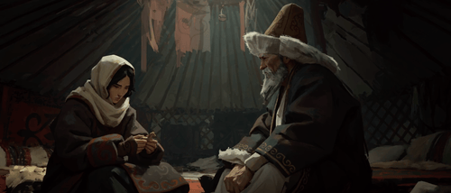

▲ Prompt：

风格：传统手绘二维动画，以每秒12帧的速度逐帧播放——每一帧都是从零开始手绘而成，逐帧重绘，保持两帧后替换。整幅画面必须每一帧都充满手绘质感：笔触和轮廓微妙地鲜活起来，随着每一帧的重绘而变化，线条和边缘仿佛在呼吸，笔触清晰可见，每一帧都经过重新渲染，呈现出逐帧手绘动画的鲜活光泽。手绘油画质感，厚重的笔触清晰可见，哑光水粉颜料。绝非平滑的数字插值，非变形，非扭曲，也非带有漂移部分的静止图像。没有3D渲染，没有游戏引擎，没有CGI的平滑效果，真正的手绘动画，而非AI的粗糙之作。人物造型参考附件图片<<<image\_3>>>和<<<image\_2>>>，室内场景参考<<<image\_1>>>——请完全按照其绘画风格、纹理、色调和氛围进行制作。关于动态效果：人物（长老和安娜）以12帧/秒的速度进行双人动画，画面流畅而富有张力；氛围元素——昏暗的光线、飘浮的尘埃和烟雾——以平滑缓慢的方式移动，而非生硬的阶梯式动作。安静私密的室内对话，一切都缓慢、沉重、静谧。

导演笔记：

1\. 场景——在<<<image\_1>>>所示的哈萨克毡房内，日落后的傍晚，女儿失踪多年之后。<<<image\_2>>>所示的长老（阿克萨卡尔）与<<<image\_3>>>所示的安娜交谈，安娜是一位多年来一直在寻找失踪女儿的母亲，她从未放弃过。他直截了当地告诉她，时间已经过去很久了，狼群夺走了许多人的生命，她该停下来了。安娜没有回答。她静静地坐着，手里拿着她失踪女儿的小木玩具，缓缓地转动着。她的沉默和她的双手就是她的拒绝。这一幕就此结束，无言却坚定。

2\. 逐帧手绘感——每一帧都像是手绘而成，线条和笔触中蕴含着柔和而持续的流动感，纹理和轮廓在每一帧中都经过微妙的调整，绝不僵硬，绝不机械平滑，也绝不插值或变形。动画师的手在每一帧、整个场景中都清晰可见。

3\. 镜头和焦距——使用变形宽银幕镜头，以真实胶片的方式拍摄。每个镜头都有其独特的焦距：广角双人镜头使用约35毫米的焦距，以呈现自然的透视效果，同时包含人物和房间；使用约 50mm 标准镜头拍摄长者，以获得真实、无畸变的肖像；使用约 85mm 镜头拍摄双手，并采用浅景深，使背景虚化；使用约 85mm 人像镜头拍摄安娜的特写，以营造柔和的压缩感和亲密感。保持浅景深柔和细腻，使背景呈现如绘画般柔和的渐变效果，切勿使用会破坏手绘质感的强烈摄影散景。

4\. 光线、阴影和曝光——日落后的傍晚，室内场景以柔和的阴影为主，营造出深沉的低调氛围：画面约 80% 处于柔和的深阴影中，只有约 20% 的区域被暮色中最后一丝微弱的余晖透过上方圆形的沙尼拉克开口洒下。大部分区域一片漆黑，只有一小片静谧的水池和边缘处透出柔和的微光。至关重要：阴影柔和而丰富，黑暗中蕴含着微妙的色调和细节，而非死寂的黑色，也非黯淡无光——而是在黑暗中呈现出柔和的渐变。虽然画面大部分被阴影笼罩，但仅有的少量光照恰到好处地落在关键位置，确保人物面部和关键细节清晰可见——即使在昏暗中，人物面部也始终清晰可辨，绝非一片漆黑。光线非常柔和、漫射、昏暗，没有方向性。绝对没有任何可见的光线，没有光束，没有神光，没有硬光，没有体积光——没有廉价的AI特效。黄昏的光线从上方柔和地过渡，边缘柔和，没有生硬的线条。深沉柔和的阴影是主色调，面部则以少量柔光点缀。没有暖色调的光晕，没有地毯反射，没有火焰，也没有灯光。

5\. 白平衡和色彩——采用正确的自然白平衡，中性且真实，没有明显的蓝色偏色，也没有电光蓝的夜景滤镜，只有轻微的冷色调，如同自然黄昏，但整体保持中性。白色和浅色物体在光线照射下呈现出接近纯白的自然效果——安娜的头巾是柔和的米白色，长者的胡须是自然的灰白色，整体感觉很中性。画面色调柔和，饱和度降低，呈现出温暖的泥土般的暗色调，深邃而昏暗，真正的中性平衡，如同经过适当调色的低调电影夜景室内场景，绝非人工智能素材那种虚假的统一蓝色色调。

6\. 长者的形象——一位睿智、坚定、庄重的长者。他不会抱怨、哀求或乞求怜悯，也不会哭泣或自怜。他直言不讳——冷静、沉稳、脚踏实地，带着一位饱经风霜、有资格说出尖锐话语的老人的沉稳权威。苦涩与岁月的沉重，却无软弱，无泪水，无颤抖。坦白地说：够了，接受吧。这是力量与来之不易的智慧，而非悲伤。

7\. 表演至关重要——他话语间长时间的沉重沉默，克制，没有夸张的手势。情感透过他清晰可见的面部表情、眼神、姿态、头部角度和重量、肩膀、双手、呼吸和静止，如同绘画般一气呵成，一刻一刻地展现出来。让停顿显得真实自然。

8\. 长者的表演和面部微表情——他侧身端坐，姿态沉稳，头部保持水平，神态庄重，布满皱纹的脸庞虽然略显黯淡，但清晰可见，语速缓慢而平稳。他脸上充满了克制的微表情，如同绘画般一刻一刻地展现出来：疲惫的双眼缓慢而沉重地眨动；灰白的眉毛随着语调起伏——在说一些生硬的词语时，眉毛微微皱起，在停顿时，眉毛略微抬起，流露出疲惫之感；眉间和眼周的深纹微微移动；说话时，胡须下的嘴唇和下巴微微动动，嘴唇在句间轻抿；一个男人眼中微微紧绷，那是旧日悲伤的痕迹。一切都显得庄重、克制、肃穆——一种沉稳权威的细微表演，从不抽搐，从不哭泣，从不哀求。他坚定的目光和挺拔的身姿展现了他的力量。

9\. 安娜的表演和面部微表情——她双手交叠，低垂着头，饱经风霜、凹陷的脸庞在头巾的遮蔽下显得黯淡无光，但依然清晰可见，绝非一片漆黑——她低垂的双眼、五官和静默的悲伤都清晰可见。她克制的微表情一闪而过：下巴微微紧绷，缓慢而沉重的眨眼，眉毛微微蹙起，眼中闪烁着泪光却不流泪，呼吸也略微停顿了一下。她的双手缓缓转动着那个小木玩具，拇指轻轻抚摸着它磨损的表面。当他说出最难听的话时，她的双手紧紧地握着玩具。她始终保持沉默。

10\. 木制玩具——她逝去女儿的遗物：一个简朴的小巧手工雕刻木制玩具，一个雕刻着小动物的玩偶，因多年把玩而变得光滑黝黑，是母亲亲手制作或珍藏的一件不起眼的儿童玩具。小巧而珍贵，是她唯一留下的女儿的遗物。她小心翼翼地捧着它，轻轻转动，拇指摩挲着光滑的旧木纹。

11\. 所有运动物体的辅助动作——后续动作和重叠动作以两两一组的方式呈现，这是真实手工动画的标志。长者的帽子：他戴着一顶高高的哈萨克毡帽，帽檐宽大柔软，饰有蓬松的毛边（如图2所示，宽边毛边的卡尔帕克帽）。这厚实柔软的毛边仿佛活了过来，并且清晰地舞动着：每当他移动、转身、歪头或点头时，帽檐上长长的柔软毛发和簇簇毛都会随着他的动作摇摆、起伏、飘动，并伴有延迟的二次运动。毛边的摆动总是比头部滞后一拍，然后轻轻地落下，从不僵硬，从不凝固，也从不呈僵硬的固体形状——这是柔软的动物皮毛，随着他的每一个动作轻轻地流动和抖动。长者的胡须：他灰白色的长胡须随着他说话、下巴和头部的动作，在自身的重量下摆动和落下。长者的头发：他鬓角处散落的灰发随风飘动，又随风飘落。长者的长袍：他厚重的恰潘长袍宽大的袖口、裙摆、领口和镶金边随着他的呼吸和动作缓缓移动、折叠和落下；他呼出的气息微微卷曲。安娜：她白色的头巾、基梅舍克长袍的末端和恰潘长袍的褶皱随着她的呼吸和细微的动作轻轻摆动，散落的头发飘动，气息卷曲。尘埃轻轻飘浮。没有僵硬的东西——每一种柔软的材质，尤其是长者帽子上蓬松的毛皮，都比身体滞后、重叠，然后落下，一切都以二元为单位，鲜活而又仿佛是手绘而成。

12\. 玩具即是心——安娜的双手缓慢而持续地转动着，轻轻地托着女儿的小木雕玩具，她的拇指抚摸着磨损的木头，这是她无声的拒绝。镜头和构图再次回到玩具上。

13\. 手持拍摄——由人手握持，画面轻柔平静地摇摆，呼吸轻柔，自然流动，亲密而贴近，鲜活却又安静，绝不咄咄逼人，绝不抖动，绝不如云台般平稳，也绝不如三脚架般僵硬。

14\. 唇形同步——长者模糊但清晰可见的面容，嘴唇和下巴清晰地勾勒出每个哈萨克语音节的发音；安娜没有说话。

人物：

\- 长者（阿克萨卡尔）= 来自<<<image\_2>>>的哈萨克族老人，饱经风霜的脸上布满皱纹，在柔和的光线下清晰可见，自然的灰白色胡须，戴着一顶宽边柔软蓬松的毡帽，鬓角散落着灰白的头发，身穿饰有金色装饰的深色恰潘长袍，拄着一根手杖，举手投足间散发着领袖的威严和沉稳。

\- 安娜 = 来自<<<image\_3>>>的女子，一位饱经风霜、因悲伤而憔悴的哈萨克族母亲，饱经风霜的脸上在柔和的光线下清晰可见，眼神深邃，头戴柔软的米白色头巾，身穿饰有精美图案的深色恰潘长袍，低矮地坐着。

光线：日落后的傍晚，室内光线昏暗，以柔和的阴影为主，约80%的画面笼罩在深沉的阴影中，只有约20%的区域被上方沙尼拉克（shanyrak）上缓缓洒下的微弱暮光照亮。没有可见的光线，没有光束，没有神光，也没有立体光，边缘柔和晕染，阴影柔和而富有层次感，并非死黑，也没有暗部细节缺失。被照亮的一小部分恰到好处，使人物面部和关键细节清晰可见，绝非一片漆黑。深沉柔和的阴影是主色调，面部则略带柔光。白平衡准确，略微偏冷，没有蓝色调。被照亮的白色衣物和胡须接近白色。整体色调柔和，呈低饱和度的暖色调，但整体色调中性。没有暖光、反光、火焰或灯光。

氛围：黄昏时分，蒙古包内空气幽暗而凉爽，最后一缕微弱的暮光透过头顶的烟囱口缓缓洒下，微弱的尘埃缓缓飘动，深邃柔和的阴影笼罩着房间的大部分，沉寂中弥漫着旧日悲伤的气息，寒夜将至。

声音——长者的声音：一位老人的声音，沙哑、粗粝，饱经岁月洗礼，却坚定、沉稳、均匀而踏实，平静而庄重，直言不讳，不带一丝恳求或自怜，字里行间充满权威和智慧，每个字都经过深思熟虑，不慌不忙；哈萨克语，拉丁字母转写，发音与书写完全一致，柔和自然的中亚口音，没有俄语口音。安娜全程沉默，只有呼吸声。

镜头1——中广角双镜头拍摄，约35毫米镜头，手持拍摄，黄昏时分，昏暗的蒙古包内。构图采用三分法，并非居中：画面大部分笼罩在柔和的深阴影中，长者端坐在右侧三分之一处，侧身而坐，神态庄重，脸上的光线微弱却清晰可见；安娜坐在左侧三分之一处，身形较小，双手交叠，脸庞仅能捕捉到些许柔和的光线；暮色微弱的光晕从他们之间的凉亭（shanyrak）上缓缓渗出，没有光线照射，画面约80%被深沉的柔和阴影笼罩，35毫米镜头捕捉到了房间的自然空间。构图展现了他坚定的呼吁与她封闭的悲伤之间的距离——他端坐面向她，她则蜷缩在一旁，两人之间只有柔和的阴影和微弱的光线。尘埃缓缓飘动。长者望向她，沉默良久，缓缓眨了眨眼，眉毛微微上扬，略显疲惫，然后声音沙哑却坚定地开口——随着他转头，宽大柔软的毛帽帽檐也随之飘动，动作略显迟缓，长长的胡须和头巾的饰边也随之飘动，嘴唇在他模糊的脸上两下翕动，画中的线条在画面间轻轻翻动：

“Qansha ma uaqyt ötti...”

又是一阵漫长的沉默，他的眉毛落下，缓缓眨眼，胡须和帽子上的毛也轻轻落下。

“Qansha ma jandy jogalttyq...”

安娜没有抬头，她的脸庞模糊而低垂，但依然清晰可见，下巴微微紧绷，双手轻轻地捧着小木偶，转动着，头巾随着呼吸微微翕动。人物、布料、皮毛和呼吸凝结的水汽成双成对地出现，伴随着二次推进和如画般的沸腾，昏暗的光线和尘埃缓缓飘动。镜头轻柔地呼吸着，充满亲密感。

镜头硬切至第二张——中近景，拍摄对象为老人，使用约50mm标准镜头，手持拍摄，侧脸低位，呈现一张真实自然的肖像，画面中老人周围笼罩着柔和的阴影，他布满皱纹的脸庞沐浴在昏暗柔和的暮光中，虽然光线昏暗但清晰可见，他自然的灰白色胡须，宽大的毛绒帽檐，以及鬓角散落的灰发，都让他显得平静而庄重。他身后是昏暗的蒙古包，画面大部分笼罩在柔和的阴影中。构图：老人的脸位于画面右上角三分之一处，目光向下看向画面下方的安娜。他脸上的表情丰富而克制，细微的表情变化令人动容——缓慢而沉重的眨眼，灰白的眉毛微微皱起，疲惫的眼周皱纹隐隐作痛，嘴唇在胡须下轻轻抿了一下。他沉着冷静地停顿了许久，然后清晰地吐出最后几个字，声音沙哑却坚定，下巴和嘴唇在胡须下微微翕动——随着他的头部移动，宽大柔软的帽檐上的绒毛清晰地起伏、飘动，伴随着延迟的二次运动，长长的胡须和鬓角的碎发也随之摇曳，呼吸的蒸汽微微卷曲，轮廓分明的脸庞在画面中缓缓翻滚：

“Saġan toqtar kez keldi...”

他平静地说着，实话实说，没有丝毫自怜，眉毛微微下垂，缓慢地眨了眨眼，目光坚定而毫不动摇，胡须和帽檐上的绒毛也轻轻地垂落下来。镜头聚焦在他平静而庄重的脸上，在阴影中柔和的光线下，他轻轻地呼吸着。人物以二元对立的方式移动，伴随着二次运动和翻滚，光线和尘埃柔和地流动着。

镜头硬切至第三幕——特写镜头，约85mm焦距，柔和浅景深，手持拍摄，安娜双手放在膝上，周围是深邃柔和的阴影，只有手上略带柔光。构图：双手偏离中心，占据画面下方，光线柔和但清晰，而画面大部分则处于柔和的阴影中。她用略显粗糙的手指轻轻托着一个手工雕刻的小木动物玩具，缓慢而持续地转动着，拇指轻抚着光滑的深色木头。背景柔和地向后延伸，呈现出一种微妙的绘画般的渐变效果，而非强烈的虚化。她的双手和小玩具是视觉焦点，她手上的纹路在画面中轻轻地流动着。这是她对他的话语后沉默的回应。她的手放慢了一会儿——然后合拢，紧紧地握住小玩具，不放开。它们没有停止。动作一气呵成。镜头靠近，轻柔地呼吸着。

镜头硬切至第四张——安娜的脸部特写，约85毫米人像镜头，轻微压缩，手持拍摄，在她周围投下柔和的阴影，她饱经风霜、悲伤凹陷的脸庞在昏暗柔和的暮光中清晰可见，透过她米白色的头巾，并非一片漆黑，而是清晰可辨。她低垂的双眼、精致的五官和静默的悲伤清晰可见，背景在她身后柔和地晕染开来，呈现出一种微妙的绘画式渐变效果，画面大部分被柔和的阴影笼罩，她身旁的黑暗空白仿佛承载着她失去的一切。构图：她的脸位于画面左侧三分之一处，略偏中心，线条在画面中缓缓流动。一个持续的停顿——以两秒为单位的细微动作：她的下巴微微紧绷，眉毛微微蹙起，双眼闪烁，缓慢而沉重的眨眼，镜头停留在闭眼状态，她屏住呼吸，头巾的末端和散落的头发随着动作轻轻飘动，她的双手紧紧地握着画面下方的木制玩具。然后她缓缓抬起头，将脸庞迎向凉亭透出的微弱光线，随着她抬起头，柔和的光芒也洒在她的脸上。她的眼神坚定、笃定、毫不动摇——不是屈服，而是决心，目光越过长者，直视着自己的意志。她一言不发。她的沉默和抬起的目光，便是彻底的拒绝。尘土轻轻飘动。画面中，人影成双成对出现，伴随着轻微的动作和沸腾的光芒，轻柔而流畅。留住她那不可动摇的宁静，然后结束。

所有镜头均无配乐：无音乐，无配乐，无任何乐器——只有自然音效：毡房里沉闷的寂静，黄昏时分毡墙外寒风的轻微呜咽，布料轻柔的摩擦声，长者沙哑而坚定的哈萨克语，他平稳的呼吸，木制玩具在她掌心转动的轻微声响，余烬微微落下的声音。无字幕。只有自然音效，绝对没有音乐。

限制条件：传统手绘二维动画，每帧12帧，每一帧都是单独手绘的，逐帧重绘，笔触和轮廓微妙地鲜活起来，每一帧都在变化，使整个画面每一帧都感觉像是手绘的。绝对不使用平滑插值，不变形，不扭曲，不是变形的静止画面，而是真正的手绘动画，而不是AI生成的粗糙动画。大气光和尘埃在人物以每帧12帧的速度动态移动时平滑地飘动。使用变形电影镜头，每个镜头使用不同的焦距——广角双人镜头约35mm，长老肖像约50mm，插入镜头约85mm柔和浅景深，安娜的特写镜头约85mm——任何浅景深都保持柔和微妙，背景虚化柔和自然，绝不使用会破坏手绘效果的强烈摄影散景。整体色调非常低调。画面以阴影为主，约80%的画面处于柔和深沉的阴影中，只有约20%的区域被上方沙尼拉克（shanyrak）微弱的暮光照亮。阴影柔和而丰富，色调和细节微妙，并非死黑，也非压抑，而是在黑暗中呈现出柔和的渐变。这部分受光区域恰到好处地保留了人物面部和关键细节，使其清晰可见，绝非一片漆黑。深沉柔和的阴影是主色调，面部则略带柔光。唯一的光源是微弱的暮光，它非常柔和地漫射均匀，边缘柔和过渡。画面中绝对没有任何可见的光线，没有光束，没有光束，没有神光，也没有体积光，没有廉价的AI痕迹。白平衡正确，仅略微偏冷，没有蓝色调，也没有电光蓝的夜景滤镜效果。白色布料和胡须在受光区域接近白色，而受光区域则呈现出柔和的、不饱和的、温暖的、大地般的黑暗，但整体色调中性，如同经过适当调色的画面。低调的电影之夜内景，没有温暖的光芒，没有回响，没有火焰，没有灯光，两个角色都以克制的面部微动作进行表演——年长者缓慢而沉重地眨着眼睛，灰色的眉毛随着沉重的动作移动，在说一些艰难的话语时，眉毛皱成一道深深的皱纹，疲惫地微微抬起，眉毛和眼线移动，胡须下的嘴巴和下巴有细微的动作，严肃、克制、庄重，从不抽搐，从不哭泣；安娜下巴紧绷，缓慢而沉重地眨着眼，眉毛微微蹙起，眼睛闪闪发光，但从未流出泪水，呼吸急促。次要动作和后续动作发生在所有移动的事物上，以二为单位——至关重要的是，长老高高的哈萨克毡帽有着宽阔柔软蓬松的毛皮帽檐，其厚实柔软的毛皮显然是活的，并且会动。每次他转身、倾斜或点头时，长长的柔软毛发和簇毛都会随着延迟的动作起伏、飘动和落下；他的头总是慢一拍，然后轻轻地落下，从不僵硬，从不冰冷，从不死板。那是柔软的动物毛皮，轻轻地流动和抖动；此外，他长长的灰白色胡须也在摆动和落下，鬓角松散的灰发飘动，厚重的恰潘帽的袖口、裙摆、领子和金边也在移动和落下，他的呼吸如同蒸汽；安娜的头巾、基梅舍克的末端和恰潘的褶皱搅动着散落的头发，呼吸的蒸汽飘散开来——每一种柔软的材料，尤其是蓬松的帽子毛皮，滞后地重叠并落在身体之后，没有一丝僵硬，人物来自<<<image\_2>>>（长老）和<<<image\_3>>>（安娜），内部来自<<<image\_1>>>，傍晚日落后，在哈萨克毡房里，一场私密而安静的对话场景。四个镜头以硬切的方式呈现——35毫米中景双人镜头，50毫米中近景拍摄长者，85毫米特写镜头聚焦安娜双手捧着女儿的木雕动物玩具，85毫米近景拍摄安娜，最后在她抬起头，迎着头顶柔和的微光，无言地抬起双眼，展现出坚定的神情。长者是一位睿智、坚定、庄重的老人，他平静而权威地讲述着真理，没有抱怨、恳求或自怜，没有哭泣，也没有颤抖，他坚强地压抑着痛苦。他那略显黯淡的脸庞清晰可见，却又充满生机，蕴含着严肃而克制的微表情。表演和停顿，所有的情感都透过可见的面部表情——眼睛、眉毛、眨眼、姿势、头部角度、肩膀、双手、呼吸——传递出来，如同绘画般自然流畅，没有夸张的动作，一切都轻柔地从手中流淌而出，伴随着轻柔平静的呼吸和摇摆，营造出亲密而又充满张力的氛围。近景，不咄咄逼人，不紧张，不如云台般平稳，不如三脚架锁定。木制玩具，画面的核心，她已故女儿的手工雕刻小木偶，因多年把玩而变得光滑。安娜抱着它，转动着它，拇指轻抚着磨损的木头。这是画面的焦点。当他说出最难听的话时，她紧紧地握住它。安娜完全沉默，她的脸清晰可见。她的沉默和她握着玩具的双手，她的拒绝。最后，她抬起头，沐浴在柔和的光线中，目光平静而坚定地抬起。构图采用三分法，而非居中——老人在右侧，侧脸直立；安娜在左下方，身形娇小，蜷缩着。昏暗柔和的光线在他们之间，脸庞隐约可见，但依然清晰可辨。深沉柔和的阴影构成主要的负空间，以及失去的沉重感。哈萨克语对话，拉丁字母转写，发音与书写一致，没有俄语口音。没有音乐，绝对没有音乐，只有自然音效，亲密、深沉、柔和、克制的音调。

下滑查看更多

这些差异靠单纯关键词很难表达清楚，**必须依靠剧本上下文联系和导演论文般的提示词共同完成。**最后，导演比对手中和以上二者相似的数百个版本后，选择了后者这个版本，他们认为，情景会更合适。

再比如暴风雪母女走散镜头，如果只写“母亲带着两个孩子在雪地里逃跑，被狼追”，AI大概率会生成一个灾难片式追逐画面。

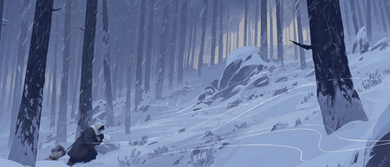

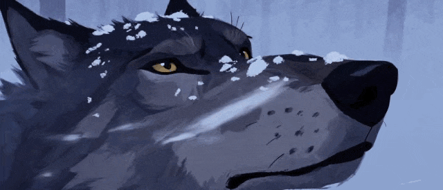

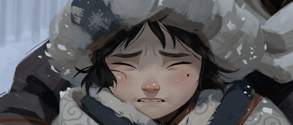

但剧情需要的不是灾难爽感，而是残酷选择的隐忍感，提示词需要写出镜头的物理处境和情绪逻辑，落到实处就是场面是否有必要出现“小女孩被狼群吞没”的明确画面。

剧情里，小女孩和母亲“分开”，以至于被狼群带走。

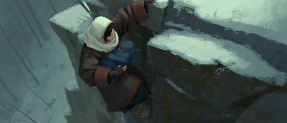

▲ 小女孩明确被狼群带走的版本

导演认为这一幕的重点**不是“狼来了”，而是“母亲来不及”。****不是“孩子丢了”，而是“草原把她收走了”。**所以最后在正片中选择了更加“留白”的“雪崩”版本。

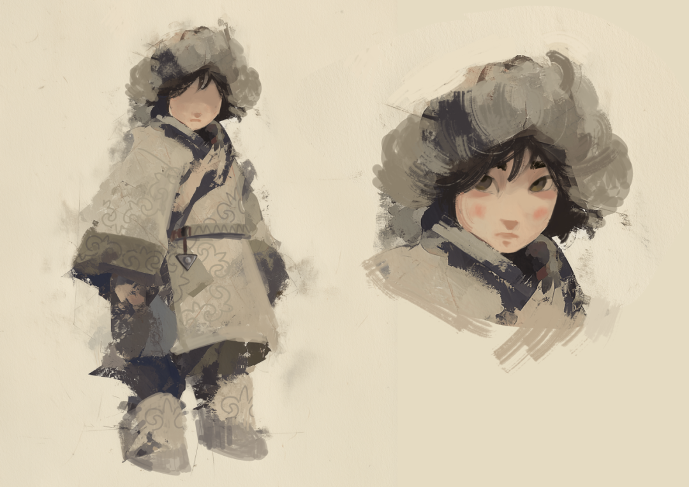

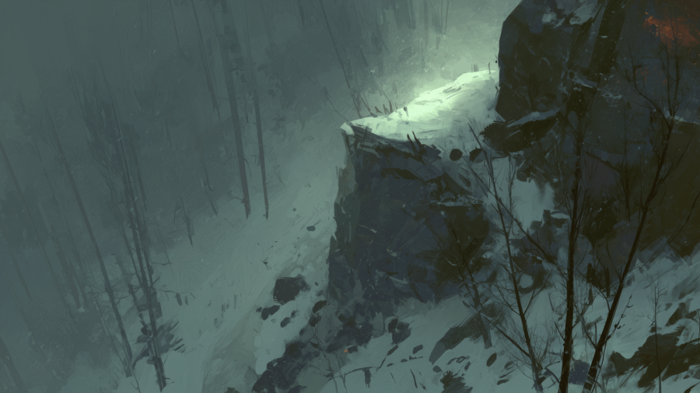

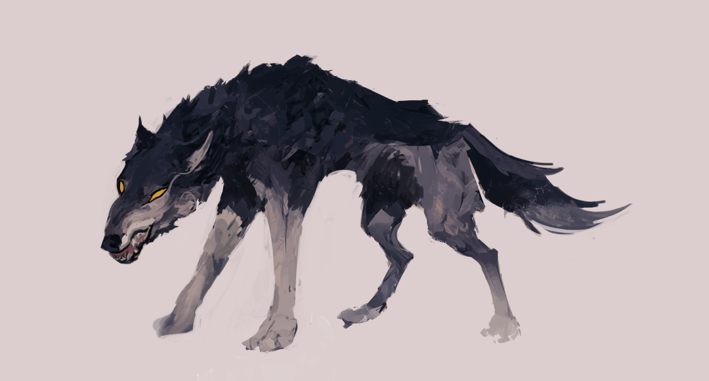

▲ 镜头素材

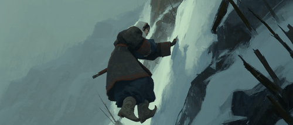

▲ 小女孩被雪崩吞噬的版本

▲ Prompt（雪崩版本）：

风格：定格动画——逐帧动画，呈现出手绘般的二维效果，宛如一幅会动的油画，而非黏土、木偶或三维动画。每秒12帧，动画制作于两帧之间：每秒12幅独立的手绘画面，每个姿势保持两帧后无缝衔接，绝不拖沓。笔触和轮廓在每一帧中都保持着微妙的动态感，如同油画般生动鲜活。没有平滑插值，没有运动模糊，没有变形，是真正的逐帧动画，而非人工智能的粗糙处理。风格参考<<<image\_1>>>，ANA参考<<<image\_2>>>，UMAI参考<<<image\_3>>>，雪崖参考<<<image\_4>>>。婴儿并非单独指代——根据描述呈现：一个裹得严严实实的婴儿，裹在一条厚厚的深蓝色羊毛毯里，紧紧地贴在安娜的胸前，安娜紧紧地抱着他，婴儿只是一个小小的深蓝色包裹，脸几乎看不见，微微动了动；并非另一个活跃的孩子。恶劣天气：雾气弥漫，雪花飘落，狂风呼啸。大气运动（雾、飘落的雪花、风雾、呼吸产生的水汽）流畅地移动；人物、雪崩和飞溅的雪花成双成对地移动。

场景位置——记住这一点，这是镜头的关键：悬崖在乌迈的前方，在她面前拔地而起。安娜爬上了悬崖，站在高处。乌迈站在悬崖脚下，面对着悬崖，仰望着母亲的身影。雪崩从同一处悬崖倾泻而下——正是乌玛伊正对着、仰望的那处悬崖——径直朝她奔来，迎面而来，与她面对面。所以，乌玛伊和雪崩是面对面的：她抬头望着悬崖，白色的雪墙就从悬崖上向她倾泻而下。她看到了雪崩，因为她正看着它。危险来自前方，来自她面对的悬崖，来自她母亲所在的位置——而不是来自她的身后，永远不要来自她的身后。摄像机必须放在乌玛伊的侧面，或者从她的肩膀上方朝向悬崖，这样我们才能在一个画面中同时看到她仰望悬崖的脸和从悬崖上倾泻而下的雪崩——孩子和雪崩面对面。千万不要把雪崩放在她的身后。

导演笔记：

1\. 这场戏——灾难的始末，整个故事的核心，必须通过精确的因果链来呈现，构图和镜头运用共同讲述了这个残酷的故事。安娜单手抱着婴儿攀爬白雪皑皑的悬崖，她的脚踩松了一块高处的积雪；积雪崩塌，咆哮着从悬崖上倾泻而下，直奔站在悬崖脚下、仰望着母亲的小乌迈而去；乌迈眼睁睁地看着雪崩袭来，恐惧让她动弹不得；雪崩吞没了她，将她卷走。高处的安娜目睹了这一切，无助地尖叫。没有狼群，没有岩石——一块山上的积雪化作雪崩，倾泻而下，而站在悬崖边的孩子被卷入其中。

2\. 摄影机法则（卢贝兹基手持摄影技巧，应用于每个镜头——镜头之间的硬切保留，但每个镜头都像卢贝兹基的风格拍摄）——每个镜头都是一个连续的、有动机的、流畅的手持运动，绝不静止，绝不锁定：（a）手持的人性化存在——摄影机由人手握持，成为场景中鲜活的存在，轻柔而自然地摇摆和漂移，颠簸和修正，受风吹拂，绝不像云台那样平稳，绝不像三脚架那样锁定，绝不像机械那样生硬；在灾难的瞬间，手持摄影机充满攻击性和紧迫感，在静止的时刻，它则显得平静而舒缓；（b）连续的、有动机的运动——每个镜头的运动都有其原因，由动作驱动：它随着安娜的攀爬而上升，随着雪崩的发生而倾斜和下降，随着乌迈的摇摄和重新构图而移动，随着尖叫声而摇晃——每个镜头都是一个流畅的、有动机的摄影机运动，而不是固定的画面； (c) 沉浸于自然之中——镜头与人物一同置身于暴风雪之中：飞雪和飞沫掠过镜头，雾气弥漫画面，雪崩的粉尘扑面而来，我们身处其中，而非置身事外；(d) 宽广沉浸式构图——采用宽广、近景、环绕式的构图，将我们置于空间之中，巨大的悬崖和暴风雪将人物环绕；(e) 仅使用自然光——仅使用现有的昏暗灰色暴风雪光线，不使用任何人工光源、光线或光束；(f) 场景色调——暴风雪和积雪的冷灰色调构成了全部色调。卢贝兹基的手持摄影机贯穿了所有四个镜头。

3\. 乌玛伊的表演——静默的恐惧，克制，没有剧烈的反应，没有尖叫——她没有哭喊，也没有挣扎；她是一个受惊的小女孩，僵住了。一个清晰却内敛的弧线，她的脸和身体以两步为单位，保持着一个个踏步姿势，每个动作都恰到好处：（a）等待——她独自站在悬崖脚下，面对着它，渺小、迷茫、寒冷，瑟瑟发抖，紧紧地抱着自己，仰着头，看着母亲攀爬着上方的悬崖，小脸上满是焦虑；（b）不安——她面前的悬崖传来一声低沉的隆隆声，她静止不动，向上仰望着悬崖，眼睛睁得大大的，不安，还不明白发生了什么； （c）惊恐的觉醒——她看到雪崩的白色墙体正从悬崖上倾泻而下，直扑向她，与她正面相撞。她惊恐地睁大了眼睛，小小的脸上满是恐惧——但她却安静地、僵硬地动弹着：嘴唇微微张开，呼吸一窒，小小的身体僵硬地蜷缩着，一个受惊的小女孩呆立原地，望着正向她袭来的东西，没有尖叫，也没有挣扎；（d）雪崩袭来——她几乎没有动弹，就被雪崩吞没。恐惧被压抑在内心深处，纹丝不动——惊恐的双眼睁得大大的，一张僵硬地仰着的脸直视着迎面而来的雪，一个吓得动弹不得的孩子所感受到的那种无声的恐惧。她的小脸上写满了恐惧，却从未发出声音，从未发出尖叫。 （注：参考画面中人物的绘画风格、泛红的冷漠脸颊、毛皮镶边的兜帽以及惊恐而安静的仰视表情都正确——保留这些细节，只需调整地理位置，使雪崩发生在她前方，也就是她面对的悬崖下方，而不是在她身后。）

4\. 因果链——在屏幕上按顺序呈现每个环节，先是原因，然后是结果，每次呈现两个：（a）安娜的脚踩在悬崖高处厚厚的积雪上，积雪在她的重量下裂开并崩落，一条裂缝横贯山坡；（b）崩落的积雪滑落，然后咆哮着从悬崖上倾泻而下，形成雪崩，一堵不断增长、翻滚的雪墙从悬崖上滚落，直扑山脚下的乌迈——雪崩是贯穿始终的线索，沿着它向下移动； (c) 乌玛伊站在山脚下，面向悬崖，抬头望去，看到雪崩正向她袭来，吓得动弹不得；(d) 倾泻而下的雪崩吞没了她——翻滚的白色巨浪从她面前的悬崖上拍打着她小小的身影，将她吞噬；(e) 乌玛伊被卷入雪崩洪流，一个小小的黑色身影翻滚着消失在翻滚的白色雪崩中，雪崩继续向前奔涌。一切原因都清晰可见：脚踩断了高处的雪板，雪板化作雪崩，从悬崖倾泻而下，雪崩带走了面向悬崖的孩子。

5\. 雪崩——真实的物理定律和重量，积雪成双成对地倾泻而下，始终沿着乌迈面前的悬崖倾泻而下，直扑她而来：一块压实的雪板在高高的悬崖上崩裂脱落；雪崩沿着悬崖向下堆积——翻滚翻滚的雪块和雪粉墙，沉重、快速、势不可挡，一团滚滚的雪粉云从雪崩前方升腾而起，倾泻而下，直扑脚下的孩子；雪崩像海浪一样从前方袭来，将乌迈卷走，继续向前倾泻而下，激起巨大的雪粉云（成双成对的雪雾和雪粉）。巨大、猛烈、无情，从她面前的悬崖倾泻而下。

6\. 乌玛伊被卷走——雪崩吞没并卷走了乌玛伊，但她并没有被血肉模糊地压死——她被卷入、掩埋，在白色的洪流中翻滚而去，一个小小的黑色身影（她身上唯一的颜色）消失在翻滚的雪中，消失在茫茫的白色之中。她就这样被这座山带走了。她是否幸存的谜团，留给了电影。

7\. 安娜（Ana）目睹这一切，发出尖叫——她身处悬崖高处，无助地单手抱着婴儿，向下望去，看到自己引发的雪崩倾泻而下，将乌迈（Umai）吞噬在雪崩脚下。她伸出手，嘶声喊着女儿的名字。面部表情：她原本强忍的镇定瞬间崩溃——她的脸庞扭曲变形，双眼因恐惧而睁大，嘴巴也张开，之前所有克制的温柔瞬间化作赤裸裸的恐惧，如同面部撕裂般断断续续地扭曲着。 （她的尖叫是场景中唯一响亮的呼喊——孩子保持沉默，只有母亲发出尖叫。）

8\. 构图法则（画面讲述故事——破裂，与誓言的亲和力相反）——线条：残酷的雪崩线条从上方的阿纳（ANA）笔直地倾泻而下，直落山脚下的乌迈（UMAI）——这条厄运之线从山顶的母亲沿着悬崖向下延伸到山脚下的孩子，孩子正仰望着这条线。形状：巨大的、翻腾的、无形的白色雪崩从悬崖倾泻而下，吞噬着面对它的小小、圆润、静止的孩子——山体正面吞噬了她。色调：反转——黑暗的小女孩被倾泻而下的巨大、明亮的白色暴雪吞没，黑暗的身影淹没在白色中；孩子惊恐地仰起的脸庞是视觉焦点，直到白色将她吞噬。运动：对比鲜明，强度极高——快速猛烈的雪崩倾泻而下，冲击着面对它的小女孩，她仍然惊恐万分；而上方的母亲则无助地伸出手去。对比与亲近：最大程度的对比和视觉强度的巅峰——誓言的亲近感一直等待着的破裂。空间：深邃——悬崖向上延伸，雪崩从崖面倾泻而下，直扑镜头和孩子。

9\. 构图：墨迹（解读为群体）——悬崖脚下，小女孩惊恐万分，被倾泻而下的巨大白色雪崩吞噬殆尽——大与小的对比，山峰的白色暴风雨迎面而来，吞噬着渺小的身影。遮蔽：雾气和翻滚的雪粉遮蔽了灾难的一半，白色的洪流彻底吞噬了乌玛伊。镜头高度：低矮而近距离地展现了孩子仰望悬崖、白雪倾泻而下的无助；渺小而无力地俯瞰着上方的母亲。大与小的对比：渺小的孩子和远处渺小的母亲与巨大的悬崖、暴风雪和倾泻而下的巨大雪崩形成鲜明对比。

10\. 天气——雾、雪、风，一切都流畅自然：低矮的雾气飘过悬崖底部，厚厚的积雪在阵风中被吹得四处横飞，狂风卷起雾雪，呼出的气息撕裂着空气，灾难被暴风雪和雪崩的粉尘云半遮半掩地吞噬。

11\. 以两个为一组的次要动作——安娜和乌玛伊的衣服、头发和呼出的气息被吹拂，深蓝色的襁褓包裹着的婴儿在移动，雪崩卷起阵阵雪雾，雪块翻滚，所有这些都以两个为一组进行描绘；雾气和飘雪营造出柔和的氛围。

12\. 光线——雾雪中冷灰色的暴风雨光线，平淡柔和，没有方向性，没有阳光，没有光线，没有光束，没有上帝之光，人脸清晰可见。正确的白平衡为中性，未使用蓝色滤镜，色调柔和，饱和度降低，雪呈现柔和的暴风雨灰白色，雾气呈浅灰色；画面中没有血腥味——孩子被雪吞噬，但画面中没有受伤。

镜头一——悬崖之上，约50毫米焦距，卢贝兹基手持拍摄，一气呵成的攀登动作。镜头跟随安娜攀爬在雾气弥漫、雪花纷飞的岩壁高处，随着她的呼吸和摇晃，飞雪掠过镜头。构图：安娜单臂攀爬，位于画面上方，深蓝色襁褓中的婴儿紧贴着她的胸口，她的靴子伸向一块厚厚的积雪——画面与她一同高高在上，让我们感受到脚下幼小婴儿的坠落。她的脚落下——厚厚的积雪两两断裂，一道裂缝横贯山坡，一块积雪崩落。手持摄影机猛烈摇晃，镜头向下倾斜，伴随着令人眩晕的眩晕感，一气呵成地跟随岩板滑落，咆哮着冲下悬崖，穿过迷雾，最终汇成雪崩，倾泻而下，直扑山脚下远处渺小的身影——那是死亡的阴影，是残酷的机制。镜头切到雪崩倾泻而下的画面。

镜头切换到第二个镜头——在悬崖脚下，约35毫米镜头，镜头拉近，卢贝兹基手持摄影机，一气呵成地移动，摄影机位于乌迈的侧面/略微越过她的肩膀，低而近地拍摄着悬崖，随着她的呼吸和摇晃，雪花和雾气在镜头前飘过——画面同时捕捉到她仰起的小脸和她面前的悬崖，以及从悬崖上倾泻而下的雪崩，仿佛与她面对面。乌迈的静默恐惧，克制而清晰，没有尖叫，没有挣扎：她站在悬崖脚下，面对着它，又小又冷，瑟瑟发抖，抱紧自己，仰着头看着母亲攀爬上面的悬崖——然后，她面前的悬崖传来一声沉闷的隆隆声，她顿时静止不动，向上仰望的双眼睁得大大的，不安地望着悬崖——然后她看到白色的雪崩之墙正从悬崖上倾泻而下，直奔她而来，与她正面相撞，她惊恐地睁大了眼睛，小小的脸上充满了恐惧，静静地，僵住了：嘴唇微微张开，呼吸急促，小小的身体僵硬地蜷缩着，一个受惊的小女孩凝视着从她面前的悬崖上向她袭来的东西，像钉子一样钉在原地，没有尖叫，也没有挣扎。然后，雪崩袭来——她几乎纹丝不动——倾泻而下的雪崩如同海浪般从前方袭来，将她吞没。翻滚的雪尘吞噬了她娇小的身影，将她卷走，带走。一个黑色的小身影在翻滚的雪尘中翻滚，消失不见。雪崩奔涌而过，朝着镜头猛烈袭来，雪花一簇簇地飞溅。那个黑色的孩子被狂暴的雪尘淹没。她消失在了雪中。真实的重量和冲击力，一簇簇地袭来。

镜头切换至第三幕——广角，约35毫米胶片，卢贝兹基手持拍摄，一个流畅而有力的动作，随着雪崩的洪流漂移，沉浸在掠过镜头的雪雾之中。构图（倾泻）：雪崩从悬崖倾泻而下，沿着一条强劲的下倾对角线横扫而过，形成一条巨大的翻腾雪河，滚滚的粉雪云卷入迷雾和暴风雪中。乌玛伊曾经站立的悬崖脚下如今已被掩埋，消失殆尽，苍白翻腾的白色和迷雾构成了吞噬她的负空间。粉雪翻滚着，两两爆裂。她消失在了白色之中，被这座山带走了。

硬切至镜头4——安娜在悬崖上，约50毫米焦距，卢贝兹基手持拍摄，一气呵成，镜头随着她在岩壁上摇晃、呼吸，狂风吹拂着画面，雪花掠过镜头。构图（大与小，残酷的永恒距离）：安娜渺小而无助地攀附在巨大的悬崖峭壁上，一只手臂紧紧抱着她襁褓中包裹着的深蓝色婴儿。巨大的冰冷悬崖、苍白的雾气、暴风雪以及沿着峭壁向下延伸的触目惊心的雪崩痕迹，都让她显得渺小。翻滚的白色洪流和粉尘云在悬崖脚下远处，她的女儿就在那里消失——她们之间是悬崖下的巨大距离，雪崩的路径，如今已成永恒且无法逾越的鸿沟，成为失去的压抑空间。她向下望去，看到了这一切，她的脸瞬间破碎——双眼瞪得老大，嘴巴张得老大，镇定彻底崩溃——她伸出空着的那只手，伸向那带走乌迈的白色洪流，一条无法连接的动态线，她对着暴风雪发出撕心裂肺的尖叫：

“UMAI!!! U-MA-AI!!!”

她的哭喊声被风撕扯而去。在悬崖脚下很远的地方，雪崩和她的女儿都消失在了迷雾和翻滚的雪中。紧紧抓住她娇小无助的身躯，以及下方乌玛伊曾经所在的地方那片广袤无垠的白色虚空。结束。

她的哭声被风撕扯而去。在悬崖脚下，雪崩和她的女儿都消失在了迷雾和翻滚的雪中。紧紧抓住她那弱小无助的身影，以及下方乌玛伊曾经所在之处那片广袤无垠的白色虚空。结束。

音频：无音乐——狂风呼啸的暴风雪，雪层断裂的噼啪声和沉重的轰鸣，雪崩倾泻而下越来越大的咆哮声，雪流奔腾的嘶嘶声，以及安娜撕心裂肺的尖叫声被这一切吞噬——孩子没有哭声，只有母亲的尖叫。无字幕。只有自然音效，绝对没有音乐。

限制条件：定格动画，每两帧以12fps的帧率进行定格，画面呈现绘画般的沸腾效果，人物和雪崩雪以步进的方式移动，绝不滑行；不使用平滑插值、运动模糊或变形；雾气、飘落的雪花和风雾平滑呈现，而人物、雪崩雪、绘制的雪雾和粉尘则以步进的方式移动；采用手绘油画风格（参考<<<image\_1>>>），非照片级真实感，非3D效果；地理位置锁定：悬崖位于乌迈前方，在她之前拔地而起；安娜爬上了悬崖；乌迈站在悬崖脚下，面向悬崖，仰望着她的母亲；雪崩从她面对的同一悬崖倾泻而下，直扑她而来；她和雪崩面对面；她之所以能看到雪崩，是因为她直视着它；危险来自她面前的悬崖，而不是来自她身后；镜头不会从乌迈的侧面或肩后拍摄。悬崖峭壁，一帧画面同时捕捉到她仰起的脸庞和从悬崖倾泻而下的雪崩——不要把雪崩放在她身后。卢贝兹基的摄影机运用了流畅的手持拍摄技巧，每个镜头之间都有硬切，但每个镜头都是一个连续的、充满动感的、流畅的手持运动，绝不静止，绝不锁定——手持拍摄展现了人的存在，如同鲜活的生命，轻柔而自然地摇摆、漂移，在阵风的冲击下颠簸、修正，绝不像云台那样平稳，绝不像三脚架那样固定，绝不机械。灾难中的急迫和爆发力胜过静谧的瞬间。连续的、充满动感的运动，每个镜头都是一个流畅的、充满动感的运动，由动作驱动：随着安娜的攀爬，倾斜、坠落，跟随雪崩；随着乌迈的尖叫，摇晃、重新构图；而不是固定的画面。沉浸于自然之中，镜头仿佛置身于暴风雪之中，飞雪和飞沫如影随形。镜头外，雾气弥漫，雪崩的粉末向镜头喷涌而出，我们身临其境。宽广的沉浸式构图，近距离的环绕式构图，将我们置于空间之中，巨大的悬崖和风暴将人物包裹其中。仅使用自然光，只有昏暗的灰色风暴光照亮，没有人工光源，没有光线，没有光束。场景的色调，风暴和雪的冷灰色调，整个色调——卢贝兹基的手持摄影贯穿了所有四个镜头。婴儿的形象根据描述呈现，一个深蓝色的小襁褓，紧紧地贴在安娜的胸前，安娜紧紧地抱着他，安娜紧紧地抓着悬崖，婴儿几乎看不见，微微动了一下。没有第二个活跃的孩子。没有狼，没有岩石。灾难是雪崩，从乌迈面对的悬崖倾泻而下。乌迈的表演：安静的恐惧，克制的，没有大的反响，没有尖叫，她没有哭喊，她……一个惊恐的小女孩，面对着悬崖和倾泻而下的雪崩，僵住了，没有挣扎——她独自一人，瑟瑟发抖，紧紧地抱着自己，仰着头，望着悬崖，焦急地看着母亲攀爬。前方悬崖传来隆隆声，她却屏住了呼吸，睁大了眼睛，不安地望着眼前的悬崖。她惊恐地意识到，白色的雪墙正从悬崖上倾泻而下，直扑她的脸庞。她惊恐地睁大了眼睛，小小的脸上充满了恐惧，嘴唇微微张开，屏住呼吸，身体僵硬地蜷缩着，盯着正向她袭来的东西，像钉在原地一样动弹不得。她没有尖叫，没有挣扎，然后白色的雪崩袭来，她几乎没有畏缩，就被吞噬了。她把恐惧压抑在心底，睁大了惊恐的眼睛，一张僵硬的仰脸直视着迎面而来的雪。这是一个孩子害怕得动弹不得的无声恐惧，清晰可辨，却从未发出声音，从未发出尖叫。她面颊绯红，戴着毛茸茸的兜帽，惊恐万分，如同画中人一般。从参考图来看，只保留了地理位置不变，所以雪崩就在她面前的悬崖边上。灾难的发生，请仔细阅读其精确的因果链：因果关系——安娜的脚踩碎了悬崖高处一块坚实的雪板，雪板崩裂，咆哮着从崖面倾泻而下，形成雪崩，朝着脚下的乌迈奔涌而来。乌迈面向悬崖，抬头望去，看到了雪崩，吓得动弹不得。倾泻而下的雪崩吞没了乌迈，如同海浪般从前方涌来，将她卷走，掩埋在翻滚的白色雪堆中，消失在雪中。雪崩遵循着真实的物理定律，重量始终从悬崖倾泻而下。乌迈面对着她，正面对着一块高处崩裂的坚实雪板，它堆积成翻滚的雪块和粉雪墙，从悬崖上倾泻而下，沉重、快速、不可阻挡。滚滚的粉雪云从雪崩前方升腾而起，如同海浪般从前方涌来，将孩子卷走，继续向前倾泻，激起巨大的雪浪和云雾。漫天飞舞的雪粉，狂暴而冷漠，乌迈被卷走，被吞噬，被带走，而不是被血肉模糊地碾碎，被卷起、掩埋，在白色的洪流中翻滚而去。一个小小的黑影消失在翻滚的雪中，被这座山彻底吞噬。她是否幸存，留给了电影一个谜。安娜在上方目睹这一切，她尖叫着，低头看着自己破碎的脸，双眼爆裂，嘴巴张开，镇定崩溃，她伸出手，哭喊着：“乌迈！！！”孩子沉默不语，只有母亲的尖叫。镜头法则：角度和高度展现残酷。镜头一：高处拍摄，安娜攀爬，然后镜头猛烈向下倾斜，跟随崩塌的雪块和倾泻而下的雪崩，展现残酷的机制。镜头二：镜头从乌迈的侧面或肩后拍摄，低角度近景，一帧画面同时捕捉到她仰起的惊恐脸庞和迎面而来的雪崩。镜头四：大与小的对比，安娜渺小无力地站在高耸的悬崖上，暴风雪和雪崩让她显得渺小，她永远无力，只有无助。这四个镜头都是卢贝兹基手持拍摄，连续而充满动感的动作，沉浸在暴风雪的地平线上，伴随着尖叫声摇晃，没有丝毫的平稳感。雪崩始终在乌迈的背后，始终在她面前的悬崖上。构图法则：爆发与高潮的强度，残酷的下降线。雪崩从上方的安娜山笔直地倾泻而下，落在山脚下的乌迈山上。死亡之线从山顶的母亲向下延伸到山脚下的孩子，孩子仰望着这条线。色调反转：渺小、黑暗、恐惧的孩子被倾泻而下的巨大、明亮的白色暴雨吞噬，在她最大的对比下，誓言的亲和力所保留的断裂，构图如墨，舞台布景：悬崖脚下渺小、黑暗、恐惧的孩子被倾泻而下的巨大白色翻滚的雪崩吞噬，消失殆尽。她面对着，大与小的对比：山峰的白色暴雨迎面而来，掩盖了雾气和粉尘云，它们半吞噬着这场灾难，白色的洪流彻底吞噬了乌迈山。镜头低矮、近距离，无助地看着仰望悬崖的孩子，渺小而无力地看着母亲。在巨大的悬崖风暴和雪崩面前，大与小的对比。四个镜头，硬切——（1）卢贝兹基手持摄像机，ANA攀爬，脚底压碎雪板，眩晕感袭来。镜头向下倾斜，跟随雪板进入建筑物，雪崩倾泻而下，切入雪崩现场。(2) 在脚下，卢贝兹基手持摄像机，从侧面/越过乌迈的肩膀，拍摄悬崖。她静静地、僵硬地等待着，恐惧、不安、惊恐地意识到，她面对着悬崖，睁大眼睛，一动不动，没有尖叫。然后雪崩从悬崖倾泻而下，从正面冲向她，将她吞没并卷走。黑暗的孩子被白色淹没。(3) 广角镜头，卢贝兹基手持摄像机，随着雪崩的洪流漂移，雪崩席卷而下，将她站立的地方抹去，化作一片迷雾。(4) ANA，小而大，与小的对比。卢贝兹基手持摄像机，随着她摇晃，向下望去，看到并尖叫着“乌迈！！！”雪崩和女儿消失在白雪之中——人物 ANA <<<image\_2>>> UMAI <<<image\_3>>> 悬崖 <<<image\_4>>> 面孔清晰可辨，没有黑色的空洞，真实的物理和重量在破碎的雪层中，积聚的雪崩从悬崖倾泻而下，吞噬一切的巨浪，倾泻而下的洪流，恶劣天气，飘浮的浓雾，厚厚的吹雪，阵阵狂风，一切都很平缓，灾难半遮半掩，没有血腥，被雪带走的孩子在屏幕上没有受伤，次要动作，两人身上的衣服、头发、呼吸的蒸汽，深蓝色的襁褓包裹着，甩动着雪崩，卷起阵阵雪粉，雪块翻滚着落在两人身上，寒冷的灰色雾雪风暴灯光平淡柔和，没有光线，没有光束，面孔清晰可辨，正确的中性白平衡，没有蓝色滤镜，柔和的低饱和度，用拉丁字母转写哈萨克语。发音与拼写一致，不要带俄语口音，没有音乐，只有暴风雪般的咆哮和尖叫。

下滑查看更多

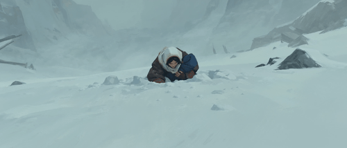

前文我们就有提到，在《Kok Boru》中，狼群代表的是草原意志，所以主创人员在编写提示词时刻意控制动物行为，狼群不应该像怪物一样扑出来，应该从风雪深处逐渐显形；毛发边缘被雪粒吞没，身体轮廓与灰蓝色草原融在一起，只有眼神最先被观众感知。

以下附上狼群追逐的几个片段，大家可以感受感受。

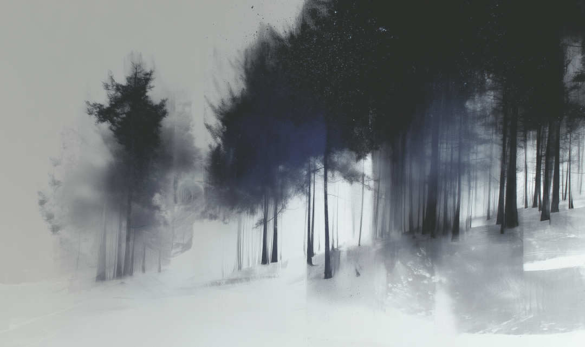

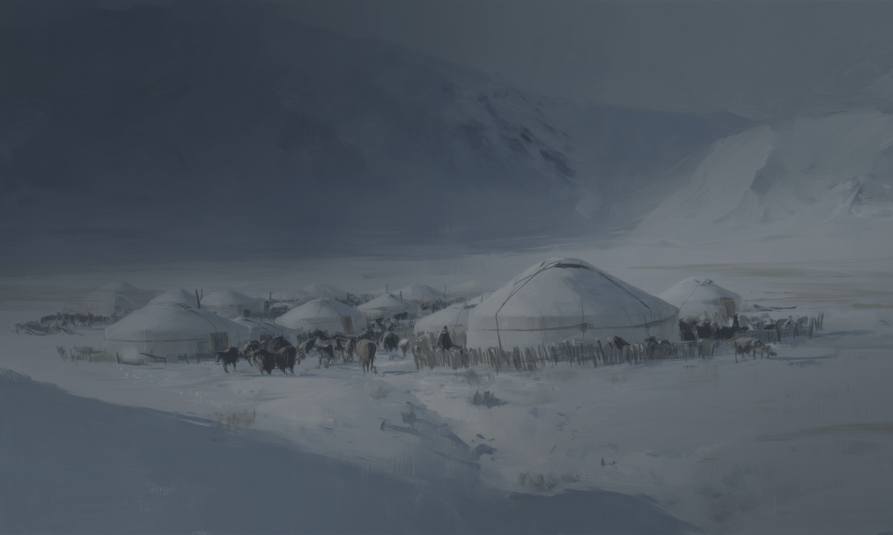

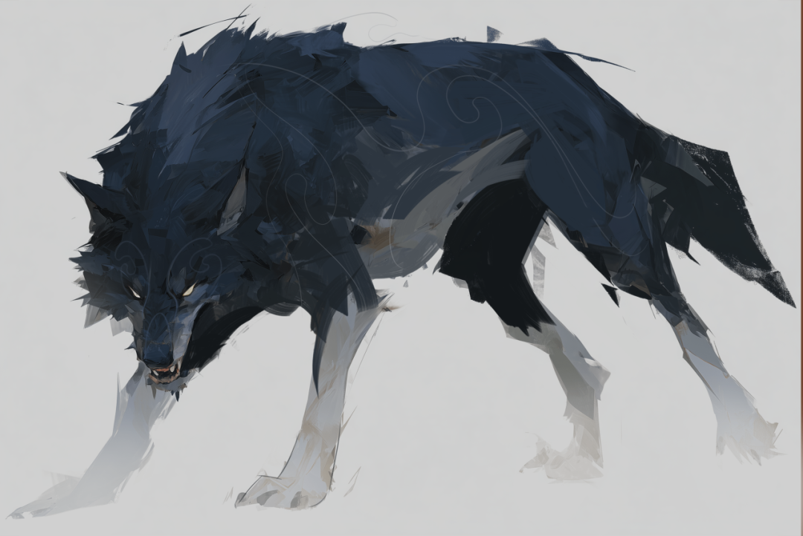

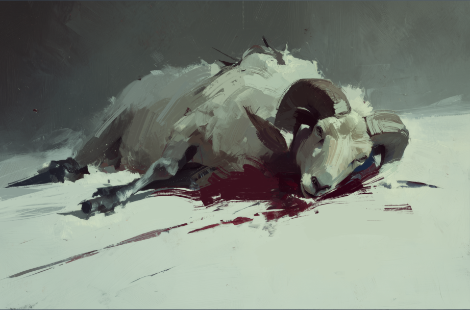

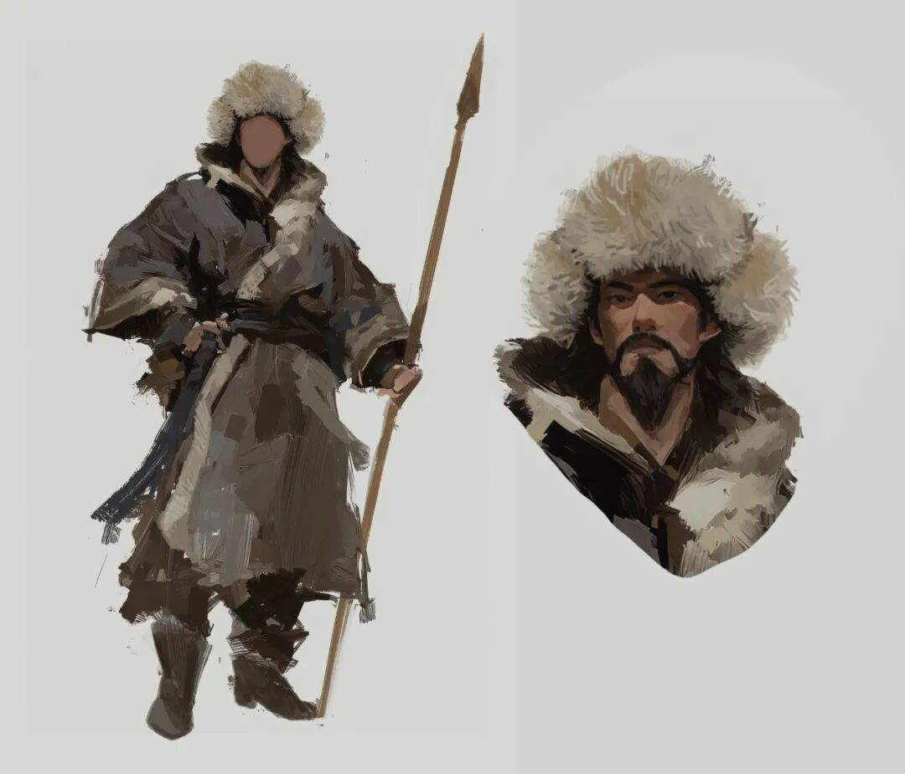

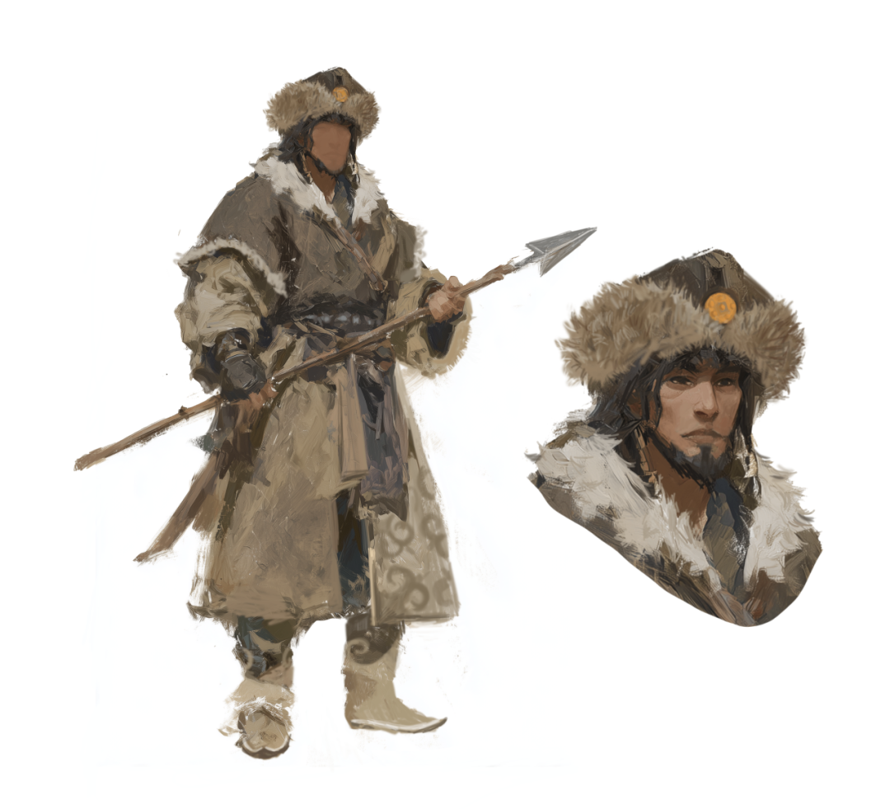

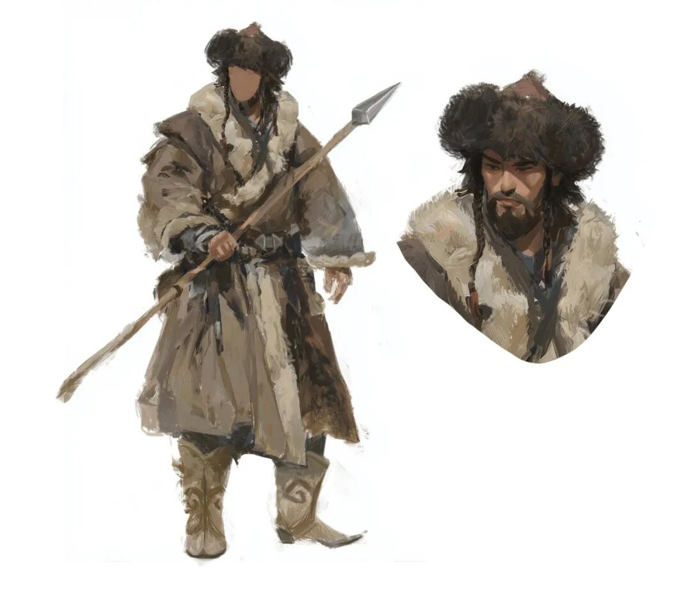

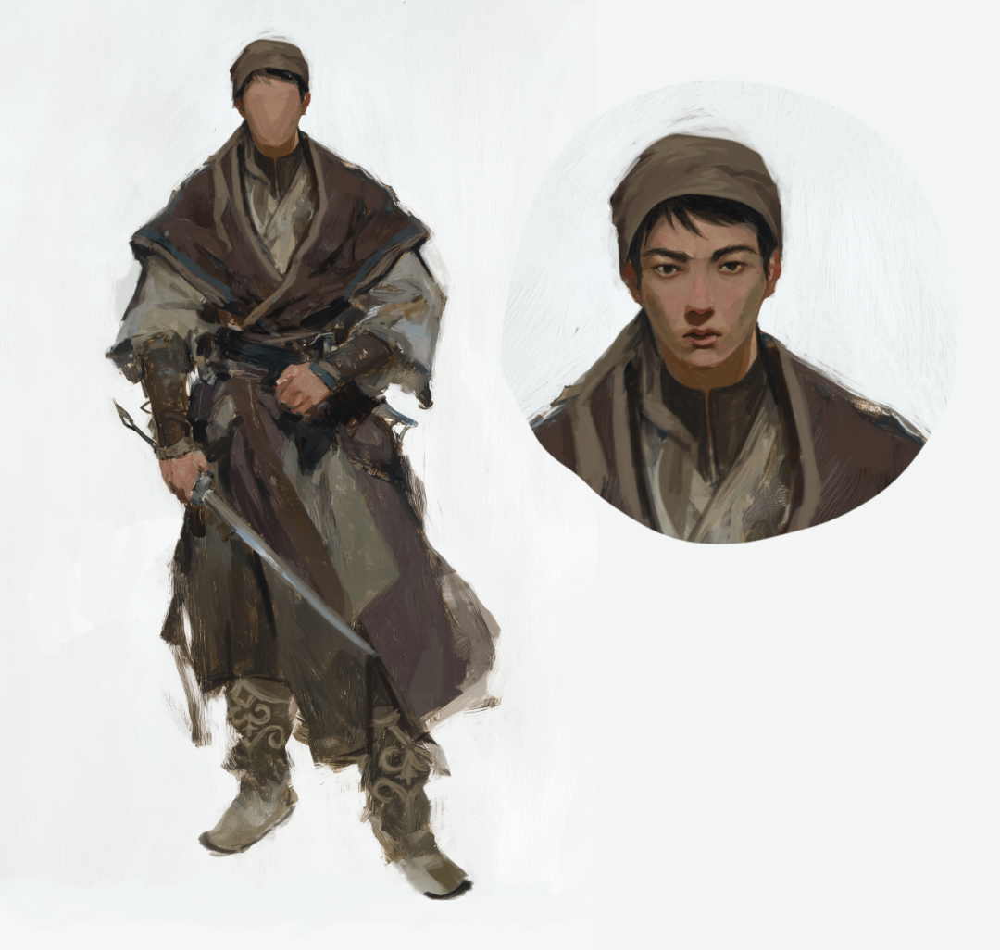

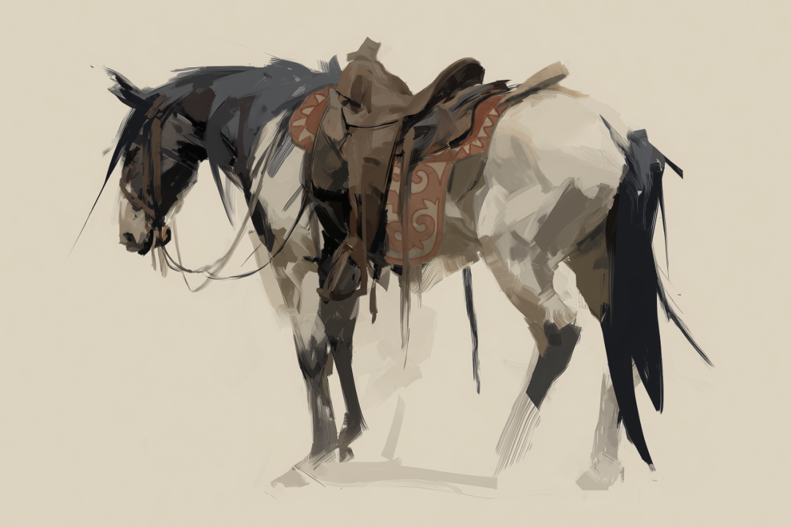

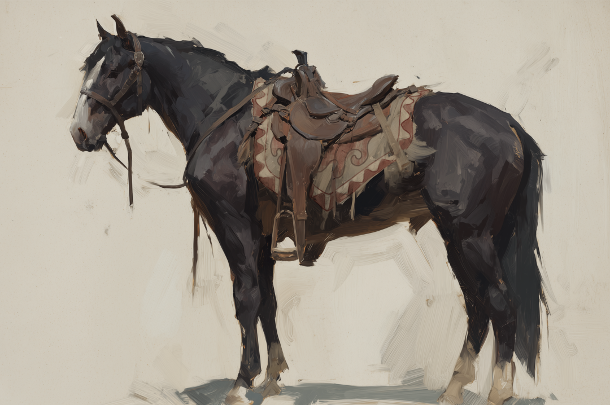

▲ 镜头素材

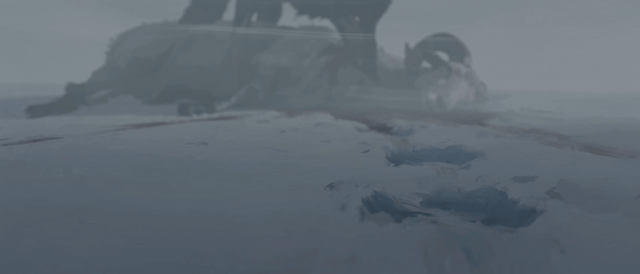

▲ Prompt：

风格：定格动画——逐帧定格，呈现出手绘般的二维效果，宛如一幅会动的油画，而非黏土、木偶或三维动画。每秒12帧，动画制作于两帧之间：每秒12幅独立的手绘画面，每个姿势保持两帧后无缝衔接，绝不拖沓。笔触和轮廓在每一帧中都保持着微妙的动态感，如同沸腾的油画。没有平滑插值，没有运动模糊，没有变形，是真正的逐帧动画，而非人工智能的粗糙处理。风格和画面参考<<<image\_1>>>，场景参考<<<image\_2>>>，死羊参考<<<image\_3>>>，狼参考<<<image\_4>>>——一头瘦削的草原狼，通体漆黑，泛着冷光，双眼苍白。大气运动（狂风呼啸的暴雪、飘扬的飞雪、风暴的薄雾）流畅而连贯；所有描绘的物体——狼、羊尸、羊毛——都以每秒12帧的速度连续移动。

导演笔记：

1\. 场景——一场猛烈的暴风雪。在冬季牧场边缘的雪地上，躺着一具血淋淋的羊尸，半埋在积雪中，深色的血迹冻结在周围的雪里——一只孤狼正站在它上方，悠然地吃着。它平静地、不慌不忙地吃着，完全无视暴风雪——直到有什么东西阻止了它。没有其他狼的踪迹——或许它是孤身一狼，或许是暴风雪掩盖了它。攻击的第一个迹象，威胁本身出现在画面中。捕食者的平静本身就是一种恐怖。

2\. 暴风雪肆虐，能见度极低——能见度仅约20%：厚厚的积雪裹挟着飞雪涌入画面，世界在数米之内便被灰白色的风暴雾霭笼罩，不见树线，不见地平线，不见天空——只有近处的地面清晰可见。暴风雪遮蔽了远处的一切——狼和尸体是白茫茫的雪雾中唯一清晰可见的黑色轮廓。

3\. 摄影机法则（卢贝兹基的拍摄手法）——一镜到底，没有剪辑：一个缓慢而有动力的移动——摄影机从极低的位置开始，几乎贴着雪面，然后缓慢而持续地向上向前移动，就像一个人直起身子去看——当狼从雪中显露出来时，摄影机的上升在低矮的蹲伏高度戛然而止，画面定格：一种刚刚目睹捕食者却不敢轻举妄动的紧张静止。手持摄像机的呼吸声越来越急促，小心翼翼地，几乎屏住了呼吸，微微颤抖。摄像机仿佛一个活生生的人影，置身于风暴之中，飞沫掠过镜头，风轻轻地拍打着画面。只有自然的风暴光。绝不使用云台稳定器，绝不机械化，绝不使用三脚架。镜头始终保持在狼的水平线上。

4\. 狼的进食——真实的动物生理现象，以每秒12帧的速度连续拍摄：狼站在猎物尸体旁，前爪抵住尸体，下颚咬住血肉，用头部、颈部和整个身体向后猛地撕扯下一块肉——尸体随着每一次撕扯而抽搐拖拽，因果关系清晰可见；然后它抬起头，一口一口地吞下撕碎的肉，喉咙蠕动，嘴部被暗淡的血迹染成深色；然后，它停顿了一下——耳朵转动——接着低下头，再次撕咬起来。动作有条不紊，不慌不忙，漠然自若。撕咬的动作利落而迅速，仿佛在快速切换姿势；动作间的静止是绝对的。

5\. 最后的停顿——警觉，倾听——进食完毕后，狼突然猛地抬起头，从猎物尸体上抬起，然后僵住了，整个身体僵硬地停留在半空中——它听到了什么。头抬起，微微侧向一边，耳朵竖起，仿佛在辨别方向，苍白的眼睛凝视着暴风雪，嘴里或嘴上还残留着最后一点血肉，鲜血染红了鼻孔，呼出的气息带着嘶嘶声，撕扯着猎物。它保持着这种警觉倾听的姿势，除了风中飘扬的皮毛和呼出的气息外，一动不动，目光在画面之外的暴风雪中，倾听着我们看不见的东西——看不见的威胁，或是看不见的狼群。它的目光延伸到画面之外的白色之中。紧紧抓住这只静静聆听的狼，直到最后。它听到了什么，我们永远无法看到。

6\. 焦点——焦点集中在狼和尸体上，使它们成为关注的焦点：随着镜头上升，它们从暴风雪中显现出来，焦点始终锁定在它们身上，呈现出柔和细腻的绘画式虚化效果，前景的积雪和远处的暴风雪渐渐消融成一片白色的薄雾，没有出现破坏手绘质感的强烈摄影散景。

7\. 构图法则（画面服务于故事）——空间：扁平、压缩、浅——暴风雪抹去了深度，没有地平线，没有出路。线条：飞雪勾勒出快速的水平风暴线；狼弓着背，在尸体上方形成一条紧张的弧线，在最后一个瞬间，它抬起头，目光凝视，形成一条指向画面外风暴深处的锐利斜线。形状：死羊是一个柔软的圆形物体——而狼在其上方则棱角分明、紧张；棱角分明的物体凌驾于圆形之上。色调：在视觉焦点处达到最大的色调对比——在近乎白色的风暴背景下，形成一个深色的整体。色彩：近乎单色的低饱和度风暴灰；血液暗淡的红棕色——在雪地上和狼的嘴上——是唯一的色彩点缀。运动：运动的对比构成戏剧性——暴风雪快速、水平、平滑地流动；镜头缓慢上升，最终静止。狼尖锐的步伐撕裂着它死寂般的停顿，然后是最后的警觉和彻底的静止。节奏：撕裂——吞咽——寂静，然后节奏被突然警觉的抬头和静止打破。对比与关联：早期的克制强度——威胁存在时的静谧恐惧，以新的警觉的持续音符结束，而非高潮。

8\. 构图式的墨色场景（镜头呈现为群体）——首先将画面解读为群体：一片广阔光线中低矮的黑色群体——棱角分明的捕食者俯视着圆润的猎物。隐藏，而非揭示：暴风雨掩盖了狼群是否在附近，在最后一个节拍中，狼听到了我们听不到的声音——看不见的才是恐怖。镜头高度作为情感表达：从无助的地面高度开始，逐渐升高到低矮的蹲伏高度，与狼的视角保持一致，从未凌驾于其上，也从未占据主导地位。大与小：广袤无垠的无形风暴与狭小黑暗的场景形成鲜明对比。

9\. 光线——暴风雪中昏暗寒冷的暴风雪光线，平淡、柔和、无方向性，没有阳光，没有硬边阴影，没有光线，没有光束，没有神光。正确的白平衡为中性，略微偏冷，没有蓝色调，没有电光蓝滤镜，色调柔和，饱和度低，雪是柔和的暴风灰白色，血是暗沉的红棕色，绝不明亮，绝不反光。

10\. 以12帧/秒的速度拍摄的次要动作——狼的皮毛在风中飘动，尾巴摆动，口中喷出的气息在风中撕裂，尸体的撕裂羊毛飘动，尸体随着每一次拉扯而抽搐和沉降；只有暴风雪、飞雪和薄雾平稳地流动。

镜头——一镜到底的长镜头，焦距约50毫米，拍摄于暴风雪肆虐之中，能见度仅数米。镜头从极低的位置开始，聚焦于雪面：被风吹拂的积雪填满画面，飞扬的雪穗顺着镜头边缘缓缓飘过，隐约可见一抹暗淡的血迹和一处新鲜的、半截狼爪印，远处传来一阵灰蒙蒙的咆哮——而咆哮声中，则传来低沉潮湿的风声。随后，镜头缓缓上升——如同呼吸般持续——从飞舞的积雪中，一团黑影逐渐清晰地出现在画面中：血淋淋的尸体半埋在雪堆里，而狼（见<<<image\_4>>>）正趴在尸体上方进食——镜头停止上升，定格在低矮的俯视位置，呼吸的节奏也随之加快。我们看着：狼用前爪支撑着身体，咬紧牙关，猛地向后一拽，撕下一大块肉，尸体随着这股拉力猛地一震，雪花四溅——它抬起头，苍白的眼睛半睁着，一口一口地吞下那块肉，嘴里沾满了鲜血，呼出的气息在风中翻腾——然后它又低下头，再次撕扯。接着——它猛地抬起头，僵住了：身体僵硬，警觉，耳朵竖起，朝着画面之外的某个方向，苍白的眼睛凝视着暴风雪，嘴里沾满了鲜血，侧耳倾听。它保持着这个姿势，一动不动，只有皮毛和呼出的气息在风中飘动，目光投向暴风雪中我们看不见的地方。构图：狼和猎物的尸体在左下角三分之一处融为一体，形成一团深色的物体；棱角分明的捕食者俯视着柔软圆润的猎物；在画面的最后，狼抬起头，目光锐利地投向右上角的白色区域；画面的其余部分是暴风雪翻滚的灰白色，构成了主要的负空间——没有地平线，没有更远的地方，它听到的声音隐藏在暴风雪中。凝视着这只在咆哮的白色中静静聆听的、僵硬的狼。它突然的静止中蕴含着恐惧。结束。

音频：无配乐，无背景音乐——只有暴风雪的低沉咆哮和嘶嘶声，以及其下狼群进食的湿漉漉的声音：撕扯血肉的沙沙声、轻微的嘎吱声、狼低沉的喘息声、沉重的吞咽声、雪拍打地面的声音——然后，在最后一个音符响起时，进食的声音戛然而止，只剩下狂风中的寂静，狼僵立不动，静静聆听，只有暴风雪和它喘息的声音。无对白，无字幕。只有自然音效，绝对没有音乐。

限制条件：定格动画，每两帧以真正的12帧/秒拍摄，所有绘制和实体部分都呈现出油画般的沸腾效果——每秒12帧，每个姿势保持两帧后快速捕捉，绝不滑行，无平滑插值，无运动模糊，无变形，只有暴风雪的飞雪和风暴雾气流畅连续地流动，采用手绘油画风格（来自<<<image\_1>>>），非照片级真实感，非3D效果，一镜到底，无剪辑——卢贝兹基式摄影机，缓慢而持续的运动，一个鲜活的手持镜头，将人置身于风暴之中，仅使用自然光，镜头从极低的位置几乎贴着雪面开始，然后缓慢而持续地上升，如同一个人直起身子，在狼解决恐惧的那一刻，镜头定格在低矮的蹲伏位置，保持静止，如同不敢动弹的人一般。绝不使用云台稳定器，绝不机械，绝不使用三脚架。从未超越狼的水平，来自<<<image\_4>>>的狼，一只瘦削的、漆黑的草原狼，有着苍白的眼睛，正在啃食来自<<<image\_3>>>的死羊。它以真实的动物物理特性，一步一步地啃食着——前爪支撑着身体，紧咬着下颚，用力地向后拉扯，撕扯着羊尸。每一次拉扯都伴随着羊尸的抽搐和拖拽，因果关系清晰可见。然后它抬起头，一步一步地吞咽，接着又低下头，再次撕扯。动作有条不紊，不慌不忙，漠然自若。最后，它突然警觉地抬起头，僵硬地停在半空中，耳朵竖起，朝着画面外的某个方向。苍白的眼睛注视着暴风雨，倾听着，除了皮毛和呼吸的蒸汽外，它一动不动，凝视着我们看不见的东西。它的目光延伸到画面外的白色区域，它听到的东西从未被展现出来。镜头始终聚焦在狼和羊尸上。单一的注意力从暴风雪中显现，柔和微妙的绘画式衰减，没有强烈的散景。暴风雪肆虐，能见度仅约20%，厚重的积雪裹挟着大雪，世界在几米之内消融于灰白色的风暴雾霾中。没有树木，没有地平线，没有天空，只有狼和尸体是画面中唯一清晰可辨的暗色轮廓。构图法则：扁平压缩的空间，狼拱起的背脊构成一条紧张的线条，它最后抬起的目光，一条锐利的画外视线。圆润的猎物尸体位于棱角分明的捕食者下方，色调对比最大，白色近乎单色的调色板上，暗沉的血迹是唯一的色彩点缀。运动对比：快速平滑的水平暴风雪与静止的镜头形成鲜明对比。狼急促的进食动作，以及它最后突然警觉的瞬间，冻结了节奏——泪水、吞咽、寂静，然后被压抑的警报声打破。克制的早期弧线，静谧的恐惧，最终以新的警报声结束。构图：广阔光场中，一个暗色的物体，棱角分明。圆润的“隐藏”而非“揭示”：暴风雨掩盖了狼群和狼，它们听到了我们无法听到的声音。镜头高度从无助的地面逐渐降低到与狼平视的高度。大小对比并不占主导地位，巨大的暴风雨与狭小的场景形成鲜明对比。左下角的巨浪是焦点，最终的视线指向右上角的白色负空间。昏暗、扁平、无方向的暴风雨光线，没有光线，没有光束，没有刺眼的阴影。正确的中性白平衡，略微偏冷，没有蓝色调。柔和的低饱和度色调，血液深沉，从不明亮，也不闪亮。次要动作以两两一组呈现：狼的皮毛和颈毛，尾巴的波浪状起伏，搅动着呼吸的水汽，撕扯着羊毛，尸体随着每一次拉扯而抽搐和沉降。残酷的场面被精心安排，而非停留，通过动作、体量和声音而非解剖细节来展现。咆哮的暴风雨中弥漫着静谧的恐惧，最终定格在静静聆听的狼身上。没有音乐，只有风声和进食的湿漉漉的声音。

下滑查看更多

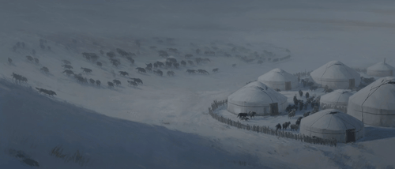

▲ Prompt：

风格：定格动画——逐帧定格，呈现出手绘二维的质感，宛如一幅会动的油画，而非黏土、木偶或三维动画。每秒12帧，动画制作于两帧之间：每秒12幅独立的手绘画面，每个姿势保持两帧后立即切换到下一帧，绝不拖沓。笔触和轮廓在每一帧之间都保持着微妙的动态感，如同油画般鲜活。没有平滑插值，没有运动模糊，没有变形，是真正的逐帧动画，而非人工智能的粗糙之作。风格参考<<<image\_1>>>，蒙古包营地参考<<<image\_2>>>，狼群参考<<<image\_3>>>——体型精瘦的草原狼，通体漆黑，泛着冷冽的光泽，眼神苍白。牧人参考<<<image\_4>>>（步行）。骑手 1（来自 <<<image\_5>>>）骑着他的马（来自 <<<image\_6>>>）——保持此人与马为一体。骑手 2（来自 <<<image\_7>>>）骑着他的马（来自 <<<image\_8>>>）——保持此人与马为一体。切勿让骑手们骑到彼此的马上。大气运动（吹雪、暴风雪雾霾）流畅自然；人物、马匹和狼群成对出现，并辅以次要动作。

导演笔记：

1\. 场景——黄昏，暴风雪席卷哈萨克毡房营地。狼群袭击了牲畜群。恐慌爆发：牧人发出警报，人们四散奔逃，骑手 1 第一个骑上马鞍，第一个冲入暴风雪中，骑手 2 紧随其后，大声指挥。

2\. 能量逐渐增强——画面从恐惧逐渐演变为混乱：黑狼在马群中现身，随后是一声嘶吼，接着是爆发式的跃马和疾驰。每个镜头都比前一个更具能量。

3\. 骑手1是领头人——给骑手1一个清晰可辨的节奏：他是第一个跃上马鞍（<<<image\_6>>>），也是第一个冲出营地，带领马群冲锋陷阵的人，他神情严肃而沉默，脸上短暂地露出表情，让观众再次认出他。骑手2一边喊叫一边上马，紧随其后。

4\. 激烈的手持拍摄——摄像机在慌乱中由人操控：持续的躁动、生硬的修正、奔跑的脚步带来的垂直弹跳、阵阵狂风的冲击、地平线永不水平、画面始终无法稳定、无法使用三脚架。原始的纪录片式混乱。

5\. 真实的物理效果——马匹因负重而后退和腾跃，骑手费力地跃上马鞍，马蹄和靴子扬起的积雪如同飞溅的松散粉尘（以两帧画面呈现雪花飞溅效果），衣衫和鬃毛在风中猎猎作响。

6\. 二次动作效果——裙摆和皮帽猎猎作响，马鬃和马尾飘扬，人和马的呼吸被风吹散，马具带摆动。

7\. 光线——暴风雪中暮色渐浓，昏暗寒冷的蓝灰色暴风雨光线柔和而漫射，没有光束，没有神光；一两团摇曳的火炬火焰如同温暖的细小点缀，在风中猎猎作响。正确的白平衡为中性，未使用蓝色滤镜，色彩柔和且饱和度较低，狼群近乎漆黑。

镜头 1 — 广角，约 35 毫米焦距，手持拍摄，黄昏时分，大雪纷飞，蒙古包营地。构图：画面右下角三分之一处，浅色圆顶蒙古包低矮耸立；左侧三分之一处，惊慌翻腾的兽群如同一团躁动不安的暗色巨兽——在兽群边缘，从<<<image\_3>>>处，隐约可见的狼影在雪雾间快速穿梭，如同暗流涌动，色调和步伐变化多端，既非镜像，也非复制。暴雪薄雾缓缓飘散，人影和动物成双成对地移动。兽群奔腾咆哮，能量涌动。

镜头一转至第二幕——中景，约35毫米胶片，手持拍摄，镜头快速移动，牧羊人（<<<image\_4>>>）在雪地里踉跄着冲向镜头，他挥舞着手臂，头巾和皮帽随着动作猎猎作响，呼出的气息撕裂空气，发出嘶哑的嘶吼，在风中嘶吼着：

“Böri-i-iler!! BÖRILER!!!”

他身后有人慌忙逃窜，火把的火焰挣扎着拍打着。雪从他的靴子里喷涌而出，像两片雪花般飞舞。

镜头硬切至第三幕——中景，约50毫米焦距，在混乱中手持拍摄，镜头对准骑手1：他飞奔到马前（<<<image\_6>>>），马儿沉重地转过身来，他以两个硬朗的步伐跃上马鞍，神情严肃而沉默，在火炬的光芒下，他饱经风霜的脸上一闪而过——然后他猛地调转马头，用马刺鞭策，第一匹马冲入暴风雪中，雪花从马蹄间飞溅而出，他的马帽和鬃毛随着风的吹拂飘扬。在他身后，骑手2（<<<image\_7>>>）翻身上马（<<<image\_8>>>），对着狂风嘶哑地喊道，嘴唇紧抿：

“Attardy qutqar!!”

镜头切换至第四幕——广角，约35毫米胶片，手持拍摄，画面极具冲击力，展现营地边缘：骑手1已化作一团黑色的身影，全速疾驰，冲向左上方的暴风雪，领头；骑手2和一两个身影模糊的骑手紧随其后，从右下方疾驰而来，马蹄敲击着地面，扬起漫天飞舞的雪尘，鬃毛、马尾和马帽成双成对地飘扬，苍白的蒙古包在雪雾中渐渐远去，前方黑暗的暴风雪如同他们奔向的负空间。镜头摇晃，地平线倾斜。马蹄声被狂风吞噬。结束。

音频：无配乐——暴风雪的咆哮，惊恐的马匹嘶鸣跺脚，牧人的嘶吼，人们的呼喊，马蹄声渐渐消失在暴风雪中，远处传来狼的咆哮声。无字幕。只有自然音效，绝对没有配乐。

限制条件：定格动画，每两帧以两步为单位的步进节奏，画面呈现油画般的沸腾效果；人物、马匹和狼群以步进的方式移动，绝不滑行；不使用平滑插值、运动模糊或变形；暴风雪的雾气和吹雪效果平滑自然，所有生物和绘制的雪花飞溅效果均以两步为单位移动；采用手绘油画风格（参考<<<image\_2>>>），非照片级写实，非3D；四个镜头采用硬切，能量逐渐增强——广角镜头展现狼群围攻狼群，中景镜头展现狼群发出凄厉的警报声“Böriler!!”。出自《牧人》<<<image\_4>>>，中等画幅，骑手1<<<image\_5>>>跃上马背<<<image\_6>>>面色阴沉，沉默不语，一拍即知，策马疾驰而去，骑手2<<<image\_7>>>也跃上马背<<<image\_8>>>高喊“Attardy qutqar!!”，画面宽广，骑手们冲入暴风雪中，骑手1领头——每位骑手都骑在自己的马上，两人之间互不混杂，手持拍摄，画面充满张力，持续不断的剧烈运动，垂直弹跳，风吹拂，地平线忽明忽暗，永不平稳，永不如云台般平滑，真实的物理效果，马匹腾空腾跃，骑手奋力跃起，扬起的雪花，松散的粉雪飞溅，次要动作，双人并肩，皮帽、鬃毛、尾巴、马具，呼出的气息，所有动作都伴随着挥舞的动作，黄昏暴风雪，昏暗寒冷的暴风雪，光线柔和，没有光线，没有光束。火炬火焰如同温暖的鞭状点缀，正确的中性白平衡，而非蓝色滤镜，柔和的去饱和度，来自<<<image\_3>>>的狼群各具特色，从未镜像，从未克隆，哈萨克语口语采用拉丁字母转写，发音与书写一致，而非俄语口音，没有音乐，只有暴风雨和人声。

下滑查看更多

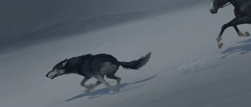

▲ Prompt：

风格：定格动画——逐帧动画，呈现出手绘2D风格。真正的12帧/秒，采用双帧动画技术：每秒12帧独立的手绘画面，每个姿势保持两帧，然后迅速切换到下一帧，绝不拖沓——即使在全速奔跑时，动作也以手绘动画特有的闪烁节奏逐帧呈现。持续的绘画感。没有平滑插值，没有运动模糊，没有变形，真正的逐帧动画，而非AI的粗糙处理。风格参考<<<image\_1>>>，狼群参考<<<image\_2>>>，骑手1参考<<<image\_3>>>，骑着他的马参考<<<image\_4>>>——始终是同一位领头骑手和同一匹马，从未更换过马匹或骑手。黄昏雪原参考<<<image\_5>>>。暴风雪的薄雾和漫天飞舞的雪花平滑地飘落；人物、马匹、狼群以及绘制的雪花飞溅效果成对出现，并伴有次要动作。

导演笔记：

1\. 场景——黄昏暴风雪中，一场残酷而迅猛的追逐。领头的骑手1追逐着一匹疾驰的狼，他像科克博鲁（kok-boru）乐手伸手去抓乌拉克（ulak）一样，从马鞍上俯身，抓住狼的颈背——狼扭断了他的手臂，围攻起来。第二匹狼从他的盲侧袭击了他。他被狼群从马鞍上猛扑下来，狼群蜂拥而至。场面野蛮而动感，运用了真实的物理原理，并展现出清晰的因果关系——每一处伤口都有其在屏幕上的对应原因。

2\. 真实的物理和因果关系——马（<<<image\_4>>>）以真实的四拍节奏奔跑；骑手1低低地挂在马鞍侧面，一只手撑着，向下伸去；狼是一头沉重的动物——被抓住时，它会在奔跑中扭动整个身体，这种扭动的重量加上咬合的重量使骑手失去平衡；屏幕上显示了咬合的画面：狼颚咬住并挤压他的前臂，撕裂袖子和血肉，鲜血呈暗色——原因总是在结果之前；第二头狼从他的盲侧猛扑过来，像导弹一样猛击他的胸膛；他被从马鞍上甩下来，以疾驰的速度重重地摔在雪地上，并带着惯性翻滚，松散的粉雪在每次撞击周围飞溅（雪雾效果以两两一组的方式呈现），而没有骑手的马继续奔跑；狼群汇聚成一股迅猛的暗流，蜂拥而至，将他淹没，形成一团凶猛翻腾的黑色巨兽。

3\. 紧张场面，而非拖沓——快速、猛烈且极具冲击力：狼群围攻时发出的声响、雪地上血迹斑斑的暗色、狼群的蜂拥而至。通过动作、黑暗的巨兽群和声音来展现野性，而非缓慢的解剖细节。

4\. 极具侵略性的手持追逐镜头——与他并肩疾驰，随着速度剧烈摇晃，被风吹得东倒西歪，镜头不断急转，地平线倾斜，永不保持水平；坠落时，镜头猛烈倾斜，仿佛世界也随之崩塌。绝不使用云台稳定器，也绝不使用三脚架锁定。

5\. 辅助动作（双人镜头）——骑手1的短裙和皮帽随着动作摆动，马鬃和马尾飘扬，狼背上的皮毛也随之起伏，马具摇摆，人马呼出的气息在风中飞舞，马蹄扬起的雪花如同粉雪般飞舞。

6\. 光线——暴风雪中的深暮，昏暗寒冷的蓝灰色暴风雨光线，柔和，没有光束，没有神光，人影在苍白的雪地上形成深色的阴影。正确的白平衡为中性，未使用蓝色滤镜，色彩柔和且饱和度较低；血液呈暗淡的红色，在雪地上清晰可见，但绝不闪亮。

镜头1——全速奔跑追踪，约35毫米胶片，手持拍摄，画面极具冲击力。构图：骑手1骑着马，如同一个庞大的黑色身影从画面右侧三分之一处疾驰而来；一头狼在他前方左侧三分之一处低空疾驰，两者均以对角线方向掠过画面左侧深处——追逐的对角线构成了动态线；远处被暴风雨照亮的苍白雪原（来自<<<image\_5>>>）掠过，形成负空间。骑手1以“kok-boru”式的倾斜姿势从马鞍侧面俯身而下，一只手撑在马鞍上，另一只手臂向下伸去抓狼的后颈，他的马鞍和马鬃随着马蹄扬起阵阵风浪，马蹄扬起阵阵雪尘。他龇牙咧嘴，嗓音沙哑，嘴唇紧贴着地面：

“Ustadym！……”

他的拳头猛地抓住狼的颈背——

镜头硬切至第二幕——近景特写，约50毫米胶片，手持拍摄，镜头猛烈地拉近：狼被抓住，在迈步的过程中猛地扭动着沉重的身躯，一个暴力的动作——它的利齿狠狠地咬住了骑手1的前臂，撕裂了袖子和血肉，暗色液体飞溅到雪地和狼的嘴上。他嘶哑的尖叫声撕裂了风。狼的扭动和撕咬使他失去平衡，身体被拖出马鞍一半，皮帽也被撕扯下来。因果关系残酷而清晰，一切都紧贴着地面。

镜头一转至第三镜头——中广角，采用大角度倾斜镜头，焦距约35毫米，手持拍摄：第二只狼从他视线盲区扑来——如同黑色导弹——猛地撞向他的胸口。骑手1被甩下马鞍，以疾驰的速度重重摔在雪地上，翻滚着，带着巨大的动能，每次撞击都激起粉雪，形成两两一组的特效，地平线倾斜摇晃，他那匹无人骑乘的马（<<<image\_4>>>）继续奔向暴风雪。接着，狼群涌来——一群毛色各异的狼从<<<image\_2>>>的暴风雪中疾驰而来，如同一道快速的黑色洪流，从四面八方汇聚，将他淹没，在苍白的雪地上形成一片凶猛的黑色巨兽，暗色液体四溅，雪花飞舞，他的呼喊声被暴风雪和狼嚎声吞噬。狼群的黑色身影将他包围，将他困住。在呼啸的狂风中，他发出一声残酷的喘息。结束。

音频：无音乐——暴风雪的咆哮，马蹄的重击，狼的嘶吼和撕咬的湿漉漉的嘎吱声，骑手的嘶吼，马匹翻滚的重重撞击，狼群汇聚的咆哮，狂风吞噬一切。无字幕。只有自然音效，绝对没有音乐。

限制条件：定格动画，每两帧以12帧/秒的步进节奏拍摄，即使在全速奔跑时也保持绘画般的流畅感；所有动作都是一步一步地从一个姿势过渡到另一个姿势，绝不滑行；不使用平滑插值、运动模糊或变形；暴风雪的雾气效果平滑，所有人物、动物和绘制的雪花喷溅效果均以两帧为单位进行；采用手绘油画风格，取自<<<image\_1>>>，非照片级真实感，非3D效果，非光泽效果；三个镜头采用硬切——全速奔跑的追踪镜头，伴随着马匹的倾斜动作和“Ustadym!”的抓握声；狼的扭曲动态特写，以及屏幕上血肉模糊的撕咬和惨叫；第二只狼全身猛扑，高速翻滚，狼群像一团野蛮的黑色巨兽般围攻它——骑手1取自<<<image\_3>>>，他的马取自<<<image\_4>>>，每个镜头中都是同一对人马。交换，真实的物理效果和可见的因果关系，屏幕上的每一处伤口，狼的扭转重量拉扯着骑手，暗色液体流淌前的撕咬，坠落前的猛烈撞击，以及翻滚的动量，激烈的手持拍摄，颠簸的狂风，地平线永不水平，坠落时剧烈的荷兰式倾斜，绝不如云台般平稳，次要动作，成双成对出现，狼皮帽、鬃毛、尾巴、狼皮、马具、呼吸蒸汽，所有动作都伴随着后续动作，来自<<<image\_2>>>的狼，毛色、体型和步幅各不相同，绝不镜像，绝不克隆，深邃的黄昏，暴风雪，昏暗的寒冷风暴，柔和的光线，没有光束，没有光束，正确的中性白平衡，没有蓝色滤镜，柔和的低饱和度，暗淡的血液，绝不明亮，绝不闪亮，残酷，快速、坚硬、充满力量，通过运动呈现，黑暗的体积和声音，哈萨克语口语，拉丁字母转写，发音与书写一致，没有音乐，只有暴风雨般的蹄声、咆哮声和尖叫声。

下滑查看更多

像这样的镜头在创作中还有很多。

至此，画面有了，笔触有了，故事也能立住，《Kok Boru》从一段“好看的动画”变成一部“完整电影预告”就只剩最后一步——后期那些看不见的功夫。

调色工作由Higgsfield的调色师**逐帧手工调整**，确保全片在色彩、基调和氛围上保持统一的呼吸感。

预告片采用了**Artlist**授权的音乐，曲目经过反复比对，只为贴合影片的情感脉搏，而最终成片将换上专为本项目创作的原创配乐。

音效设计则被当作一种叙事手段来对待，**预告里每一条音轨都经过人工清理、精修**，风声、蹄声、狼嚎声层层叠加，与画面相辅相成，才打磨出这部电影化的视听体验。

到这里我们就能看出，**现在已不是提示词短短几行的描述就可以撑起全片的时代了。**

▲ Higgsfield新作《Kok Boru》制作流程图（由小编整理）

**它越来越像导演案头工作的一部分，剧本、分镜、表演、摄影、动作、配音和后期，全部被压缩进一套可被模型理解的电影语言里。**

也许我们关注的焦点也应该在此。

从**《Zephyr》**到**《Hell Grind》**，Higgsfield一直在证明AI影视可以更快、更大、更工业化。K-pop机甲女团、95分钟长片、戛纳放映。他们几乎是踩着油门冲进了AI电影的新赛道。

但到了《Kok Boru》，它突然把问题变得更安静，也更接近创作本身：**当一个团队拥有了生成风雪、狼群、草原和大规模动画镜头的能力，他们最应该讲什么？**

不是再复制一个好莱坞大片，而是回到自己的记忆、土地和传说里。

AI不是万能的，它仍需要剧本设定、审美设计。它偶尔也会犯错，会把笔触磨平，但它正在变成一支新的画笔。

**这支画笔不只属于像Higgsfield这样的平台，也属于那些过去被预算、团队规模和制作周期卡脖子的创作者们。**

这支画笔最终画出的，无论是更逼真的奇观，还是更写实的故事**——都不只取决于算力，关键是执笔之人。**

**以及，心里一片没有被画出来的草原。**

**

_**END**_

**

****

**你一定还感兴趣：**

[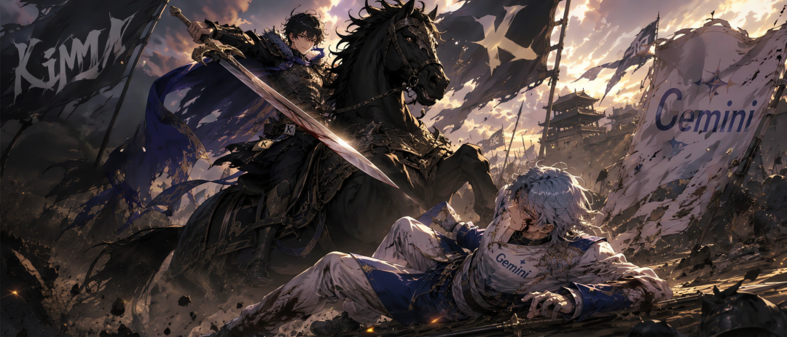](https://mp.weixin.qq.com/s?__biz=MzAwNjAyMzczNQ==&mid=2651421940&idx=1&sn=1a4cc0183851eacc91cb34d48c2de092&scene=21#wechat_redirect)

# [谷歌新模型翻车上热搜，成了“北美御三家”第一个被干掉的?](https://mp.weixin.qq.com/s?__biz=MzAwNjAyMzczNQ==&mid=2651421940&idx=1&sn=1a4cc0183851eacc91cb34d48c2de092&scene=21#wechat_redirect)

# [成本砍半、效率翻倍、300部已用！Netflix撕开了AI影视的底裤，然后呢？](https://mp.weixin.qq.com/s?__biz=MzAwNjAyMzczNQ==&mid=2651421919&idx=1&sn=674bf8e4be034c277dc41f1911272efd&scene=21#wechat_redirect)

# [当IP开始认真算账，不会算的人正在出局](https://mp.weixin.qq.com/s?__biz=MzAwNjAyMzczNQ==&mid=2651421919&idx=2&sn=08916200995b3f36449ffc704903cbbd&scene=21#wechat_redirect)

[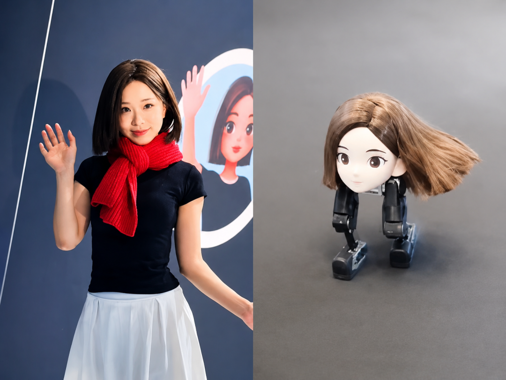](https://mp.weixin.qq.com/s?__biz=MzAwNjAyMzczNQ==&mid=2651421500&idx=1&sn=f1ecca8c114bfc96a7d1d42d36225833&scene=21#wechat_redirect)

# [机器人开始抢饭碗，碳基生物还排队投简历，今年最大的赛博庙会](https://mp.weixin.qq.com/s?__biz=MzAwNjAyMzczNQ==&mid=2651421500&idx=1&sn=f1ecca8c114bfc96a7d1d42d36225833&scene=21#wechat_redirect)

[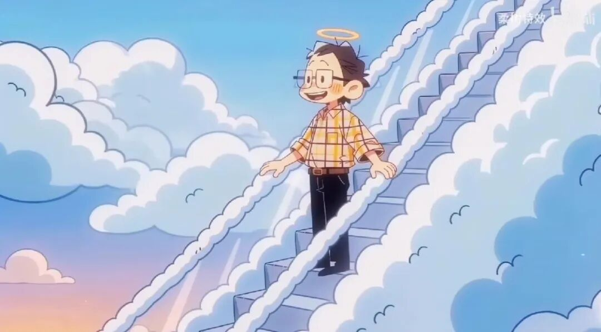](https://mp.weixin.qq.com/s?__biz=MzAwNjAyMzczNQ==&mid=2651421413&idx=1&sn=4198ce85ad59e26f71ad8b3755005dca&scene=21#wechat_redirect)

# [一个广州人独自做出的AI动画，凭什么让全网破防？](https://mp.weixin.qq.com/s?__biz=MzAwNjAyMzczNQ==&mid=2651421413&idx=1&sn=4198ce85ad59e26f71ad8b3755005dca&scene=21#wechat_redirect)

#

都看完了～快来给动画人点亮

再唠两句互动一下，来波友谊“三连击”⬇⬇⬇