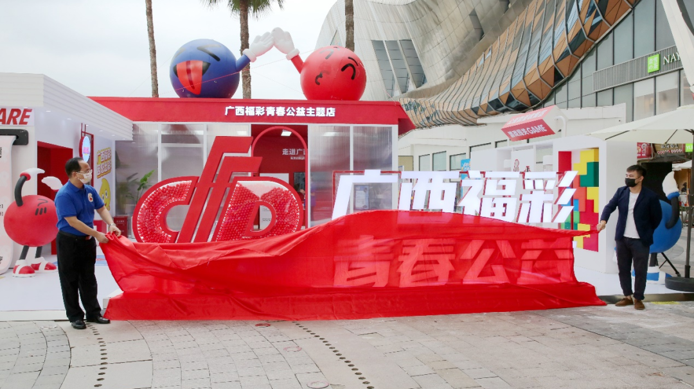
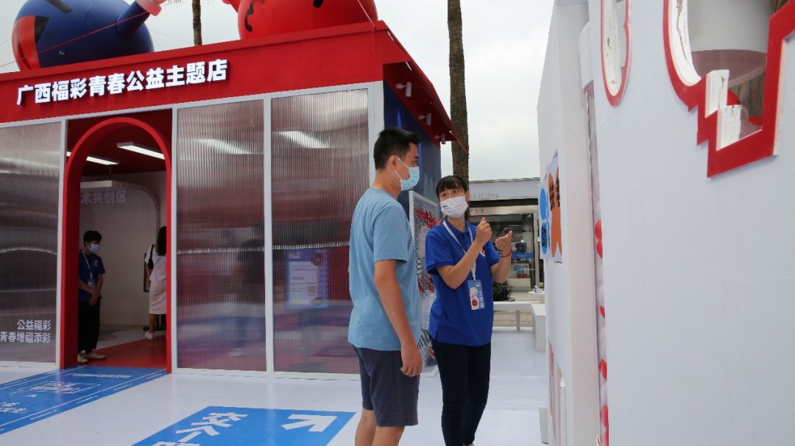
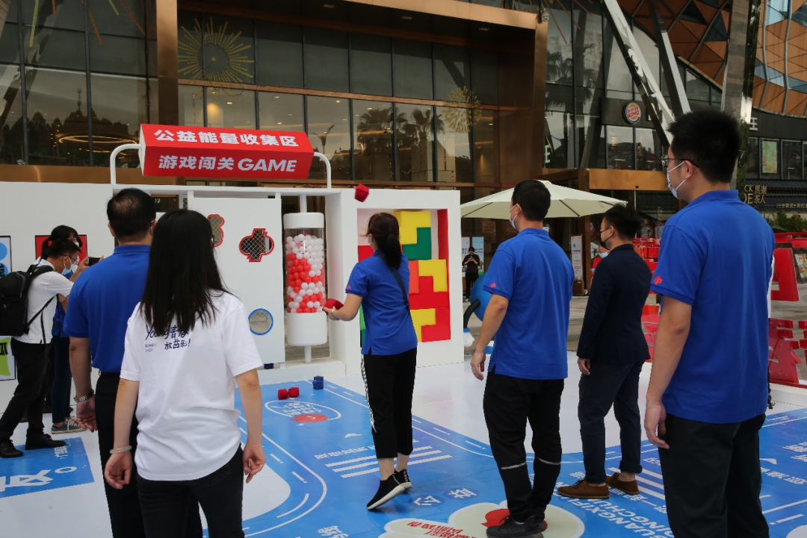
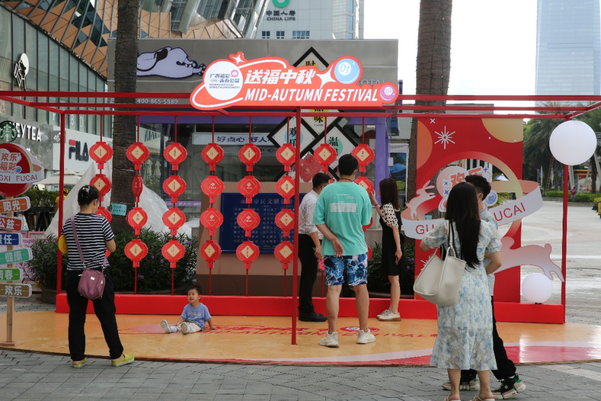
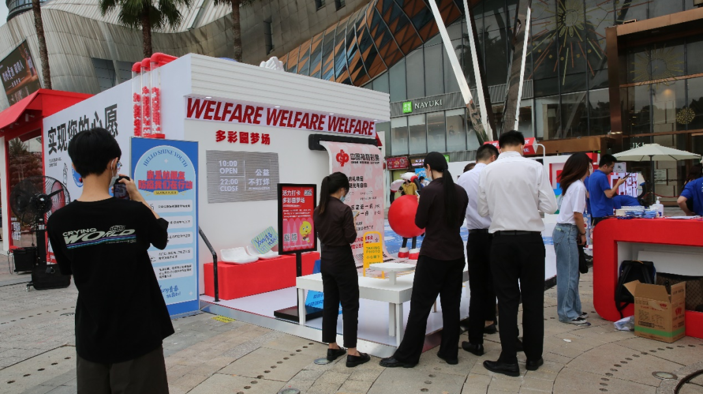
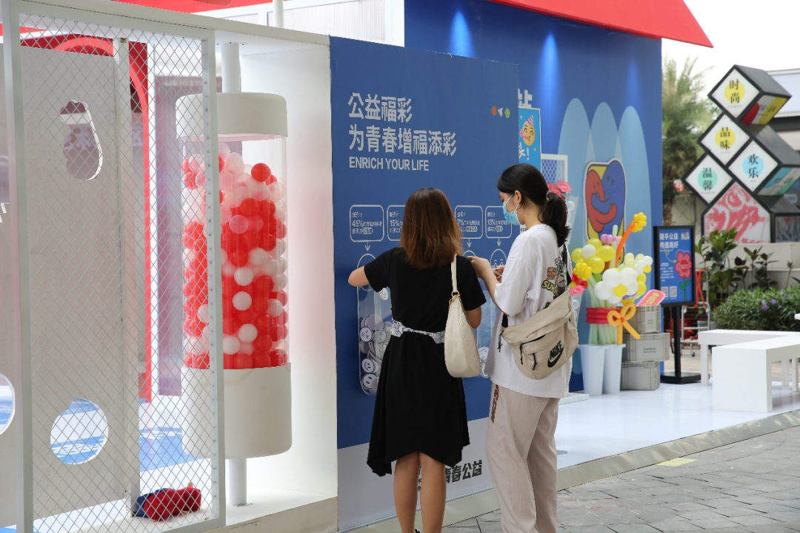
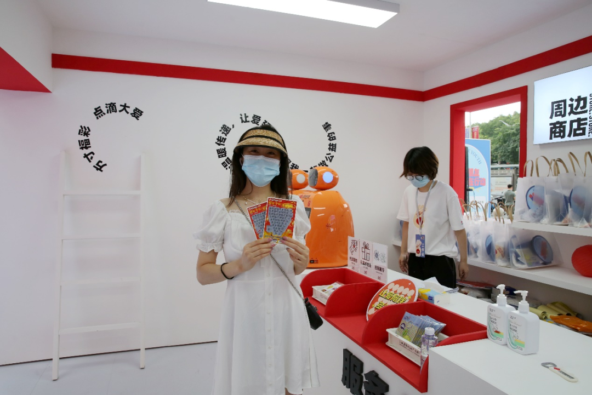
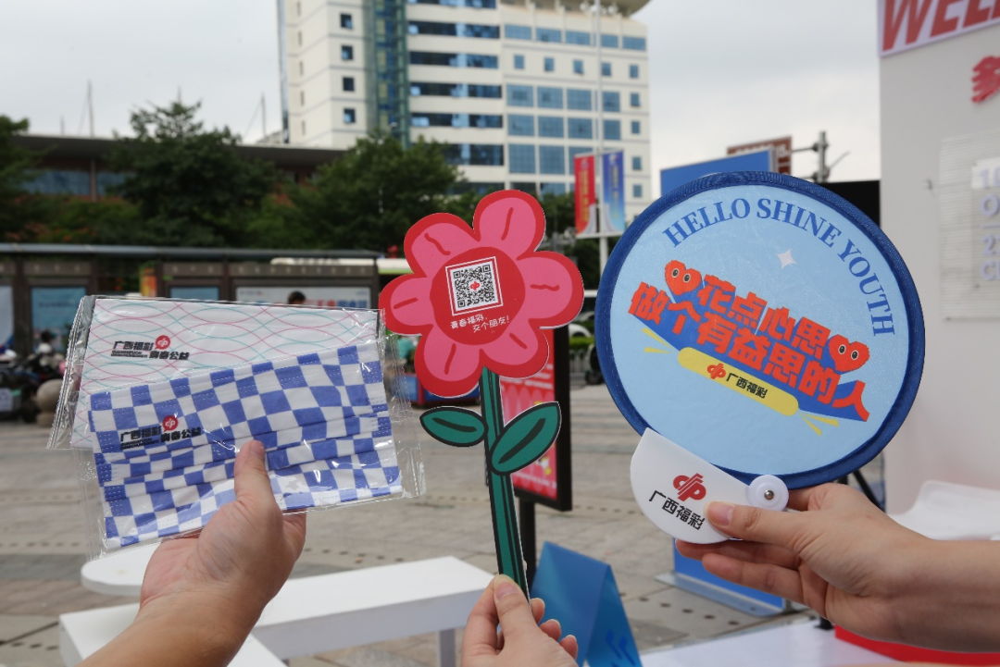
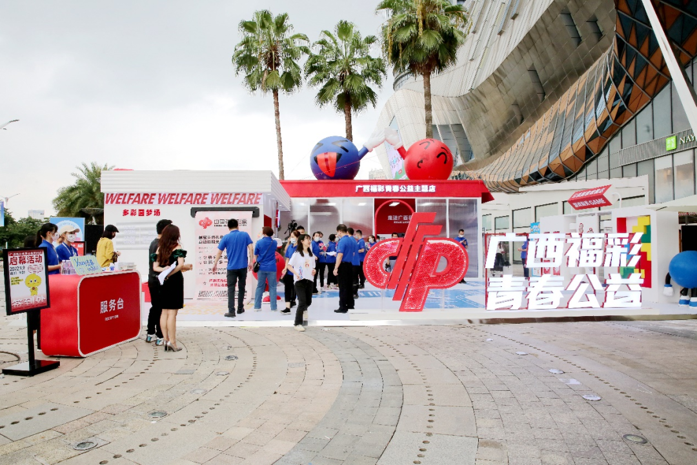
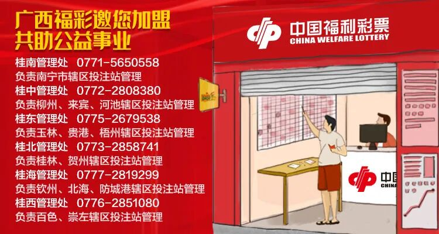

# YOUNG青春·放益彩！ ——广西福彩公益地推活动在南宁拉开帷幕
> 公众号: 广西福彩
> 发布时间: 2022年9月15日 18:23
> 原文链接: https://mp.weixin.qq.com/s/0TglxSNob4xsEeV-deHzDQ

---

一起来玩吧！

YOUNG青春·放益彩！

——广西福彩公益地推活动在南宁拉开帷幕

**2022年**

**9月9日**

_**公益快闪**_

“公益福彩·为青春增福添彩”

一起来玩吧！

已关注

关注

重播 分享 赞

**观看更多**

广西福彩

0/0

00:00/00:30

进度条，百分之0

播放

00:00

/

00:30

00:30

倍速

_全屏_

倍速播放中

0.5倍 0.75倍 1.0倍 1.5倍 2.0倍

超清 流畅

<video src="https://mpvideo.qpic.cn/0bc3xmaauaaajiapvqrctrrvbo6dbk5qacqa.f10002.mp4?dis_k=5e8a759deee728f419dae031f24dfb93&dis_t=1785481423&play_scene=10120&auth_info=Xcrb05IjcHZe4+HM7iYDRlF3OzVIGDw6HjMta0x1PRlhV1w8Um8PDC99aQ9/GA9l&auth_key=4d9139ad8ee9ca0af6afad590898fa5d&vid=wxv_2577685328097722370&format_id=10002&support_redirect=0&mmversion=false" controls poster="http://mmbiz.qpic.cn/mmbiz_jpg/E41P97iczHD1schmwM7q20GkG3XHXZBicfXD0r4jfiawTFkGN2FYvHYy7MXpiawd03Hh21UctqQ6SBDDSyqNrUDUVw/0?wx_fmt=jpeg&wxfrom=10016"></video>

继续观看

YOUNG青春·放益彩！ ——广西福彩公益地推活动在南宁拉开帷幕

转载

,

YOUNG青春·放益彩！ ——广西福彩公益地推活动在南宁拉开帷幕

广西福彩

已同步到看一看写下你的评论

视频详情

　　2022年9月9日上午，由广西福利彩票发行中心主办的“公益福彩·为青春增福添彩”地推活动，在南宁市航洋购物中心举行。为响应疫情防控要求，此次活动采取户外开放式街区主题公益快闪店的形式，让广大市民在感受到阳光青春、丰富有趣的公益互动同时，最大程度避免人群聚集。

出席开幕式的领导拉开“广西福彩青春公益主题店”帷幕

　　整场活动以“公益福彩·为青春增福添彩”为主题，借由新颖的“市集”、“快闪店”路演形式，现场打造了年轻活力个性的主题店，设置有鲜花投助站、多彩圆梦场、个性福彩公益斑马线、心愿盒子、公益能量收集闯关体验5个打卡点。通过网红场景体验、打卡传播分享，让更多市民朋友与福利彩票建立情感共鸣，走进福彩，认识福彩，共享欢乐，传递公益。此次广西福彩中心提出的“YOUNG青春·放益彩”活动口号，意在让福利彩票品牌形象年轻化，并将中国福利彩票“扶老、助残、救孤、济困”的发行宗旨和“理性购彩、量力而行”的购彩理念传播给新一代的年轻群体。

_HOT   HOT  HOT   HOT  HOT   HOT  HOT_

_活动部分现场_

工作人员向市民讲解打卡活动规则

体验公益能量收集

适逢中秋佳节前夕，活动现场还设置有互动体验

快乐加倍

体验打卡点

市民们纷纷扫码打卡

　　上午10时许，活动正式揭幕，现场不少喜欢新潮新奇事物的年轻人纷纷走进活动现场，有的现场体验鲜花投助站，通过扫码花朵上的信息，了解福彩公益背后的故事；有的一边打卡、一边将场景拍照分享到朋友圈；有的通过现场的彩票销售点购彩。“平时我对好玩的周边都有收集的爱好，今天看到活动现场的这些福彩周边，感觉很有创意，所以我把5个打卡点都体验了一遍，你看我收集到的。”手上提着福彩周边的小辰得意的展示着。第一次接触福利彩票的小黄说：“之前一直听说过福利彩票，但是不太了解，自己也没有买过。今天是第一次参加福彩的活动，刚才听主持人介绍，现场体验了这几个打卡点，也对福利彩票有了进一步了解，现场我买了几张刮刮乐和双色球彩票呢。”

随手写下公益小心愿

福彩周边展示

　　通过地推活动，一些从未接触过福利彩票的年轻人打开了认知的新大门，逐渐参与到这项既能娱乐又能献爱心的活动之中。购买福利彩票释放快乐“因子”、支持公益事业，也将成为年轻人日常生活中喜闻乐见的仪式感。据悉，本次青春公益快闪店是广西福彩“公益福彩·为青春增福添彩”主题活动的首场，其系列活动将陆续在南宁市商圈开展。

购彩体验

打卡完毕，show出获得的周边

活动现场

温馨提示

**广西福彩小tips：**

　　中国福利彩票是国家特许发行，以筹集公益资金、促进社会公益事业发展的公益彩票。1988年2月，广西壮族自治区社会福利有奖募捐委员会成立；1997年5月，更名为广西福利彩票发行中心。

　　广西福利彩票发行中心在自治区民政厅的正确领导和自治区财政厅的监督管理下，接受中国福利彩票发行管理中心的业务指导，严格遵守《彩票管理条例》《彩票管理条例实施细则》等政策法规，在广西区域内开展福利彩票销售管理工作。

　　据相关信息披露，福利彩票自1988年“落地”广西，34年来，广西累计销售福利彩票677亿多元，筹集公益金209亿多元，有力推动了全区福利服务设施建设，惠及广大老年人、残疾人、孤残儿童、困难群众，取得了显著社会效益，为广西社会福利公益事业的发展作出应有的贡献。

扫一扫

请关注
广西福彩

