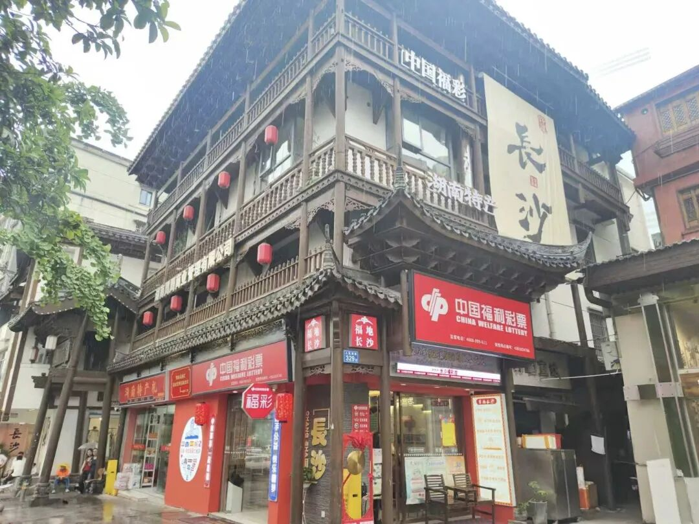
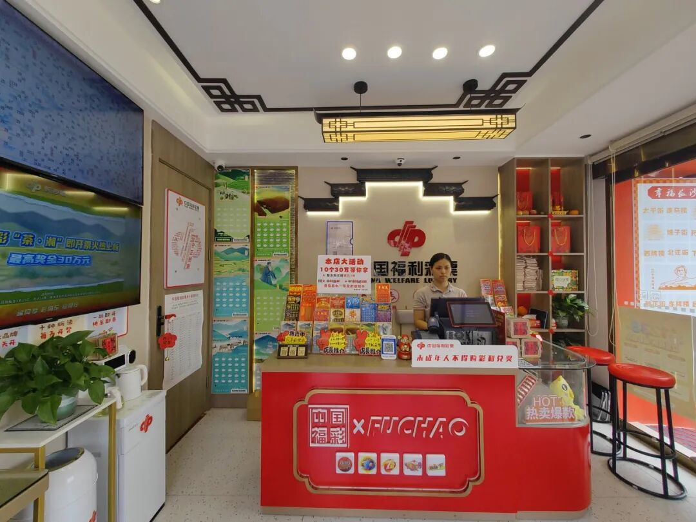
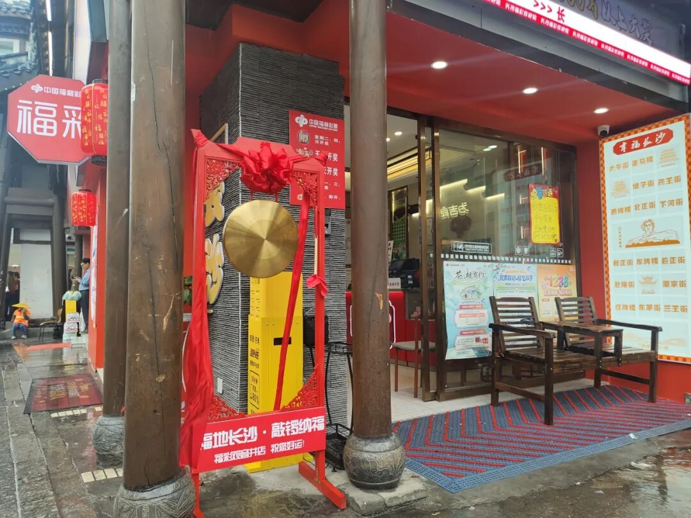
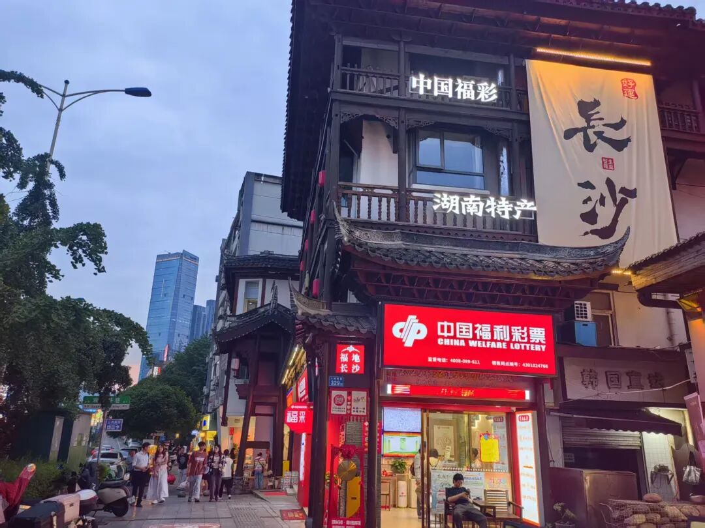

# “公益+文旅”长沙福彩将公益融入城市烟火
> 公众号: 长沙福彩中心
> 发布时间: 2026年5月25日 17:54
> 原文链接: https://mp.weixin.qq.com/s/tCG2ZMF-HhbBStUofOOJtA

---

**“公益+文旅”**

**长沙福彩将公益融入城市烟火**

在长沙核心文旅街区人民西路黄兴广场旁，一家兼具民国风韵与现代潮流的福彩体验网点近日成为市民与游客的新晋打卡地。这里不仅是购彩者的“福地”，还通过“福彩+文旅”的创新融合，将公益温度融入城市烟火。

**国风与潮流碰撞：一眼心动的福彩新地标**

该店坐落在紧邻红色刊物《湘江评论》旧址的历史街区，门店的设计将老城区的韵味和福彩的现代感结合得恰到好处，古色古香的建筑外立面与“中国福利彩票”LOGO相得益彰。远远望去，“中国福彩”“中国福彩 一起造福”与“福地长沙”等公益标识牌特别醒目，引得不少游客在此驻足拍照。很多游客和彩民表示：“在这里既能感受历史，又能体验公益，特别有意义。”

步入店内，以福彩红为主色调的“福潮店”将现代风与中国传统花雕木刻工艺融为一体，既古朴典雅又充满活力；墙面上巨大的电子显示屏清晰地展示着各游戏玩法的电子走势图；五颜六色的刮刮乐整齐陈列；店内摆放有新鲜的绿植；放置有雨伞、老花镜、医用药箱等便民设施；休息区还摆放有仿古木质座椅。走进这里，让人感觉这儿不仅是一个购彩场所，更像一个逛街休闲喝茶聊天的“城市客厅”。

**“福彩+文旅”创新：让公益更有仪式感**

作为长沙文旅核心区域的特色网点，该店突破传统购彩模式，以文旅特色吸引游客参与随手公益，店门前的“敲锣纳福”敲铜锣打卡装置深受游客喜爱，很多游客和彩民纷纷在此打卡合影。彩民每购买一张彩票，即可敲响铜锣，寓意“好运当头”，也让公益购彩更具仪式感和体验感。为了更好地融入周边景区，打造景区特色店，该店业主谭武怀在店外专门设置了“幸福长沙”导览图和“没错，我也很喜欢长沙！”等文化历史主题打卡墙，将星城长沙的太平街、坡子街、走马楼、潮宗街、东茅街等周边老街和历史文化地标都一一注明，引导游客在购彩之余探索老长沙的历史文化底蕴。

**公益初心融入烟火气：打造城市文化新名片**

谈起网点设立的初衷，谭武怀表示：“经营福彩多年，我一直想把公益与长沙的文旅特色结合。”此次选址于此，正是看中其紧邻《湘江评论》旧址的红色文化背景，以及老街巷的鲜活烟火气。

“每天都有五湖四海的游客经过，他们在游览长沙历史文化街区的同时买一张彩票支持公益，再敲响铜锣讨个好彩头，把历史的沉淀与美好的期待化作一段美好体验。”

从历史建筑到潮流设计，从单一购彩到文旅体验，这家福彩网点不仅是购彩服务的延伸，更是城市文化的展示窗口。通过将福彩元素与长沙老街风貌、文旅地标深度融合，让公益理念以更生动的方式走进大众生活，成为长沙“网红城市”标签下的又一特色名片。未来，随着更多类似网点的落地，长沙福彩将持续探索“进景区、融文化”的新模式，让每一张彩票都成为连接爱心与城市故事的纽带。

编辑：艾亿博

一审：罗   丰

二审：黄   龙

三审：熊天乐

随手公益，理性投注，快乐圆梦

客服电话：4008-099-611

