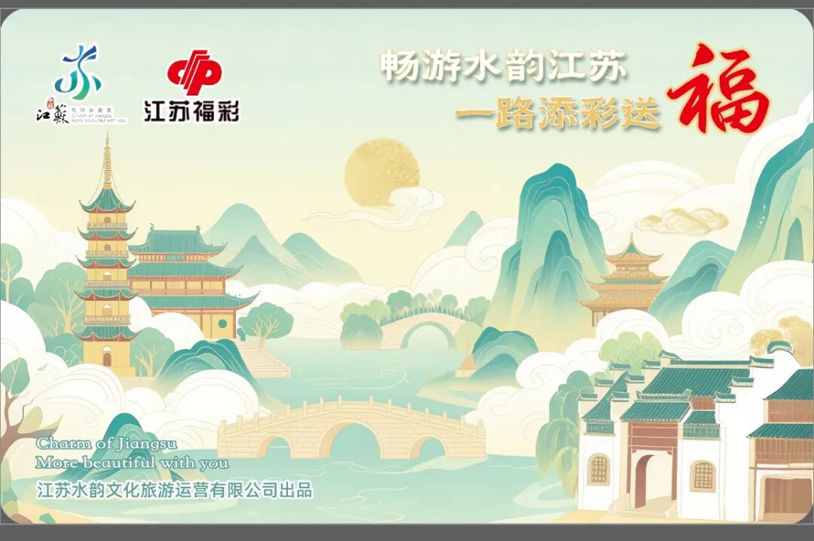
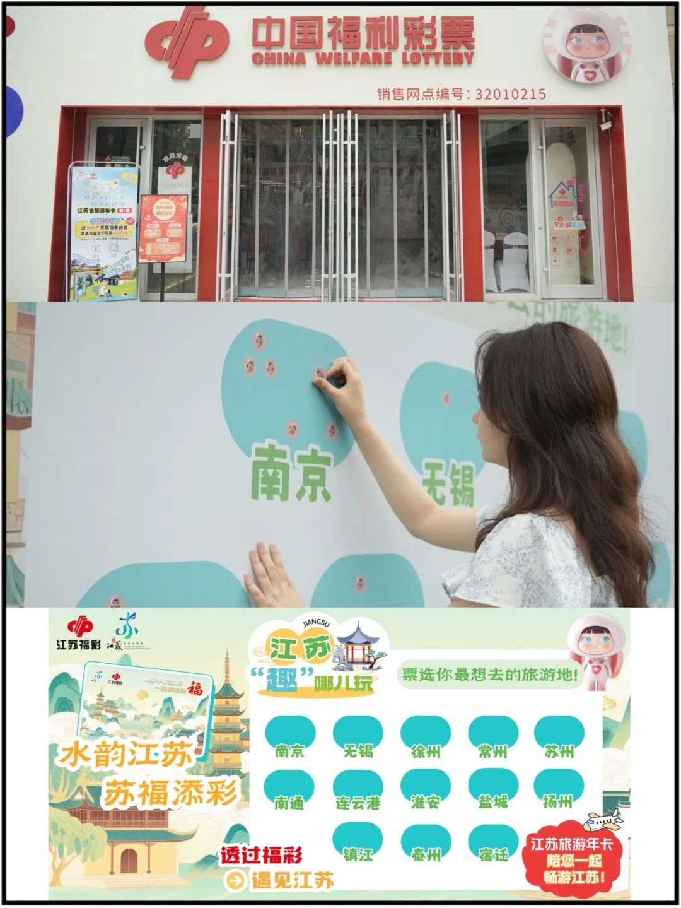

# “福彩+文旅”创新融合新模式 “水韵江苏·苏福添彩”活动正式启航
> 公众号: 江苏福彩
> 发布时间: 2025年10月12日 22:11
> 原文链接: https://mp.weixin.qq.com/s/Vd-b_MrZwQgGKbLVPuqP-g

---

已关注

关注

重播 分享 赞

**观看更多**

江苏福彩

0/0

00:00/02:47

进度条，百分之0

播放

00:00

/

02:47

02:47

倍速

_全屏_

倍速播放中

0.5倍 0.75倍 1.0倍 1.5倍 2.0倍

超清 流畅

<video src="https://mpvideo.qpic.cn/0bc3gqabkaaareabfs7kfvufangdcu2aafia.f10002.mp4?dis_k=69aeb411470fef5e9a8b38881a9113c3&dis_t=1785480077&play_scene=10120&auth_info=HIOE+FVfFRzmqJq3BkNaM2JKHGNtETM0M1NgN1VgHQc6PghiaSBvbQ5gEl04T3k=&auth_key=d5f66f39efce83e3d052b06bc1bf463b&vid=wxv_4203960934123061258&format_id=10002&support_redirect=0&mmversion=false" controls poster="http://mmbiz.qpic.cn/mmbiz_jpg/P7hT2eIrLFRVQpAY7lbgwx2CQKyYKw8kW1wt3SwxCfw7UGibPZylSn8P3kr6EtGDBobm1ZmeVJLrW7OqesY9YCQ/0?wx_fmt=jpeg&wxfrom=16"></video>

继续观看

“福彩+文旅”创新融合新模式 “水韵江苏·苏福添彩”活动正式启航

转载

,

“福彩+文旅”创新融合新模式 “水韵江苏·苏福添彩”活动正式启航

江苏福彩

已同步到看一看写下你的评论

视频详情

10月11日，“水韵江苏·苏福添彩”活动启动仪式在南京市秦淮区福彩旗舰店举办。此次活动是我省推进福利彩票与文旅产业深度融合、探索“福彩+”发展新模式的有益实践。

活动现场，与会代表一起观看了活动宣传片，深刻感受福彩公益与水韵之美的交融共鸣。江苏省福利彩票发行中心与大运苏心健康公司签订合作协议，共同启动“水韵江苏·苏福添彩”活动，并现场发布“水韵江苏·福彩”联名数字旅游年卡。

启动仪式外场，设置了沉浸式户外互动游戏区，特别在“透过福彩遇见江苏”社交媒体互动环节，参与者只需打卡游戏现场，拍摄活动照片或视频，并带上[#苏福游](javascript:;)[#透过福彩遇见江苏话题发布至社交媒体](javascript:;)，即可随机获得一张“江苏旅游打卡透卡”。现场市民参与热情高涨，纷纷拍照打卡，捕捉水韵江苏之美，为“公益福彩”与“品牌文旅”的IP融合增添一抹亮色。

“水韵江苏·苏福添彩”活动面向全省，首批选择南京、徐州、苏州、扬州四个试点城市，以“三个融合”为核心，通过渠道融合，在福彩销售网点植入文旅代办服务功能，丰富网点收入来源；通过用户融合，促进购彩者与游客群体的相互转化；通过品牌融合，联合打造“公益福彩+品牌文旅”IP，构建“福彩+文旅+民生”紧密联系的发展新格局。活动将有效赋能基层销售网点，推进文化旅游场景和公益宣传渠道互联互通，进一步塑强福利彩票“公益、责任、阳光”的品牌形象。

来源：省中心战略发展和渠道部

编辑：孙卉垚

审稿：张勇

