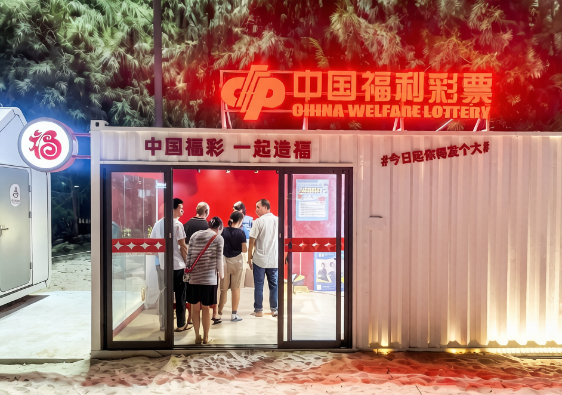
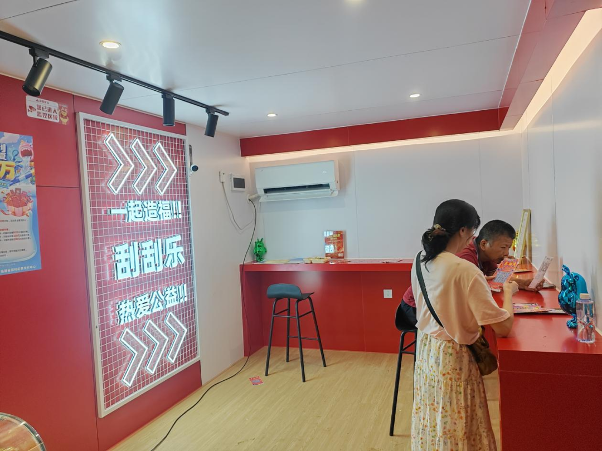

# 【福彩资讯】福彩体验店入驻泉州惠安青山湾 打造“福彩+文旅”融合新亮点
> 公众号: 福建福彩
> 发布时间: 2026年7月24日 11:55
> 原文链接: https://mp.weixin.qq.com/s/qjb3OjCowJztPw2RZ84zGQ

---

7 月 18 日，以“惠女海岸・洄岸季”为主题的2026青山湾暑期滨海狂欢节，在惠安青山湾旅游度假区拉开帷幕。这场覆盖整个暑期的文旅盛宴，不仅为市民游客带来了明星音乐live、海岸烟火市集、水上运动等多元体验，更迎来了一抹亮眼的“福彩红”——泉州福彩体验店正式亮相活动现场，将公益福彩的温暖底色注入夏日海岸，开启了福利彩票与文旅消费深度融合的全新探索。

海岸新景：

福彩体验店成洄岸季公益打卡点

走进青山湾洄岸季活动现场，红白相间的福彩体验店与碧海金沙相映成趣，成为海岸线上一道独特的风景线。体验店采用半开放式、年轻化的设计风格，打破了传统彩票销售点的固有印象，让游客在享受滨海度假的同时，能够轻松接触福彩、了解公益。

“本来是来听演唱会、看海的，没想到还能顺手买几张福彩刮刮乐，既体验了刮奖的乐趣，又能为公益事业出一份力，感觉很有意义。”来自厦门的游客陈女士在体验店购买了几张“喜相逢”即开票后高兴地说。据现场工作人员介绍，洄岸季启动首日，福彩体验店就吸引了不少游客驻足体验，年轻群体占比超过七成，成为活动现场人气较高的打卡点之一。

渠道破圈：

“福彩 +”模式激活发展新动能

文旅场景是福彩渠道拓展的重要方向，此次福彩体验店入驻青山湾洄岸季，是泉州福彩推进渠道多元化、场景化建设的又一重要举措。近年来，随着消费场景的不断升级，泉州福彩积极探索“福彩+”融合发展新模式，加快推进销售网点进景区、进商圈、进夜市、进交通枢纽，打破传统销售渠道的边界，让福彩从单纯的销售场所融入市民日常消费场景。

下一步，泉州福彩将继续深化“福彩+文旅”融合发展路径，结合泉州世遗城市文旅资源，在更多重点景区、特色街区、文旅活动中布局福彩体验场景，打造一批具有泉州特色的福彩文旅IP，让福彩成为展示城市文明、传播公益文化的重要窗口。

文字：若鸣

编辑：小楚

