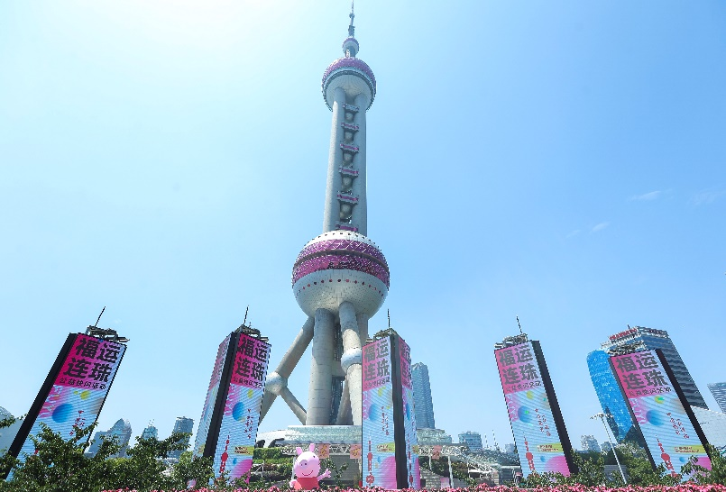
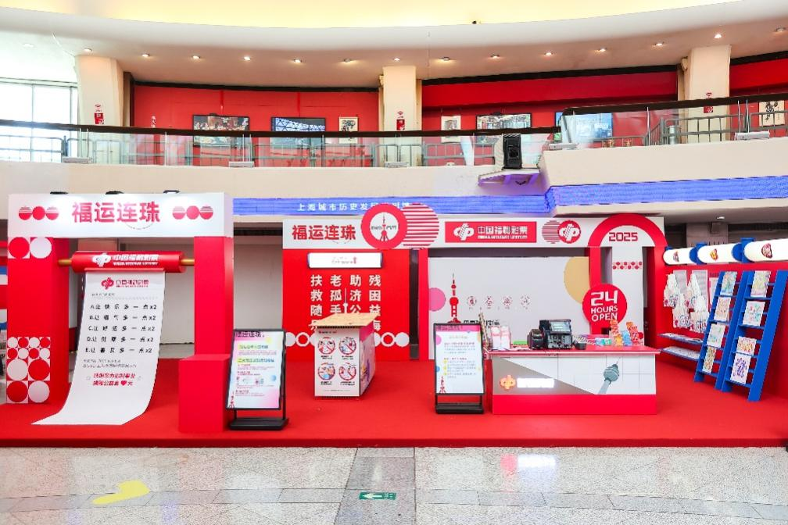
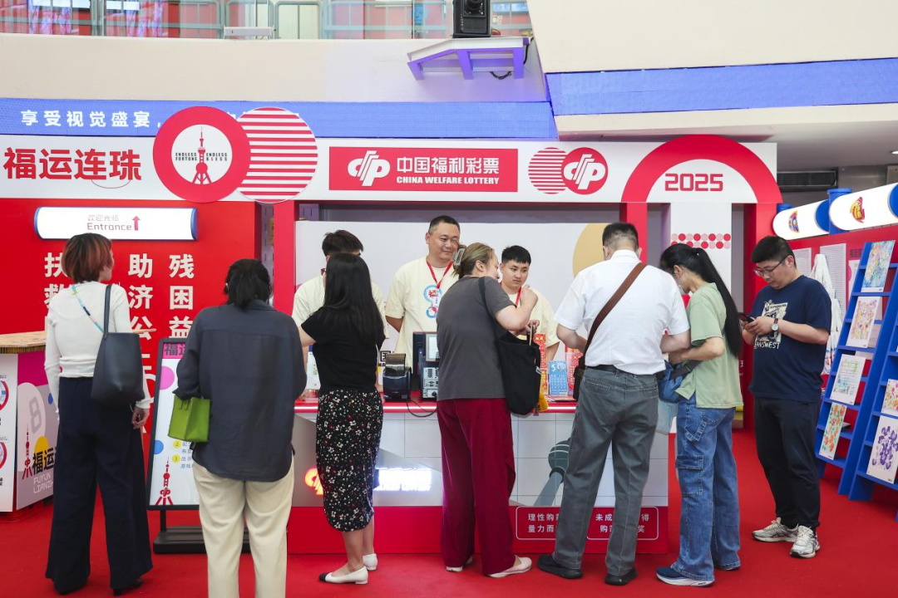
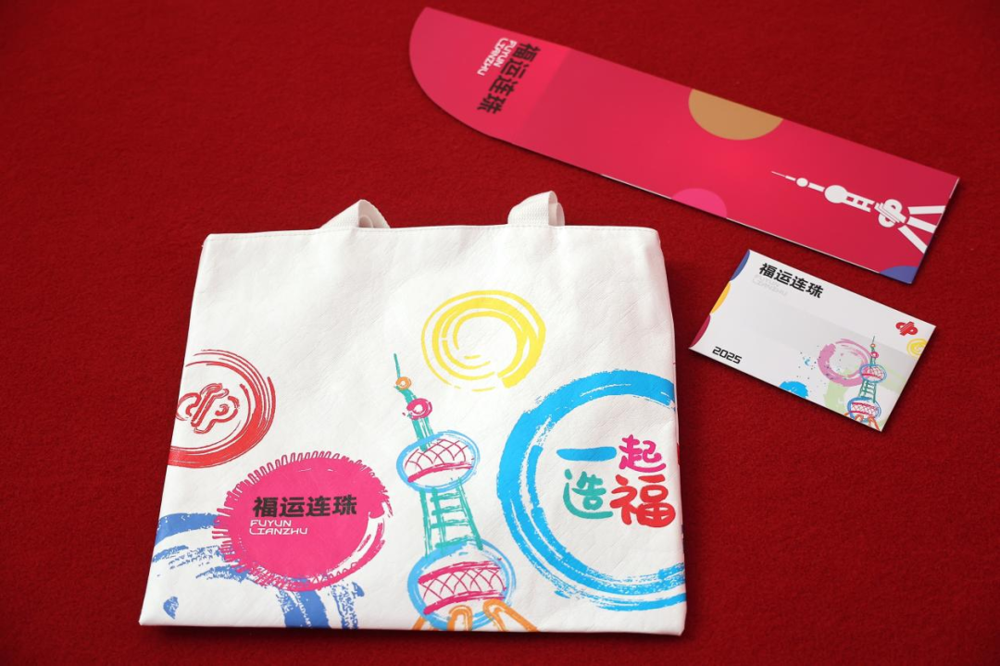
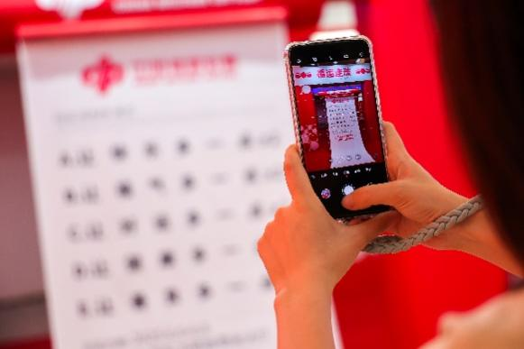
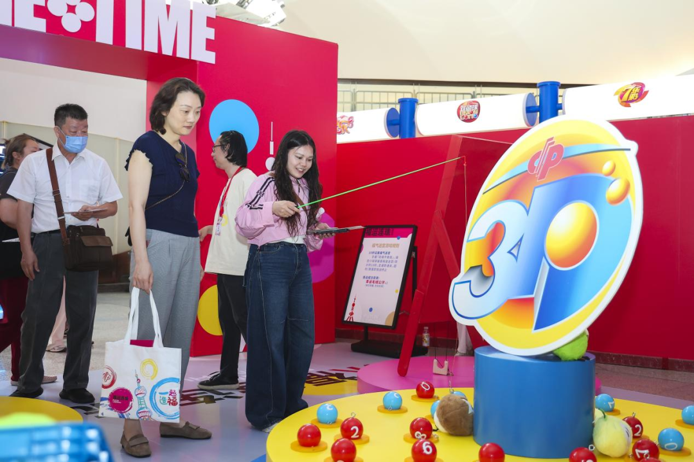
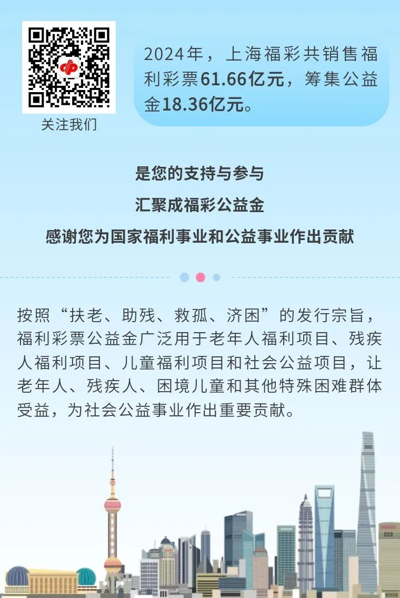

# 上海福彩×东方明珠：公益与城市地标的“双向奔赴”
> 公众号: 上海福彩
> 发布时间: 2025年6月12日 15:30
> 原文链接: https://mp.weixin.qq.com/s/erZhcS0FNgsQuUus3mDxow

---

2025年6月6日至8日，上海福彩以“福运连珠”为主题，在上海地标东方明珠塔的零米大厅开展公益快闪活动，通过“福彩+文旅”的模式，让“扶老、助残、救孤、济困”的公益宗旨转化为可感可知的沉浸体验，提升了福彩公益传播效力。

左右滑动查看更多

本次活动以“福运连珠”为主题，将东方明珠塔身形象与福彩logo创意融合为活动主视觉，象征公益力量串联城市美好生活。为此次活动特别设计的“东方明珠限定彩票封套”融合海派文化与"福彩"元素，让公益属性变得更加生动。

此外，本次快闪活动以公益为轴，串联文化、旅游、城市地标等多元场景，"福气鱼池""福气迷宫""福气投投乐"等三大原创游戏将彩票体验转化为趣味互动，吸引了游客积极参与。场内“福气车厢”打卡装置融合上海城市剪影与福彩活动视频，激发年轻人拍摄传播热情。同时，此次快闪活动还与陆家嘴周边福彩网点推出互动活动，让“扶老、助残、救孤、济困”宗旨可触可感。福彩公益文化与海派文化的融合，让福彩公益理念更加深入人心。

