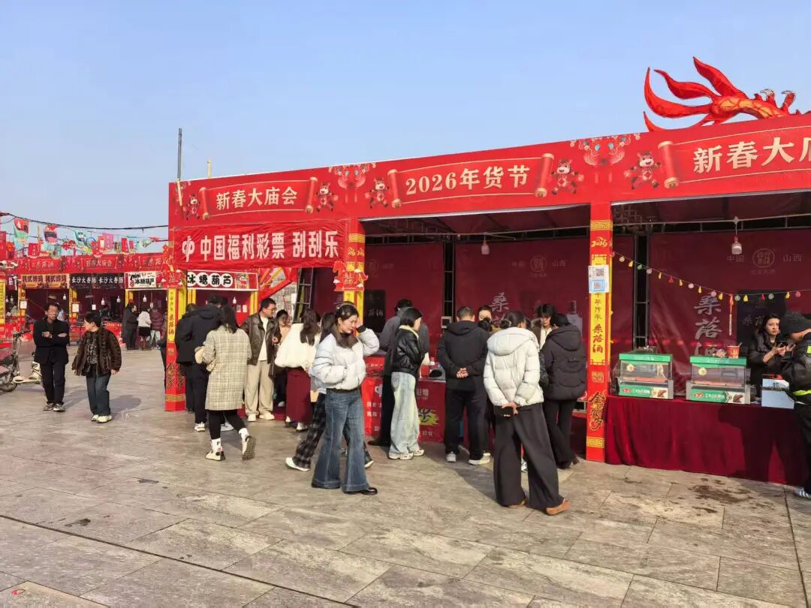

# 丨动态丨融合地方文旅IP——对接新兴消费场景运城倾力打造“福彩+景区”新生态
> 公众号: 山西福彩
> 发布时间: 2026年3月4日 12:30
> 原文链接: https://mp.weixin.qq.com/s/LAdzkyeFptIErUpZ_vIwHA

---

**进景区看好景，刮福彩添好运**

**“福彩+景区”新生态**

春节期间，在“团圆欢聚”与“文旅过年”热潮带动下，山西省运城市入境游热增速名列全国第五名，累计门票收入同比增长近六成，再次擦亮“国宝第一市 天下好运城”的运城文旅金名片。在此期间，运城市福利彩票发行中心以创新姿态深度参与，积极组织全市36家站点开展福彩户外销售活动，尽显“福彩+文旅”的勃勃生机。

“进景区看好景，刮福彩添好运！”在永济市牛魔王逍遥谷景区，周峰身穿红马甲，热情地向来往游客介绍刮刮乐“丙午马生肖票”、“多喜乐”等各种即开票的游戏规则，积极宣传福利彩票“扶老、助残、救孤、济困”的发行宗旨。牛魔王逍遥谷景区春节前刚刚开始运营，通过还原历史文化场景、引入真人互动演艺、设计丰富的非遗民俗表演，成功吸引了大量游客前往线下体验，成为今年春节最受抖音网友欢迎的景区TOP10（排名第四）。“火爆的流量让我切实体会到了福彩+文旅的好处。春节期间，根据运城市福利彩票发行中心的统一安排，我在永济市三个景区设立了三个户外临时销售站点，集购彩体验、公益宣传、便民服务等服务于一体，让游客在游览的同时便捷购彩，实现双赢。”周峰说。言语间，一位游客展示刚中的50元奖金，引得周围游客跃跃欲试。

近年来，运城福彩贯彻新发展理念，不断开拓福彩销售新场景，以“福彩+景区”“福彩+夜市”“福彩+商超”等模式，积极融入大众生活，实现了“福彩+”的持续“破圈”，为福利彩票事业健康发展注入了新活力。

来源：运城福彩

编辑：闫慧   审校：郭卓婷

声明：本公众号为宣传福利彩票公益事业的平台，非营利目的，属公益性质。本公众号文章、图片等信息涉及著作权的，归原著作权人所有。本运营团队已尽最大努力标注信息（含图片）来源，如著作权人有异议，请及时联系运营机构予以删除。

**往期回顾**

**[丨警示丨两起案件，为您揭秘“预测彩票号码”的连环套路](https://mp.weixin.qq.com/s?__biz=MzI1NDI4MDM1MQ==&mid=2247574682&idx=1&sn=cda6c269f408ecfcd0bd8046b1fce88f&scene=21#wechat_redirect)**

**往期回顾**

**[丨科普丨双色球](https://mp.weixin.qq.com/s?__biz=MzI1NDI4MDM1MQ==&mid=2247574682&idx=2&sn=27bf41b53da0712e6c7425e6ea3495b6&scene=21#wechat_redirect)**

**点击“阅读原文”查看****开奖信息**