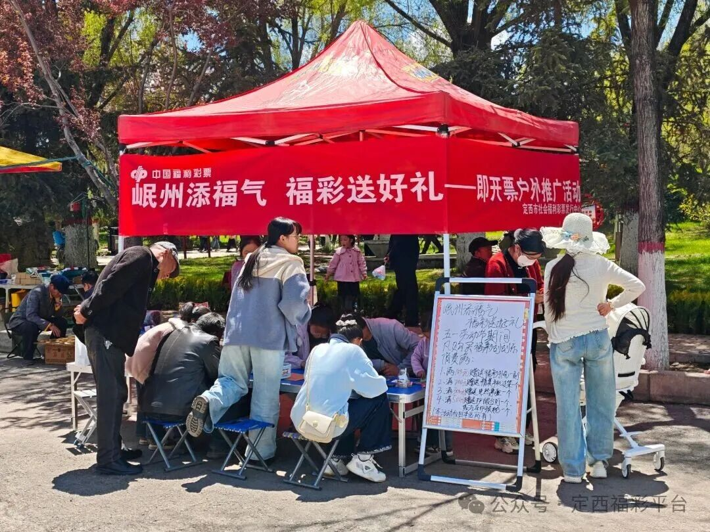
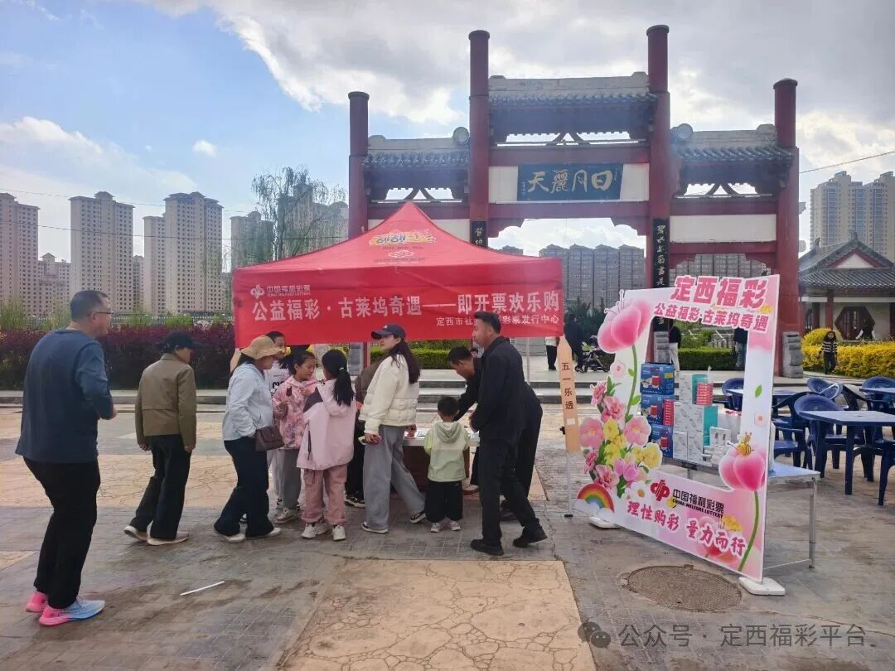
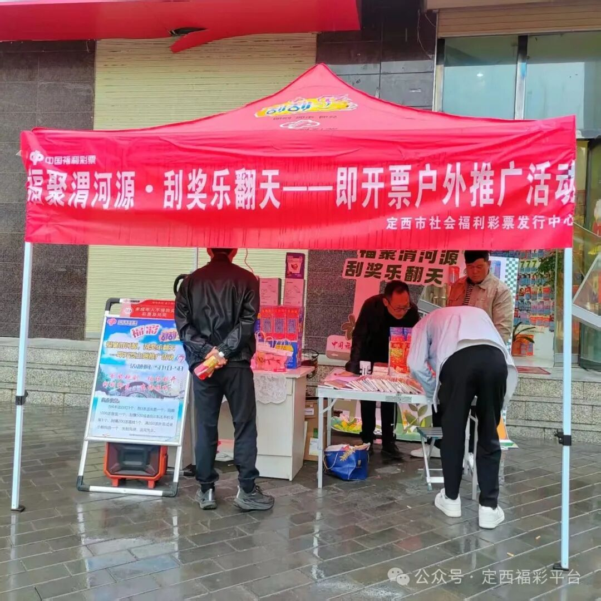
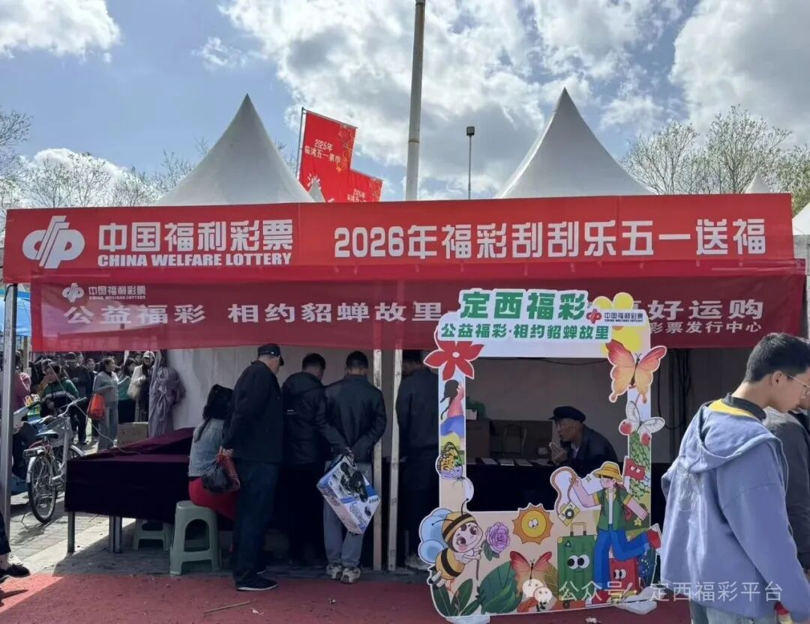

# 五一福彩跨界出圈！“福彩+文旅”地推活动点亮岷县、陇西、渭源、临洮
> 公众号: 定西福彩平台
> 发布时间: 2026年5月8日 17:20
> 原文链接: https://mp.weixin.qq.com/s/ItXBq0ILelUn382ExC_HLw

---

**岷县、陇西、渭源、临洮五一地推活动**

刚刚过去的“五一”假期，旅途有新风、体验再升级。福利彩票打破传统销售模式，创新打造“福彩+文旅+地方特色”全新互动场景，在岷县、陇西、渭源、临洮四地同步开展小型特色地推活动，以多元购彩新模式、沉浸式公益体验，将福彩温暖与假日欢乐深度融合，让公益理念走进千家万户，奏响假日公益便民新乐章。

此次地推活动精准贴合各地文旅特色与群众假日出行需求，摒弃单一销售模式，构建起轻量化、场景化、便民化的线下服务阵地，实现四地多点开花、同步发力。活动现场巧妙融入地方文化元素，让福彩公益与本土特色相映成趣，既为文旅氛围增添亮色，也为广大市民、游客打造了便捷购彩、零距离了解福彩的全新窗口，解锁假日休闲与爱心奉献双重体验。

**岷县、陇西活动现场**

**渭源、临洮活动现场**

活动期间，福彩工作人员化身公益宣传员与服务专员，全程提供贴心购彩指导、规则讲解、疑问解答等一站式服务。同时，工作人员围绕福彩“扶老、助残、救孤、济困”的公益宗旨，开展沉浸式公益理念宣讲，细致讲解福彩公益金的筹集、使用方向，以及福彩在助力养老服务、关爱残障群体、帮扶困境儿童、救助困难群众等方面的暖心举措，让大家深刻感知每一次购彩都是一次爱心传递，每一份幸运都承载着公益力量。

新颖的活动形式、浓厚的公益氛围，吸引了众多市民、游客驻足参与，活动现场人头攒动、热闹非凡，处处洋溢着欢声笑语。大家在感受假日惬意、领略地方文旅魅力的同时，纷纷驻足体验多元购彩玩法，在轻松愉悦的氛围中参与公益、收获惊喜，不少群众在交流中纷纷点赞福彩创新举措，切实感受到福彩公益的温度与力量。

此次五一小型地推活动，通过“福彩+文旅”的跨界融合，不仅丰富了群众假日文化生活，打造了便捷高效的公益购彩场景，更让福彩公益理念以更接地气、更具活力的新姿态深入人心。

