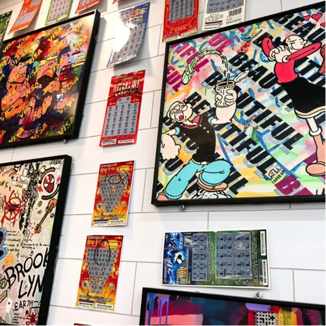
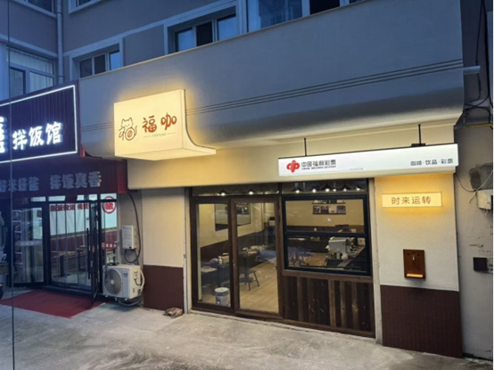
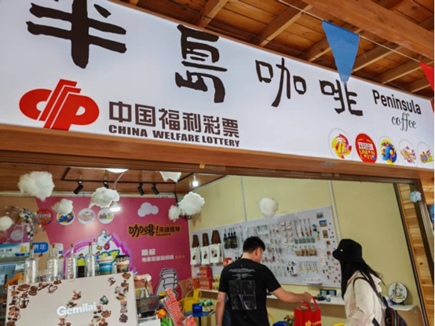
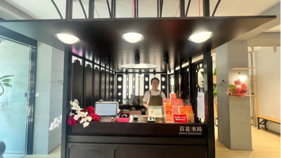
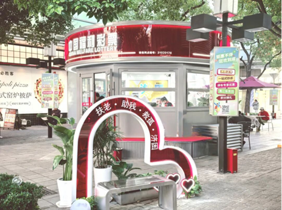
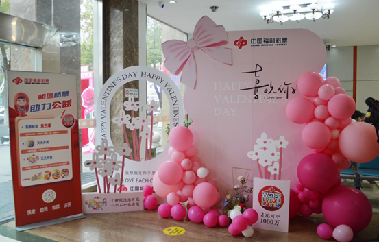

# 从街边店到网红打卡点，福彩店正成为年轻人新宠
> 公众号: 舟山福彩
> 发布时间: 2026年2月7日 09:00
> 原文链接: https://mp.weixin.qq.com/s/P3NQuRhvXdyzrOHokRUWjw

---

以前买彩票，得专门找一家店

现在

喝杯咖啡、逛逛商场、旅游途中

……

都能欣喜地偶遇到福彩店

干净整洁，不失时尚

**彩票正在走出“彩票店”**

在济南融创茂一家便利店里，满墙的动漫手绘与色彩缤纷的刮刮乐彩票共同构成一面“魔法城堡”艺术墙。年轻人逛累了，进来买瓶水，顺手抽张彩票，拍个照，轻松自然。这里不再是传统印象中的销售点，而是一个会吸引年轻人主动拍照打卡的潮流地标。公益，通过视觉艺术与时尚审美的结合，变得在年轻人最熟悉的日常里触手可及。

图：山东省济南五禾便利店内，“魔法城堡”彩票墙成为打卡点

这样的场景，也在黑龙江牡丹江的“福潮店”里在上演。中国福利彩票Logo与福咖的门头形象相得益彰，店内温暖的橙黄色灯光，热情地招呼着每一位路人。咖啡操作台紧邻着占据C位的刮刮乐展示区，“左手咖啡，右手彩票”，成了不少年轻人休闲公益的新选择。

图：黑龙江省牡丹江市中国福利彩票“福潮店”

青海湖畔，一家小小的咖啡馆将福彩销售点轻巧地嵌在了观景窗边。这里室内是简约时尚的陈设，满墙的公益标语传递着温度，窗外便是连绵的湖光山色。自2025年7月开业以来，这里成了游客歇脚的新选择。点一杯热饮，刮一张印有高原风光的即开票，既满足了味蕾，又多了一份旅途中的小期待。店主坦言，这里能营造轻松氛围、提供交流空间，既满足了游客的胃，又填补了行者的心。

图：青海湖畔的福彩“半岛咖啡”

从便利店到咖啡馆，彩票正走出传统门店，融入年轻人的生活空隙，成为一个自然而然的选项。买彩票这件事，不再需要郑重计划，而成了生活里一个轻松的“顺手之举”。

**旅行路上添点惊喜**

以前旅行带伴手礼，无非是特产和明信片。如今，一张融入当地文化元素的彩票，也成为一种轻巧又特别的“旅行纪念品”。

在苏州平江路历史街区的“百花书局”福彩点，你能感受到这种融合的极致。色彩明快的即开票，就安静地陈列在油墨书香与昆曲评弹的背景音里。游客在这里感受千年古巷风韵时，可以顺手带走一份“姑苏风雅”主题票，它既是一张有当地特色的文创品，也寄托了一份旅途中的幸运期许。

图：江苏省苏州百花书局福彩点

这种“文旅+福彩”的结合，不仅让公益触角伸向更广阔的天地，也为游客带来了独特的体验。在青岛百年历史的中山公园里，一座德式老建筑被改造为“中山公园壹号彩咖”。这里不止有咖啡和彩票，更是一个能让你歇脚的新中式空间。逛完公园看罢灯会，走进去点杯咖啡，顺手刮张彩票，公益就这样自然地融进了闲适的休息时光。广西福彩的“阿福旅行记”，则直接把一座“福运岛”搬到南宁音乐小镇，让年轻人在打卡拍照时，不知不觉就感受到公益的趣味。

近年来，“彩票+”跨界融合不断发展。在这股浪潮中，上海福彩立足本地特色，以文化为纽带，将公益与幸运编织进这座城市的商业空间、文化地标与江南古镇的肌理之中，实现品牌影响力的提升，也给购彩者带来了不一样的惊喜体验。

从江南的古典街巷到海滨的百年公园，再到南国的音乐市集，福利彩票不再是一个需要特意前往的站点，而是在不经意间出现，让你在探索风景的同时，也能感受到这座城市流露的温度与善意。

**连领证，都能沾个喜气**

近年来，多地民政部门与福彩中心探索协作，把公益祝福融入人生的重要节点。

在苏州吴中太湖婚姻登记点，这座被称为“最美婚姻登记处”的地方，福彩的公益理念，通过文化墙、电子屏以及520等特殊节日举办的“为爱加码”主题活动，将仪式感拉满。新人们完成登记后，常会收到一份别致的小礼物：可能是一张可现场刮开的定制“囍”字即开票，也可能是一个6元彩票红包，甚至是一束用刮刮乐扎成的“幸福花束”。有新人笑着表示：“收到福彩的这份惊喜让领证仪式更具社会意义，我们感受到了公益的温度，也希望我们以后的日子能像福彩寓意的那样，充满幸运和福气。”

图：江苏省泰兴市民政局婚姻登记处

在山东滨州，这份“甜蜜的融合”更是深入整个婚俗流程。当地的婚姻登记服务中心，精心设计了“福说喜事”文化墙和“喜相逢”互动墙，处处洋溢着公益的祝福。新人领证后就能获赠福彩婚柬等礼物。当地还创新地将婚姻登记流动办理点与福彩销售专区一同设在百货公司里，提供“登记就地办、婚庆用品特惠购、福利彩票随手买、公益随手做”的全链条服务，真正把好事办到了年轻人的心坎上。同样，在山东潍坊等地的登记处，新人们也能在领证后立刻移步福彩专区，亲手刮开“囍”字票，体验“双喜临门”的即时喜悦。而在广东汕头，公益则与健康关怀携手，新人们在自愿完成婚前检查后，也能领取一张“囍”字主题彩票作为纪念，现场此起彼伏的刮奖声与欢笑声，瞬间将这份祝福的喜悦拉满。

婚姻登记处的一张彩票未必带来大奖，却总能添一份好彩头，让仪式感多了一份美好的期待。当公益的“福”遇见人生的“喜”，福彩的加入，让个人“小家”的幸福开端，与社会“大家”的公益善意，在这一刻温暖相连。

福彩店的形态，正在悄然改变，不再局限于街角一方柜台，而是融入咖啡香、湖光山色，甚至婚礼的喜悦里。彩票也不再只是纸上的数字，而是悄悄“溜进”人们的日常，在放松、行走或欢笑的时刻，轻轻递上一点善意与期许。

来源：中国福彩

