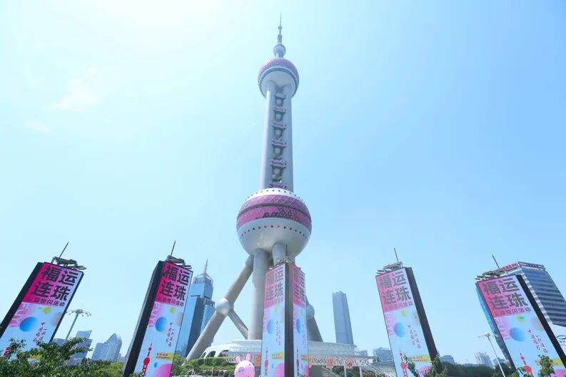
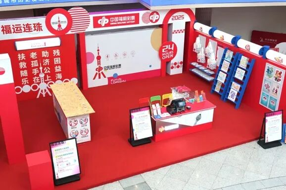
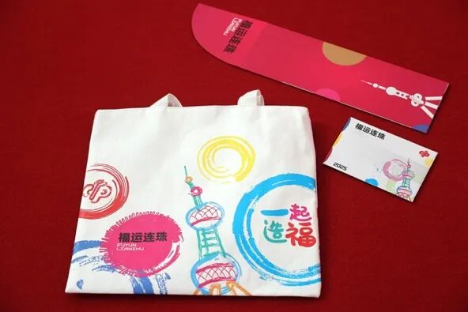

# 当福彩遇见东方明珠，一场快闪如何让年轻人爱上公益？
> 公众号: SMG发布
> 发布时间: 2025年6月7日 10:15
> 原文链接: https://mp.weixin.qq.com/s/_2Bye-RWRTGdMUiB42qgQA

---

6月6日，上海地标东方明珠广播电视塔与中国福利彩票首次携手打造的“福运连珠”公益快闪活动在东方明珠零米大厅启动。这场城市公益事件通过游戏化场景与地标流量叠加，将公益转化为年轻群体的可感体验，打造出全民可感知的公益能量场。

活动吸引了全民参与热潮，活动参与人群破万，线上线下聚合十万公益人群参与其中。而这背后离不开上海广播电视台旗下互联网节目中心历时半年的资源整合及活动策划。

**突破传统，策划公益新体验**

长久以来，传统公益活动模式相对单一，难以充分吸引年轻群体的关注。互联网节目中心敏锐察觉到这一痛点，在活动策划过程中，将中国福利彩票的公益宗旨拆解为三大游戏模块、两大打卡场景和多重文创礼品的形式。

一方面，通过“打卡-游戏-分享”路径，利用极具视觉冲击力的打卡场景吸引人流驻足，让年轻群体完成从旁观者到参与者的身份蜕变。同时，为本次活动专门设计了“福运连珠”福袋礼包、“福运连珠”东方明珠限定封套、活动限定明信片等周边，通过丰富文创礼品，将中国福彩的公益形象深植人心。

这种创新的形式，追求将公益基因进行年轻化表达，使得公益不再是高高在上的说教，而是大众能够切实参与并乐在其中的活动。

**赋能地标，东方明珠变身公益入口**

互联网节目中心聚焦场景价值，探索将东方明珠这一地标场景转化为公益能量的放大器。

 “福运连珠” 公益快闪选址东方明珠零米大厅，将游戏区与“福气车厢”打卡点形成沉浸式闭环，让游客从“登塔观光”自然切入“公益体验”。而借助“福运连珠”东方明珠限定封套等文创周边，则将地标IP转化为可收藏的公益记忆。

在此次公益活动合作基础上，互联网节目中心还将长线布局，探索让公益成为东方明珠文旅的标配模块。现正与中国福彩推进合作，力促在东方明珠零米大厅设立常设「福运驿站」，将定期迭代公益互动。

从单次活动的爆款策划，到固定点位、周期内容、专属产品的三维生态构建，互联网节目中心正以东方明珠为原点，绘制专属SMG的公益文旅地图。

**IP锻造，践行 “文旅商体展” 目标**

从静安光影节中“毛茸茸派对”线下活动IP的初次面世，互联网节目中心长期致力于IP创新与锻造能力。此次“福运连珠” 公益活动，也是互联网节目中心基于集团复合优势，围绕 “文旅商体展” 目标进行的综合实践。

从文化层面来看，活动将公益文化与海派文化地标东方明珠深度融合，通过展示公益成果、传播公益理念，丰富了城市文化内涵。商业推广上，福袋礼包售卖、周边网点彩票销售联动以及文创产品推出，实现了公益与商业的良性互动。聚焦旅游方面，活动吸引众多游客参与，为东方明珠塔增添了新的吸引力和活力。

未来，互联网节目中心将继续探索从"活动策划方"升级至"场景运营商"，持续打造更有生态价值的IP产品。

编辑 | 潘思骋

素材来源 | 互联网节目中心

