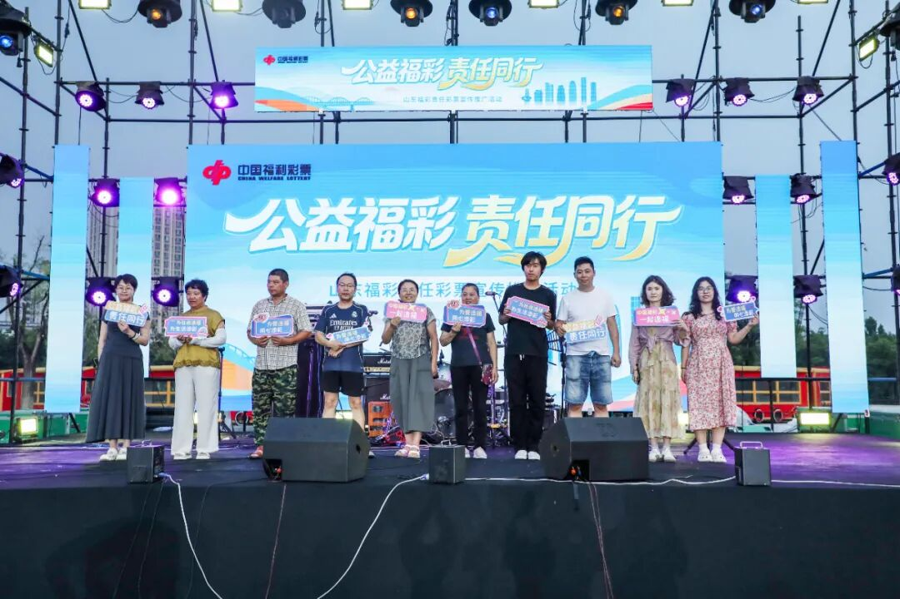
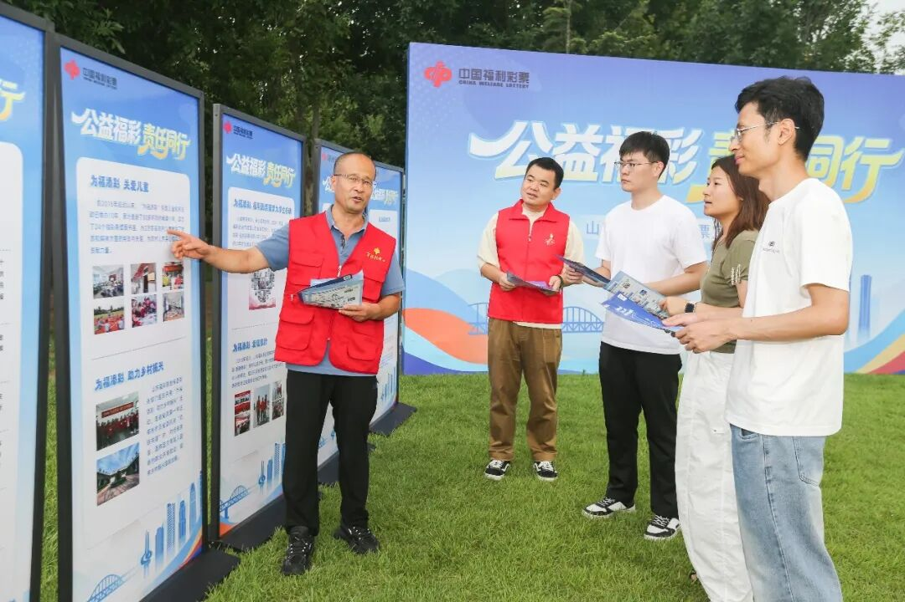
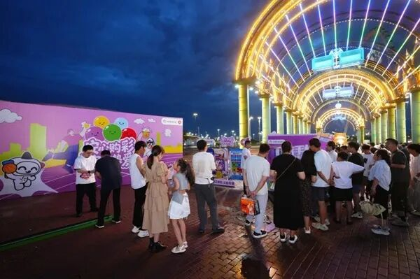
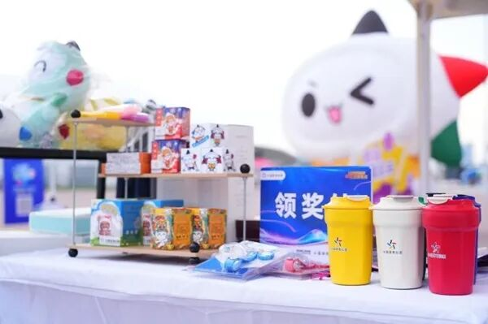
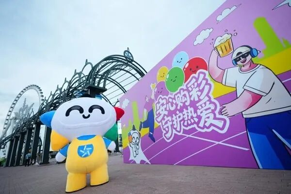
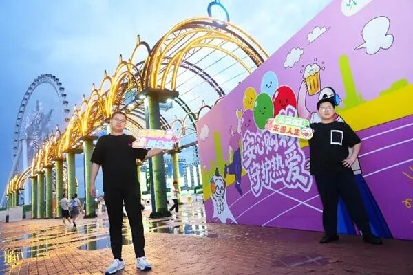
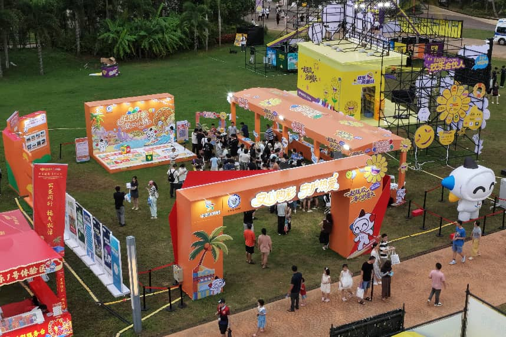
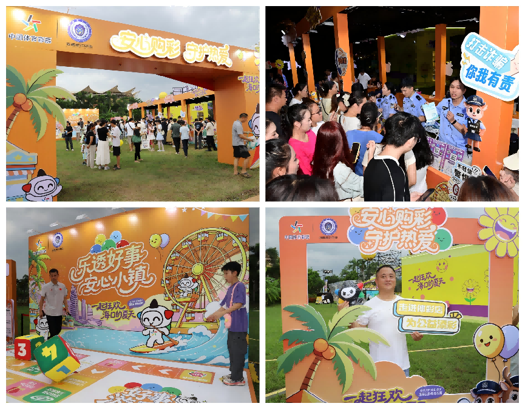
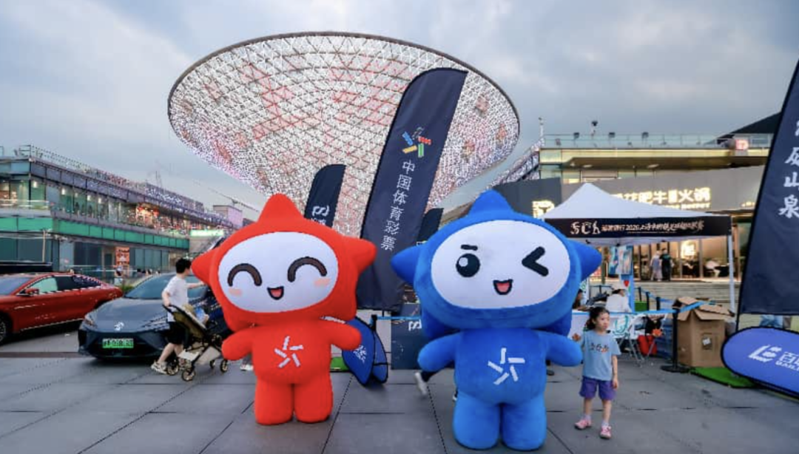
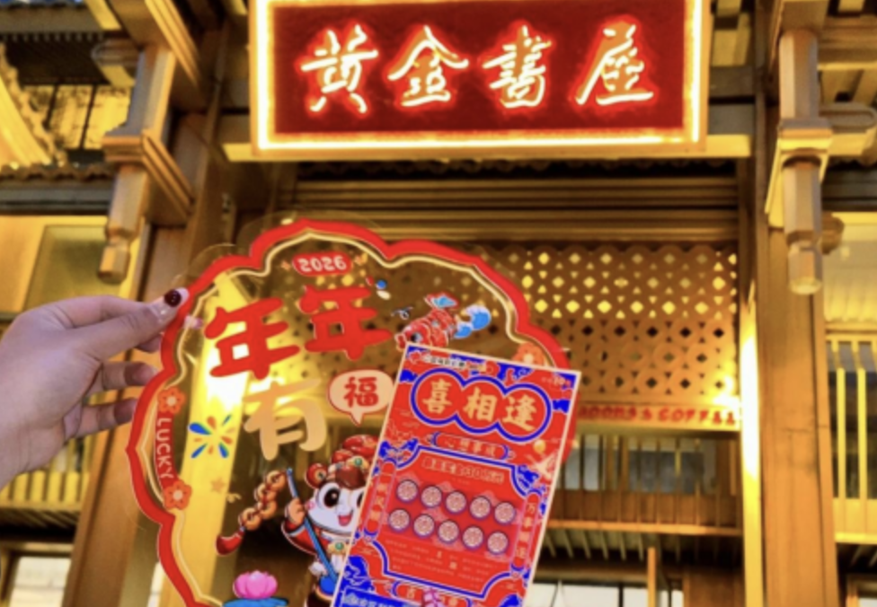

# 彩票+文旅，从“蹭流量”到“搭场景”
> 公众号: 荆彩传媒
> 发布时间: 2026年7月30日 09:23
> 原文链接: https://mp.weixin.qq.com/s/hGfPAIHjES3IfQcCtcmRRg

---

当下正值暑期，全国各地景点迎来游人如织的景象。人们在旅途中缓解生活压力，感受不同的地域文化、风味美食。随着旅游市场的不断升温，彩票机构也尝试将彩票销售和宣传与旅游产业融合，从传统的体育赛事冠名，扩展到了音乐节、啤酒节、沙漠景区、主题乐园、市井街区、博物馆等多元场景，让人们从一个新的视角认识彩票。

**公益品牌嵌入青年文化IP**

7月24日至25日，山东福彩“公益福彩 责任同行”活动亮相2026新青年音乐节新声计划海选赛淄博站。山东福彩的展区不仅是潮玩互动与幸运体验的空间，更成为传递责任彩票理念的重要窗口。整齐排列的宣传展板图文并茂，通过“理性购彩 量力而行”“构筑责任彩票防火墙”“不向未成年人售彩兑奖”等宣传口号，引导大家树立健康购彩理念。

现场播放了打击非法彩票短剧，还特别设置了打击非法彩票科普专区，通过典型案例图解，直观揭露了“高赔率私彩”“网络代购彩票”等常见骗局的危害，提醒市民“认准正规销售网点，远离非法赌博陷阱”。

本次活动专门设置了知识打卡与趣味闯关环节，将责任彩票常识融入答题互动，参与者完成挑战即可兑换定制周边，避免了传统宣传的说教感，也让“公益、责任、阳光”的品牌形象更易被年轻群体接纳。

**啤酒节燃动公益热情**

7月26日，由黑龙江体彩主办的“安心购彩 守护热爱”品牌公益展示活动，在哈尔滨冰雪大世界啤酒节园区圆满落下帷幕。本次活动深度借势哈尔滨啤酒节的城市级热度与人流势能，为广大市民与游客打造了一处融休闲、互动、公益感知于一体的特色体验阵地。

作为啤酒节现场的特色公益体验单元，体彩体验区让市民游客在驻足休憩间，便可参与趣味互动挑战、体验即开型彩票的惊喜乐趣，还能加入[#啤酒](javascript:;)+体彩=小红书创意话题互动，以开放式填空的玩梗形式记录专属夏日记忆。

活动摒弃刻板的说教式传播，将体彩公益金在全民健身、体育设施建设、乡村振兴、社会民生等领域的落地成果，融入场景化展示之中，让往来观众在逛玩之余，直观读懂每一张彩票背后承载的公益价值。

活动还通过现场直播、本地达人活动分享、用户自发拍照打卡等形式，将啤酒节的线下人流热度转化为持续扩散的线上品牌声量，进一步扩大了“安心购彩 守护热爱”主题的传播覆盖面与公众认知度。

**线上线下的沉浸式体验**

7月18日，2026年（第二十七届）海南国际旅游岛欢乐节在海口启幕。海南体彩同步开展体彩公益品牌宣传推广活动，以特色主题市集、公益成果展示、责任彩票科普为载体，生动诠释“公益体彩，乐善人生”品牌理念，同时联合海南省反诈中心普及反诈与安心购彩知识，为市民游客筑牢消费安全防线。

海南体彩特色主题市集成为热门打卡点位。好事共见证公益展示区集中呈现体彩公益成果，让市民游客直观了解体育彩票对体育事业、社会公益事业的助力作用。工作人员向公众普及合规购彩、理性购彩知识，传递健康购彩理念，同时引导公众关注“安心购彩守护小镇”线上平台，拓宽线上宣传矩阵，持续深化公众对责任彩票建设的正向认知。

据悉，本次活动将持续至8月2日，覆盖暑期旅游旺季，持续深耕文旅融合宣传场景，以群众喜闻乐见的方式传递公益力量，践行作为国家公益彩票的社会责任。

**近期彩票机构融合文旅活动的更多案例**

✍7月17日至20日，2026世界人工智能大会暨人工智能全球治理高级别会议在上海隆重举行。上海体彩作为国家公益性彩票机构，在展会周边文商旅体展市集区域世博源商圈设立特色展台，将品牌宣传、彩票销售与科创展会场景有机融合，切实履行社会责任，传递理性购彩理念。人气IP“乐小星”也来到现场与观展嘉宾进行互动，为这场前沿科创盛会增添体育公益氛围，让公益体彩的理念更加深入人心。

✍湖南福彩以跨界融合为抓手，培育壮大了一系列“福彩+文旅”新业态，不仅丰富了购彩者的体验感，拓展公益传播边界，还为福彩创新发展注入源源不断的活力。在衡阳南岳里文旅综合体、南岳大庙等景区，福彩销售网点以传统建筑风格与古街区交相辉映，檐角飞翘间尽是古朴气息；在张家界武陵源核心景区，流动售彩车穿梭于天子山、袁家界的奇峰秀水之间，迎着南来北往的游客，把一份份份幸运送到他们心间，与绝美风景相得益彰。

彩票行业与文旅产业的融合，已不仅限于场景共建，还通过IP共创、跨界联营、营销植入等方式，实现彩票公益品牌和文旅拓展的双赢，进一步拓展购彩群体，宣传地方文旅资源。

从“蹭流量”到“搭场景” ，彩票机构与文旅产业的结合已形成深度互动机制，能够创造丰富的参与体验，覆盖多种日常场景。未来，“彩票+旅游”的融合将碰撞出更绚丽的火花，让更多人在轻松快乐的旅途中，体验彩票的乐趣。

转载 | 国家彩票

