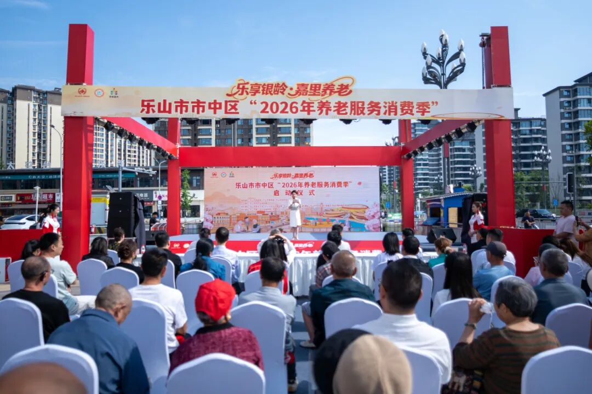
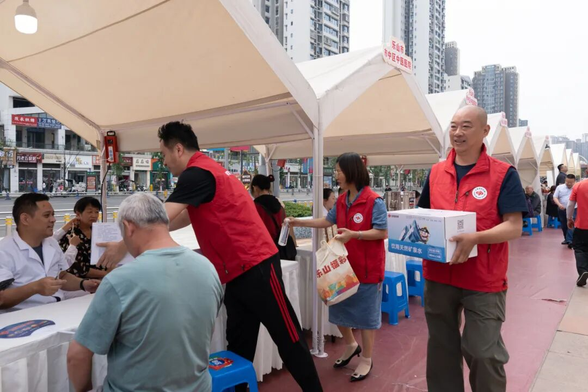
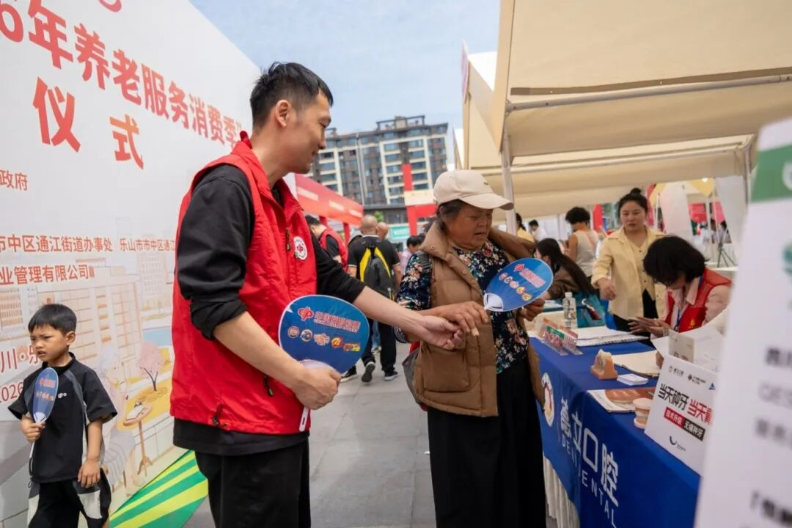
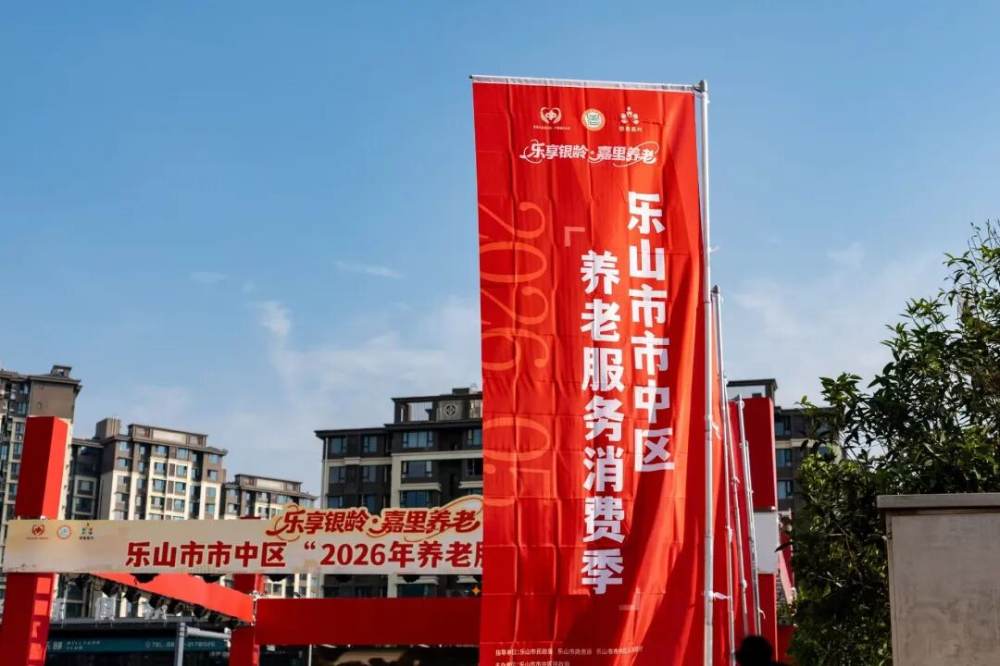

# 快闪送清凉 福彩暖银龄
> 公众号: 乐山福彩有礼了
> 发布时间: 2026年5月15日 15:19
> 原文链接: https://mp.weixin.qq.com/s/yq1i1S9chauqUkfatkdFGQ

---

近日，乐山市市中区居家社区养老服务集成改革创新试点暨2026年养老服务消费季启动仪式在嘉州大地拉开帷幕。本次活动由乐山市市中区民政局主办，旨在搭建养老服务供需对接平台，落实养老服务消费补贴政策，激活区域养老消费市场，推进居家社区养老服务集成改革创新试点工作。40余家养老服务企业、医疗机构、金融机构及社会组织参展。热闹的启动仪式现场，一抹亮眼的“福彩红”格外引人注目——四川福彩乐山分中心工作人员穿梭于人群之中，为前来参加活动的企事业单位代表、社会公众及老年朋友们送上定制矿泉水与清凉纸扇，用一场简短而温暖的“快闪公益”，为初夏的嘉州增添一份贴心凉意。

****一瓶清凉水，一把爱心扇****

******福彩****“扶老”在身边******

上午9时许，启动仪式现场人头攒动。来自全市优质养老机构、品牌商家、医疗单位的展位依次排开，不少老年人在家属陪同下驻足咨询。乐山分中心工作人员面带微笑，将一瓶瓶印有福彩标识的矿泉水和一把把设计简洁的纸扇递到老人们手中。“老人家，天气热了，喝口水，扇扇子。”工作人员一边发放，一边耐心解答老人们对福彩公益金的疑问。

“今天来咨询养老政策，没想到还有免费的水喝，你们想得真周到。”一位头发花白的老大爷接过水后连连道谢。旁边一位阿姨也笑着摇起纸扇：“这么热的天，这扇子太实用了，心里感觉特别亲切。”

据现场工作人员介绍，此次活动共发放矿泉水1300余瓶、纸扇200余把，虽是小物件，却承载着福彩人对老年群体的关爱。“我们希望通过这种‘快闪’式的微公益行动，让更多市民直观感受到：福彩就在身边，公益触手可及。”

    **快闪公益见初心**

**“扶老”宗旨落实处**

福利彩票的发行宗旨是“扶老、助残、救孤、济困”，此次送水送扇活动，正是乐山分中心践行宗旨、助力养老事业的一次生动注脚。

近年来，乐山分中心持续开展“益路扶老”、“走进民政福利机构”等系列品牌公益活动，从捐赠养老机构急需设备到参与养老服务消费季，从物资帮扶到理念传播，不断拓展“扶老”的外延与内涵。“养老服务消费季是市中区推动养老事业发展的重要平台，我们作为福彩人，不仅要筹集好公益金，更要走到老人身边，用实实在在的小服务传递大情怀。一瓶水、一把扇，看似微不足道，但代表着一份心意、一份尊重。”分中心相关负责人表示，“下一步，我们继续将‘快闪公益’常态化，结合重要节点和民政活动，用更多‘小而美’的公益行动，把福彩的温暖送到老人心坎上。同时，也将进一步管好用好福彩公益金，支持养老设施建设、适老化改造等民生项目，让每一分钱都花在刀刃上。”

**END**