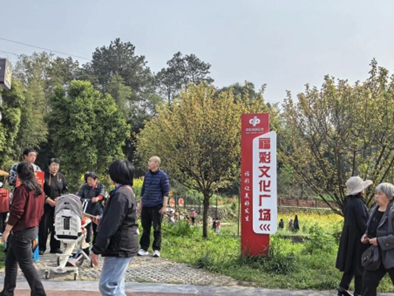
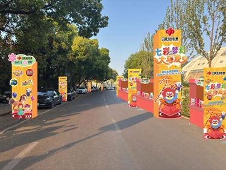
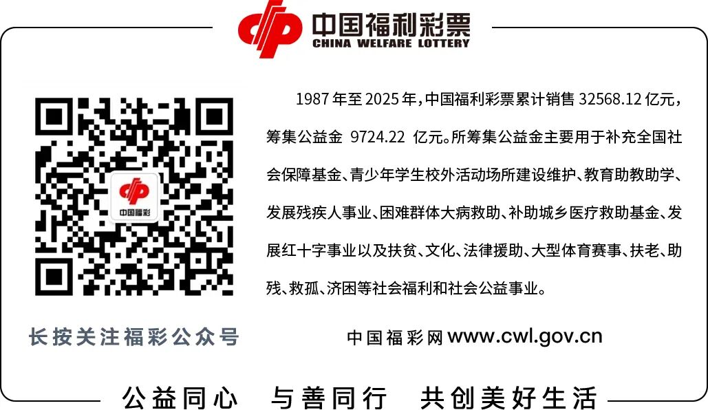

# 春暖花开，请查收这份福彩Citywalk指南
> 公众号: 中国福彩
> 发布时间: 2026年4月4日 08:00
> 原文链接: https://mp.weixin.qq.com/s/Mgzp-TskXmUVTw3QyP9Taw

---

春天的暖风，把重庆吹成了一首悠扬的山歌。永川区春游赏春季暨黄瓜山梨花荟在中华梨村梨花广场拉开帷幕。走在梨花道上，花瓣轻轻落在肩头。不远处，“福彩文化广场”的标识牌悄然映入眼帘。

古色古香的茅草凉亭里，人们围坐休憩，分享刚拍下的美景；广场中央，金黄的油菜花田前，铺设着长长的木质座椅。一座橘色相框般的建筑上写着“在这里等你”，成为游客争相打卡的热门背景。

这里不只是休憩场所，更是融合公益宣传、浪漫打卡与农旅体验的平台。在这里，福彩走进花海，出现在人们Citywalk的照相框里，大家在沉浸春日美景的同时，感受着福彩带来的温度。

**福彩“变”了**

在许多人印象中，福彩是街角那间亮着灯的小门面，布局紧凑，色调单一。如今，福彩已悄然出现在Citywalk的路线图里。

它出现在南京夫子庙、中山陵的树荫下，透明的玻璃勾勒出干净的空间，时尚的墙面闪闪发亮。年轻人推门而入，满是惊喜。

它出现在青岛中山公园的德式建筑楼里。在一家叫“壹号彩咖”的小店，福彩销售与咖啡、西点、养生茶饮、景区旅游等联动。咖啡机嗡嗡作响，手冲咖啡的香气与刮刮乐拼凑出一个惬意的午后。

从“我去找福彩”到“福彩在Citywalk的路上等着我”，福彩不再只是卖彩票的地方，而成了城市文旅场景里让人愿意停下脚步的所在。Citywalk途中，人们可以进来歇歇脚，点一杯香醇的咖啡，来一张满怀期待的彩票。福彩的善意，就这样在时光里有了具现。

**一场恰到好处的奔赴**

Citywalk的本质，是人们对美好生活的奔赴。我们去逛公园，去打卡网红景点，说到底，是在寻找那些能让我们从日常中短暂抽离的瞬间。

而福彩的本质，恰好是“希望”与“善意”。每一张福利彩票，都有一部分汇入公益金，去扶老、助残、救孤、济困、帮助那些需要帮助的人。购彩，就已做了一件小小的好事。

3月21日至4月6日，南京福彩深度融入城市文旅热潮，在文学客厅、南京青奥体育公园、太阳宫等热门场景开展春季全城推广活动。明城墙脚下的文学客厅里，游客可以与“李白”对诗品茗，听“曹雪芹”解读红楼，还能参与福彩公益互动。青奥体育公园的演唱会外场，“福彩能量站”让乐迷在享受音乐的同时，感受“快乐公益”。

3月28日，“绒耀西湖 樱为有你”樱花季文化市集开幕。邗江福彩在樱花大道入口设置展台。游客在赏樱拍照、品尝美食之余，随手刮一张彩票，感受“即刮即兑”的小乐趣。

3月，汕头福彩在汕头小公园国际灯会闪亮登场，让福彩元素与灯会氛围自然融合。市民、游客可以了解福彩公益金的去向，聆听公益项目背后的暖心故事，也可以在“刮刮乐”体验区随手刮一张，感受一份小惊喜。

福彩的公益温度，就这样融入春日烟火气里。当Citywalk的脚步叩响春日街巷，福彩以公益之名悄然驻守在热门打卡点，化作公益活动、爱心驿站、公益展台。它和樱花有关，和灯会有关，和春天有关，和所有让人心情愉悦的事物站在一起。

**让公益触手可及**

**让美好自然发生**

不必刻意去做公益，只是在逛公园时顺手刮了一张彩票，然后发现自己为某个山区的学校添了一块砖；不必刻意去寻找美好，只是在Citywalk的某个瞬间，遇见一抹亮眼的“福彩红”，让公益的温度恰好落在身上。

这便是“触手可及的公益”。它不再是一个遥远的概念，而是春天梨花树下的一次心动，咖啡杯旁的一张刮刮乐，Citywalk途中的一次不期而遇。

而“自然发生的美好”也正在于此。您在享受春天，享受城市，享受一个闲适的午后，公益已然发生，美好也已发生。

亲爱的朋友们，下一次计划Citywalk时，不妨把福彩站也当作一个打卡点。您正在走向春天，福彩正在走向您。美好，不期而遇。

