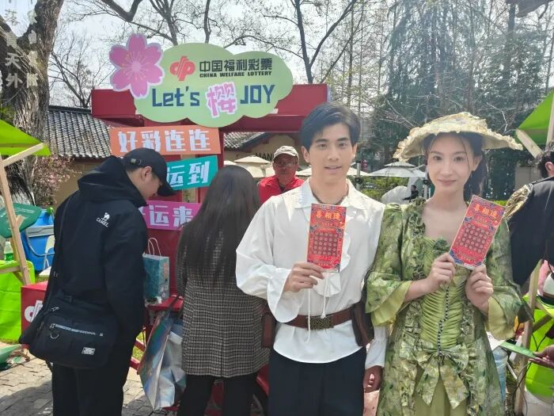
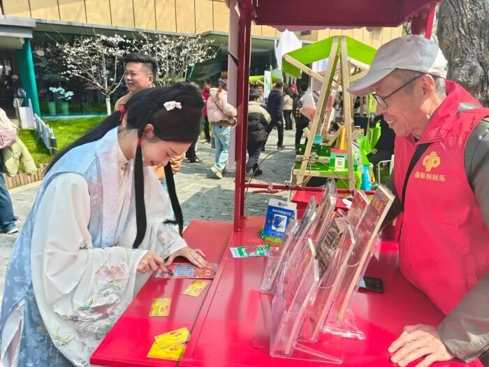
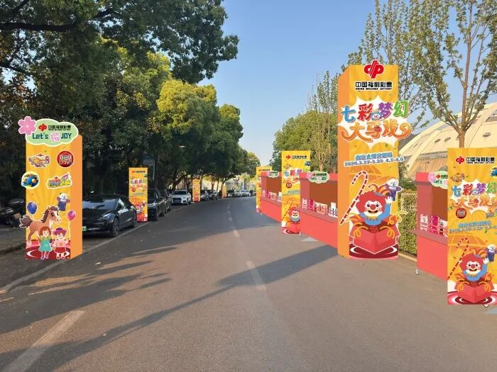

# 春风拂金陵，福彩文旅融合打造“公益+”新体验
> 公众号: 中国福彩
> 发布时间: 2026年3月28日 08:00
> 原文链接: https://mp.weixin.qq.com/s/EZw1FydUcLdIbELHoNKlfw

---

2026年3月21日至4月6日，南京市福彩中心深度融入南京文旅热潮，在文学客厅、南京青奥体育公园及太阳宫等热门文旅场景中，开展春季全城宣传推广活动。

在明城墙脚下的文学客厅，游客不仅能与“李白”对诗品茗，聆听“曹雪芹”解读红楼，还能在活动体验区参与福彩公益互动。

南京青奥体育公园体育馆内，演唱会外场特别设置“福彩能量站”，让乐迷在享受音乐的同时，感受“快乐慈善”的独特魅力。

玄武湖畔的南京太阳宫剧场将连续9天带来26场“七彩梦幻大马戏”，期间特别打造的太阳宫NICE市集内，设有福彩“刮刮乐”打卡墙。

本次活动是传统彩票销售向“场景化公益”转型的重要突破，实现了地方福彩与本地文旅的跨界融合，让市民在享受城市美好生活的同时，直观感受福彩“扶老、助残、救孤、济困”的发行宗旨。

