# 相约老博会｜上海福彩携公益温情 赴银发之约
> 公众号: 上海福彩
> 发布时间: 2026年6月6日 15:30
> 原文链接: https://mp.weixin.qq.com/s/NtubUTtyJ_dzftroZ3f7VQ

---

2026年6月4日至6日，上海福彩以 “福马献瑞 彩运当头”为主题，亮相上海老博会W1E12展位。为期三天的展会渐近尾声，上海福彩打造兼具温度、互动与人文情怀的公益展台，让福彩公益看得见、摸得着、感受得到，以点点善意温润申城银发岁月。

**适老暖心设计**

**细节藏满关爱**

立足老年朋友逛展需求，展台特设分层舒适体验：亮眼主题展区聚拢人气，全票种销售服务专区便捷购彩，轻松解压的DIY手工活动定格欢乐时光。循序渐进的体验节奏，精准贴合老年群体活动特点，将福彩扶老、爱老、敬老的初心，融入每一处细节。

公益长廊成为现场暖心打卡点，图文并茂的展示让抽象的公益变得直观可感，生动讲述福彩助力民生、守护银发幸福的温暖故事。

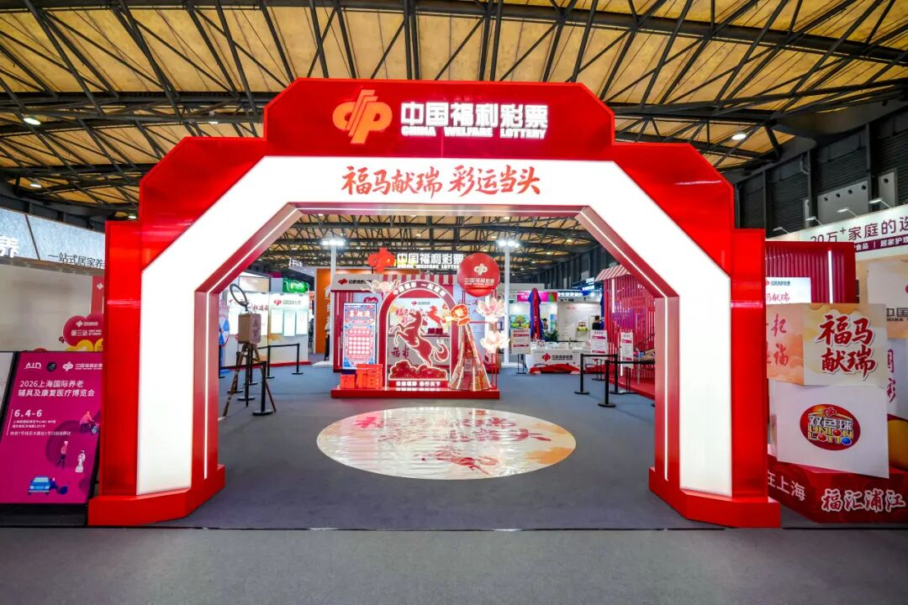

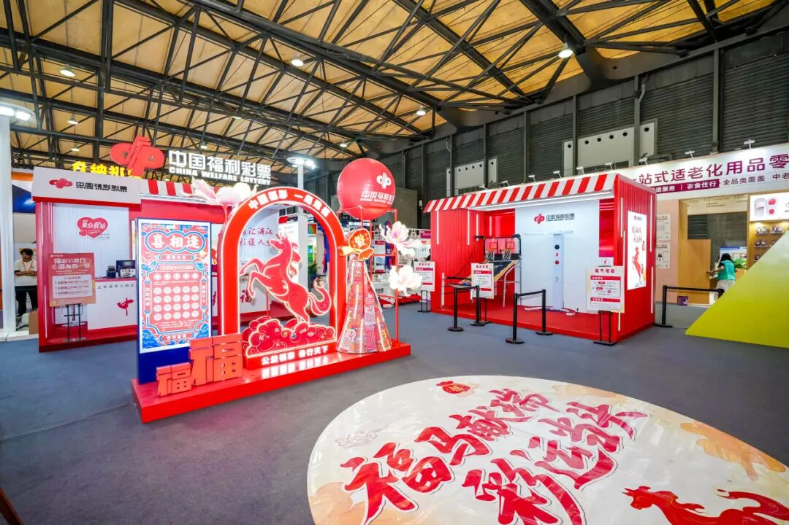

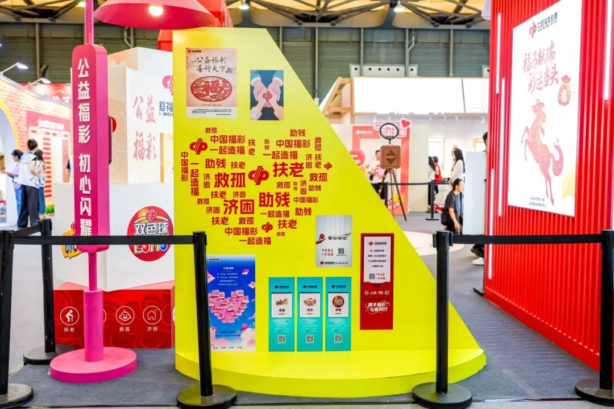

左右滑动查看更多

**公益落地可触**

**善意汇聚成光**

小小彩票，承载满满担当。展台清晰传递公益初心：每一张2元的双色球，有0.72元汇入公益金；每一张10元的刮刮乐，有2元流向社会公益事业。每一份购彩善意，都精准对接养老、民生等领域，让点滴爱心化作实实在在的温暖，让市民真切感知福彩公益的沉甸甸分量。

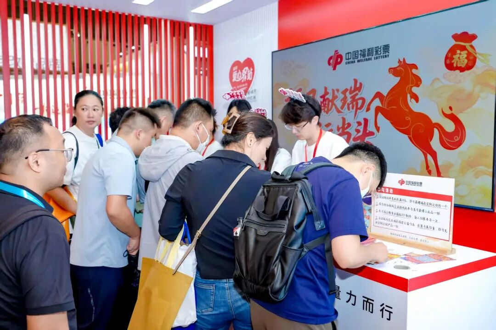

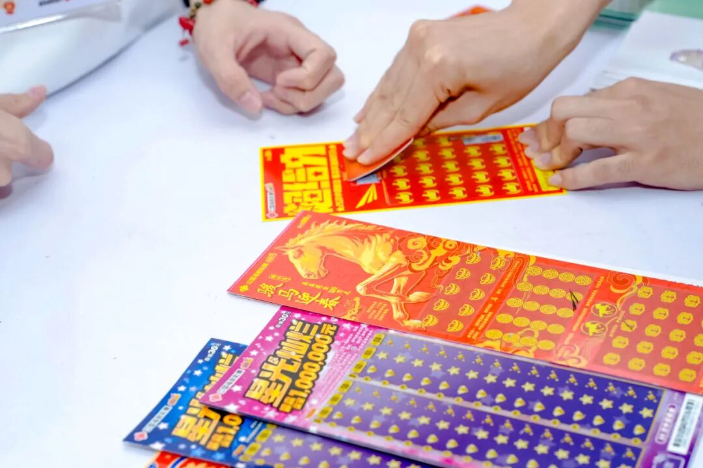

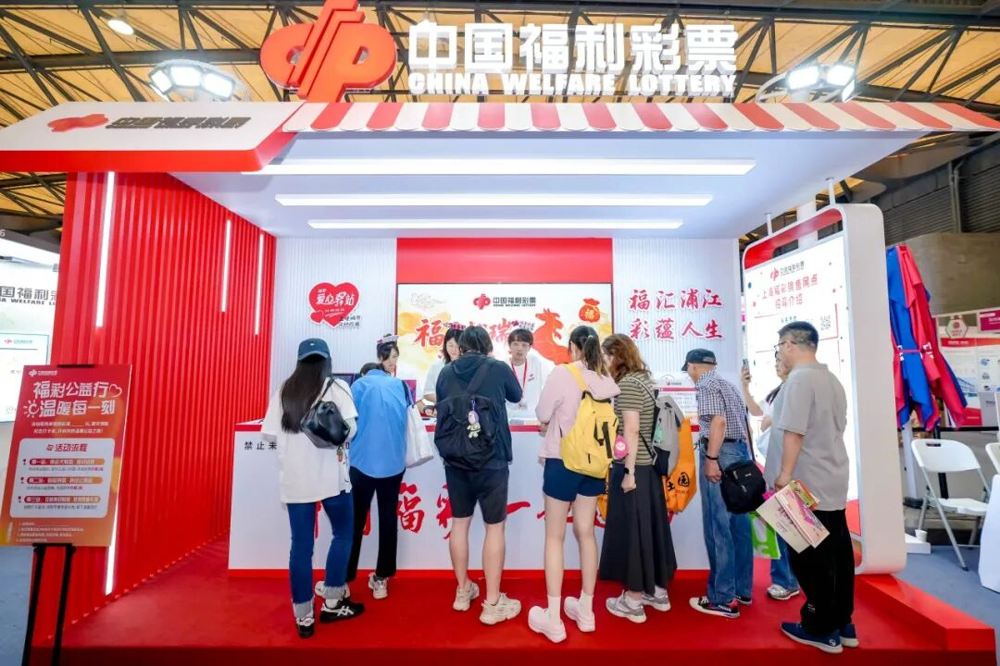

左右滑动查看更多

**趣味互动赋能**

**温情传递初心**

展台精心打造趣味投球、福运在握、福气相随三款互动小游戏，参与感十足，欢乐值拉满。现场互动体验备受青睐，福彩徽章、冰箱贴DIY人气爆棚，亲手制作专属文创，在动手实践中感受福彩文化魅力；全新上线的福彩公益护照打卡活动，将公益知识融入趣味环节，定格每一份温暖的公益参与瞬间，让福彩公益理念悄然深入人心。

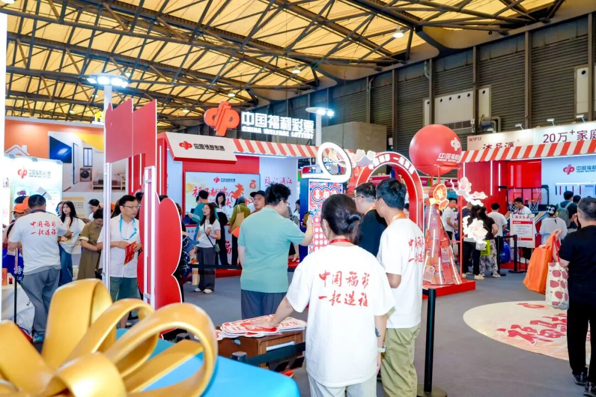

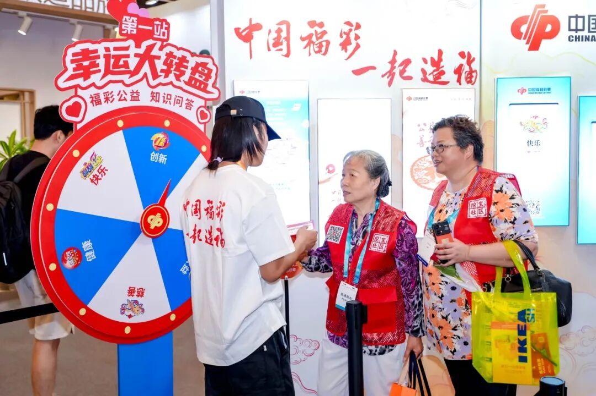

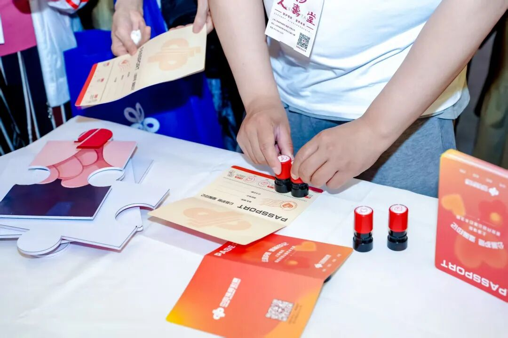

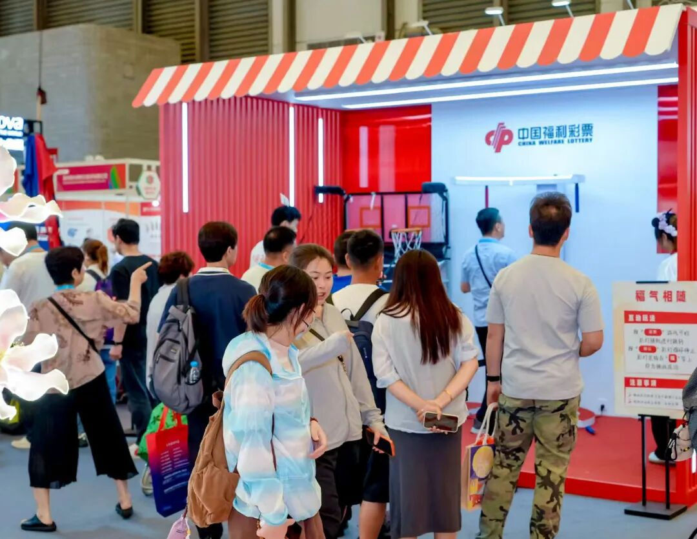

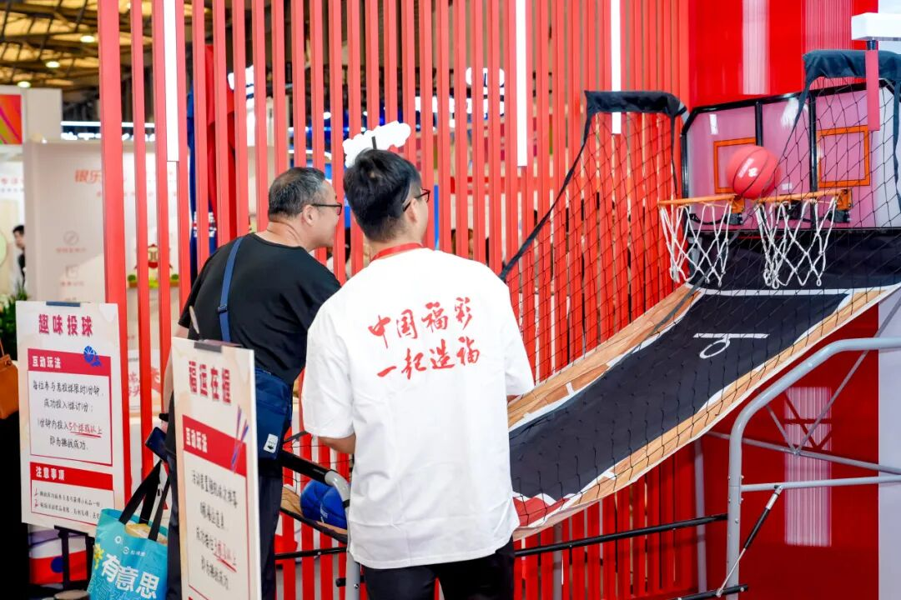

左右滑动查看更多

三日相聚虽短，公益步履不停。上海福彩以公益为纽带，汇聚万千购彩者的点点微光，用心守护银发日常，让点滴善意落地生根，温暖申城。

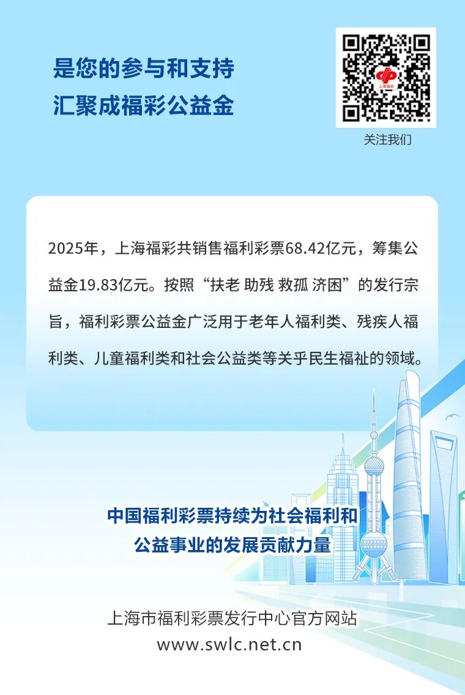