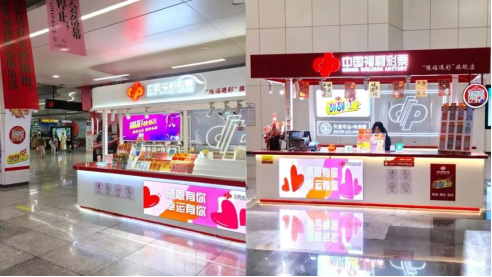
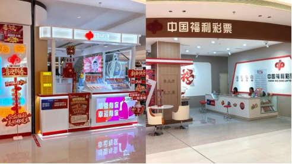
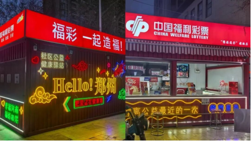
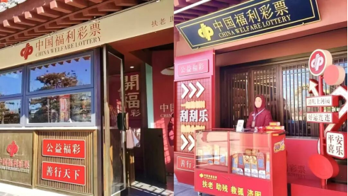

# 豫见“福彩+”，让“随手公益”温暖生活
> 公众号: 中国福彩
> 发布时间: 2026年5月21日 08:00
> 原文链接: https://mp.weixin.qq.com/s/6ZmlMAI646MC8sdTceaptA

---

一张彩票，温暖生活。近年来，河南福彩持续探索“福彩+生活”融合路径，将福彩元素融入地铁、商场、园区等场景，让公众在日常出行的间隙、休闲购物的午后、漫步园区的途中，即可轻松参与福彩公益，为生活增添惊喜，让公益触手可及。

**福彩+地铁**

**为城市动脉添一抹暖**

地铁是城市的通勤“动脉”之一，“福彩+地铁”不仅解锁了全新的服务场景，也让公益传播更加便捷。在郑州紫荆山、东风路、黄河路、二七广场、会展中心等多个地铁站，“豫福遇彩”地铁旗舰店已正式运营。开放式的空间营造出轻松舒适的购彩氛围，无需绕行、不必出站，换乘间隙“随手公益”，让每一趟通勤，都成为一段温暖的公益之旅。

**福彩+商场**

**为休闲时光加一份趣**

商场是城市生活的“第二客厅”，更是年轻人休闲消遣的首选之地。福彩以主题快闪店的形式，悄然走进郑州国贸、龙湖天街等商场。

明亮的色彩搭配、有趣的互动日常、种类丰富的即开票，让消费者轻松参与公益；一杯奶茶的时间，一次指尖的选择，快乐与善意便同步传递，快闪店更成为随手公益的公益驿站。

**福彩+夜市**

**为市井烟火注一股暖**

夜市藏着一座城市的烟火气，喧闹的人群、闪烁的霓虹，承载着人们最真实的生活热情。

福彩走进郑州健康路、北大学城等热门夜市，亮眼的标识、多样的即开票，休闲的同时，随手购买一张彩票，既收获了小小的期待，也传递了一份善意，让公益融入最鲜活的城市，在烟火气中自然生长。

**福彩+景区**

**为旅途记忆留一份甜**

旅途中的风景令人沉醉，而一份意外的小惊喜，更能成为难忘的回忆。福彩走进景区，将公益与文旅深度融合，让游客收获一份独特的旅行记忆。

在开封清明上河园，福彩融入“宋潮”文化，每一处细节都透着温暖与责任。游客随手买一张彩票，既是旅途中的小确幸，也是对公益事业的一份助力。

**福彩+文化**

**为精神角落添一份力**

文化空间是城市的精神栖息地，也是年轻人打卡聚集的热门场所。福彩走进文化街区，探索“公益+非遗”“公益+艺术”的跨界体验，在郑州油化厂创意园区、亳都新象等特色街区，福彩将公益嵌入日常打卡场景，让人们在感受文化魅力的同时，自然地接触公益、参与公益，让善意与美好双向奔赴。

从地铁到商场，从夜市到景区，从文化空间到更多日常场景，福彩正以更年轻、更轻盈的方式走进公众视野。未来，河南福彩还将有更多创新尝试，拉近公益的距离，让善意弥漫城市的每一个角落，用每一次“随手公益”温暖生活。

