# 跟着福彩游自贡——在盐都的烟火气里，遇见幸运与温暖
> 公众号: 四川福彩发布
> 发布时间: 2026年5月9日 09:08
> 原文链接: https://mp.weixin.qq.com/s/j2ZMeQxyfa4ECFFb7Nkt0A

---

千年盐都，璀璨灯城。自贡作为国家历史文化名城，坐拥 “千年盐都、恐龙之乡、中国灯城、美食之府” 四张城市名片，文旅资源富集、人文积淀深厚。自贡分中心深挖本土文化底蕴、创新公益宣传载体，开展了一次极具意义的探索实践。

当福彩中国红邂逅盐都山水风光，当公益温度相拥市井人间，“跟着福彩游自贡”便不只是一场文旅之行，更是一场邂逅美好、邂逅幸运、邂逅希望的沉浸式体验。自流井老城风韵、贡井和沿滩市井烟火、大安灯海梦幻盛景、高新区都市繁华，还有两县悠远文脉与古镇青砖黛瓦，处处风光皆有福彩网点相伴相随，为旅途增添惊喜，为公益汇聚温情力量。

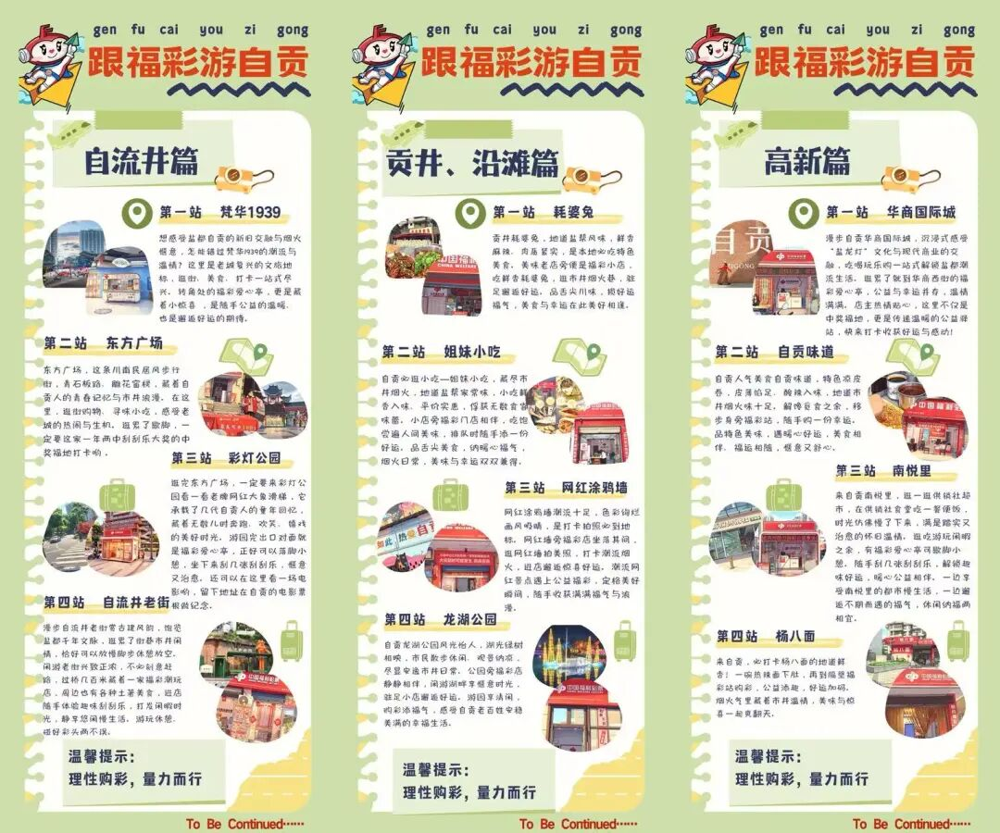

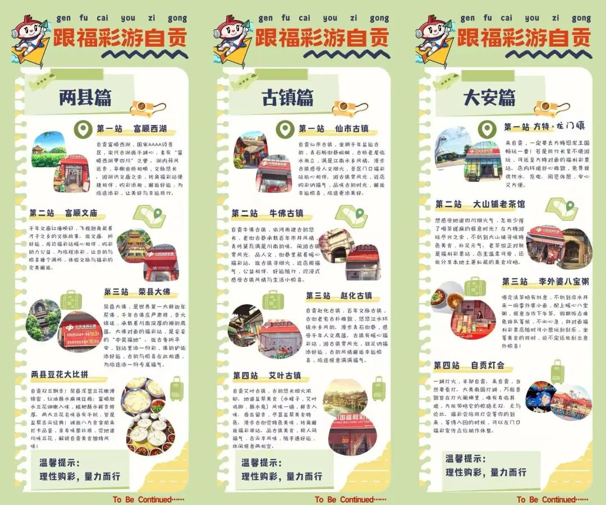

**0****1**

**自流井篇：老城记忆与潮流新生**

老城不老，因为爱心与幸运不曾缺席。梵华1939文创园集工业遗存、文创艺术、潮流消费于一体，是自贡版的“东郊记忆”；彩灯公园始建于1930年，是中国彩灯文化的发源地，承载了一代又一代自贡人的童年记忆。逛老城、寻美食，在游园出口对面的爱心亭歇脚，刮几张刮刮乐，既是惬意的放松，也是随手参与公益。

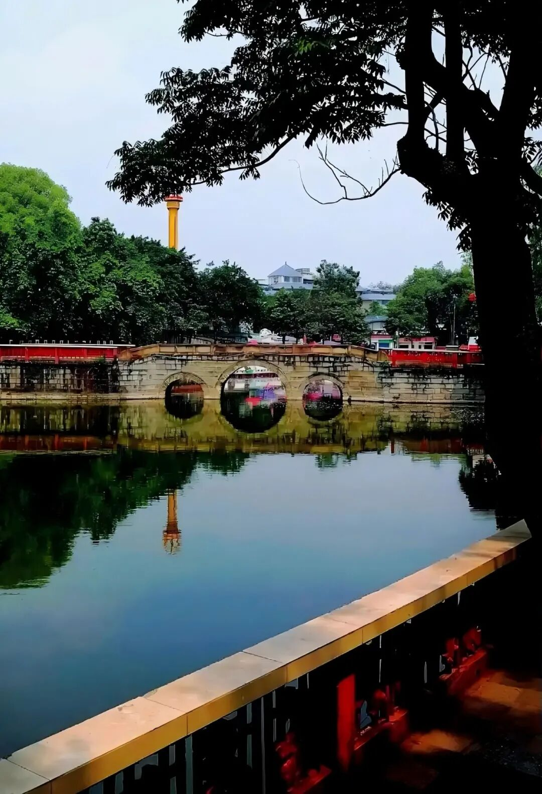

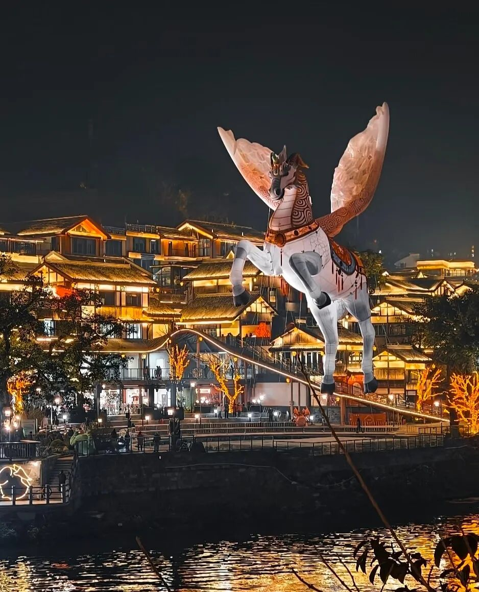

**0****2**

**贡井·沿滩篇：市井风味与网红打卡**

贡井平桥瀑布，是国内独一无二的城市天然瀑布，也是釜溪河畔独树一帜的自然奇观。耗婆兔麻辣鲜香、风味十足，姐妹小吃荟萃地道市井烟火；网红涂鸦墙潮流鲜活、色彩灵动；龙湖公园湖光树影、景致怡人，尽展自贡最接地气的生活日常。一间间福彩小店隐匿在美食街巷、公园之畔、网红墙旁，烟火美味与公益幸运在此相融相伴，为寻常时光添一份暖意，让平凡日子自带星光。

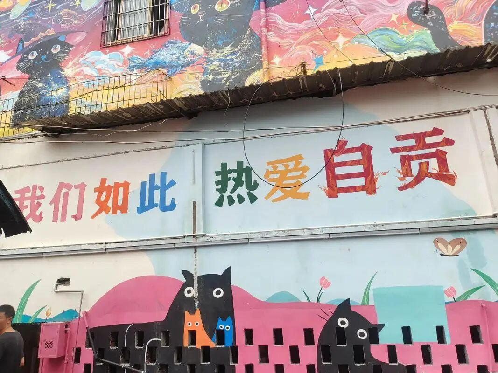

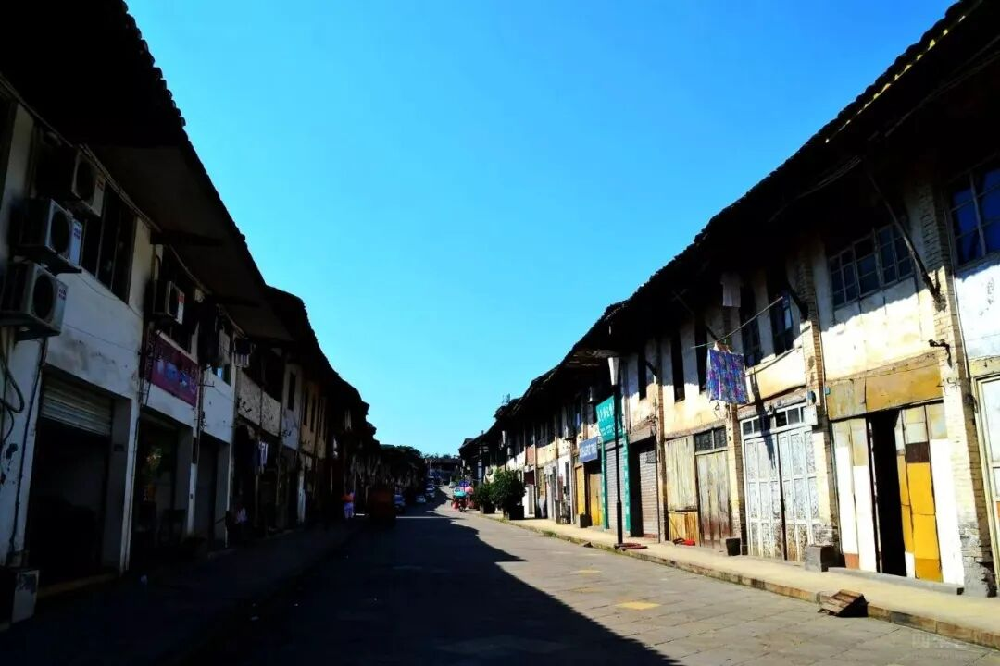

**0****3**

**高新篇：现代繁华与文化交融**

漫步华商国际城，在盐龙灯文脉与现代商圈的交融间，感受城市鲜活脉搏；走进南悦里供销社食堂，重温岁月烟火情怀；落坐杨八面庄，嗦一碗鲜香地道的本地风味。市井烟火氤氲着人间温情，街头福彩站点，更藏着一份随手可为的公益暖意。逛游途中稍感疲惫，福彩爱心亭便是歇脚小憩、暖心驻足的理想驿站。

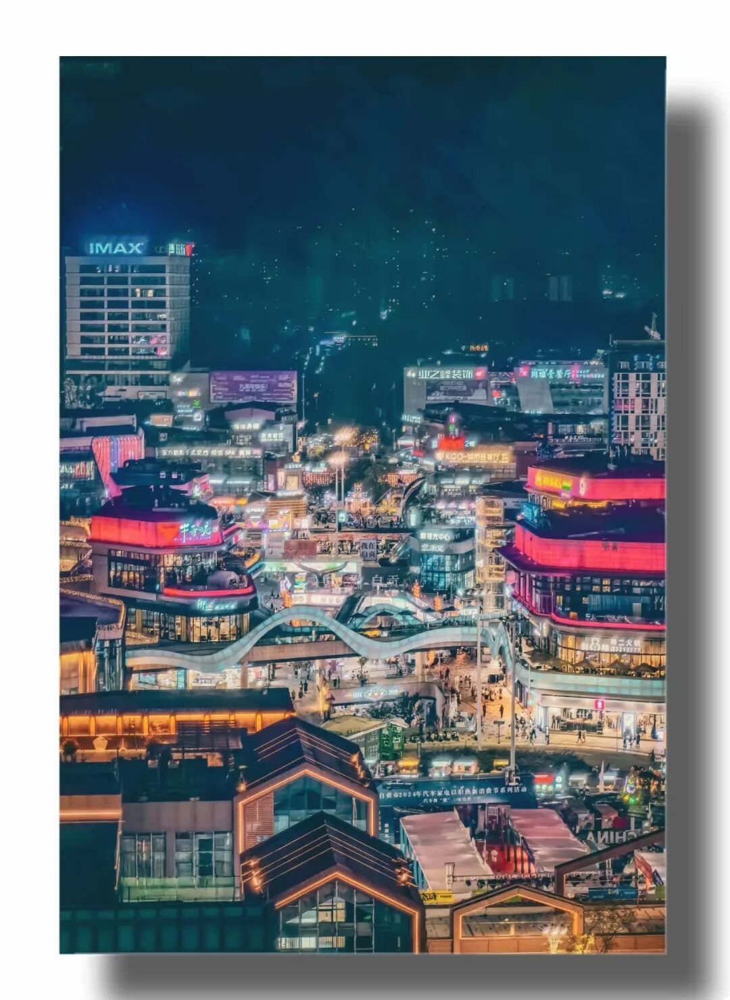

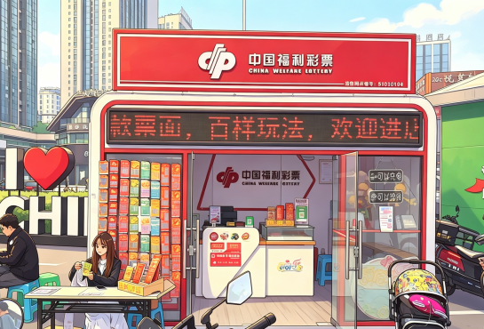

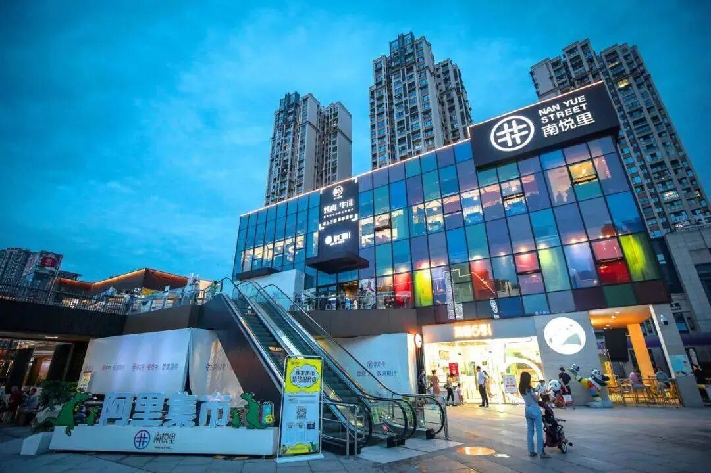

**04**

**大安篇：奇幻灯海与恐龙王国**

方特恐龙王国是全球首个以恐龙文化为主题的大型高科技主题乐园；自贡恐龙博物馆是世界三大恐龙遗址博物馆之一，也是联合国教科文组织世界地质公园的核心园区；中华彩灯大世界享誉中外，素有“天下第一灯”的美称；大山铺老茶馆的悠闲时光，三十年老店文火慢熬、暖心暖胃的李外婆八宝粥——大安本就是奇幻与现实交织的地方。灯会入园前，不妨在福彩宣传点稍作休整，让等待的时光也充满期待，而福彩，就是这灯火里最温暖的一抹红。

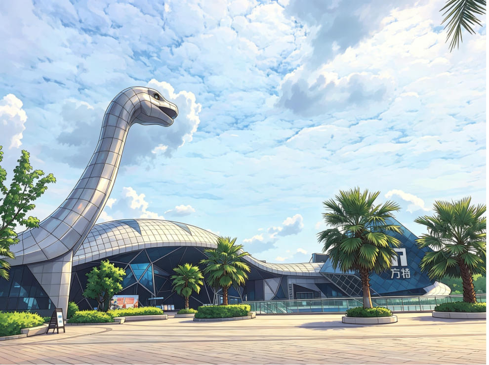

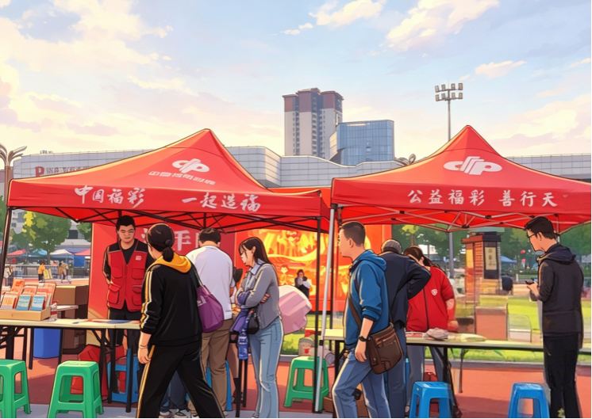

**05**

**两县篇：佛光庇佑与才子文脉**

始建于唐代的荣县大佛，是中国第二大石刻佛像、世界第一大释迦牟尼坐像，位列全国重点文物保护单位。庄严巍峨的石刻造像，静静诉说着千年禅韵与佛光庇佑。大佛脚下的福彩站点，更是被市民亲切誉为“中奖福地”。富顺西湖荷风拂面、暗香浮动，始建于北宋的文庙红墙黛瓦、飞檐翘角，氤氲出才子之乡的千年文脉底蕴。游湖访古、漫步街巷，转角便能邂逅福彩温情，让千年古韵与幸运惊喜不期而遇。

畅游荣县、富顺两地，更不能错过风味各异的盐帮豆花：一碗嫩滑爽口，一碗绵密醇香，皆是地道本土味道。旅途赏美景、品美食，而一张福利彩票，便是这场山水美食之旅最美的意外惊喜。

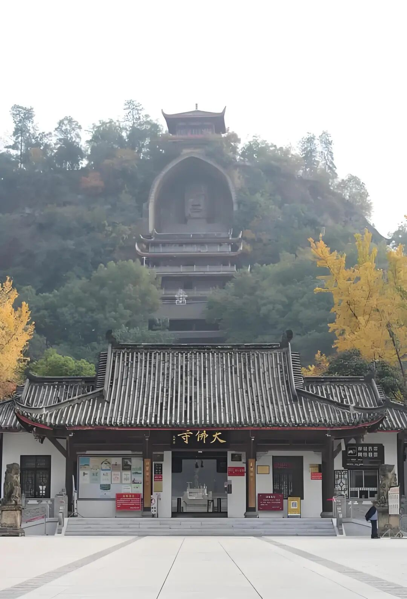

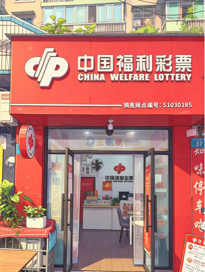

**06**

**古镇篇：盐运古韵与时光长廊**

仙市古镇是“中国盐运第一镇”，也是釜溪河畔的千年码头，保存完好的明清古街、古码头、古祠堂，诉说着千年盐运的悠悠古韵。牛佛古镇九宫十八庙格局承载着百年市井风情，牛佛烘肘更是名扬川渝；赵化古镇的青石街巷幽静质朴，这里也是戊戌六君子之一刘光第的故乡；艾叶古镇的天车（盐井架）景观独特，处处洋溢着盐帮烟火气。漫步其间，仿佛穿行在时光长廊之中，而散落于每座古镇的福彩网点，就像一位默默守候的老友，在你游览人文风光之余，为你纳福添运，让旅途的每一分惬意，都化作公益的一份力量。

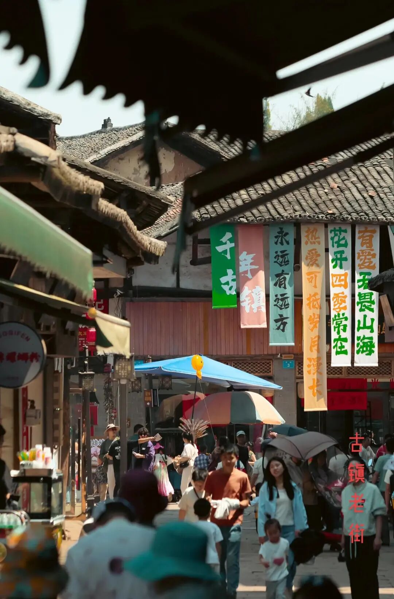

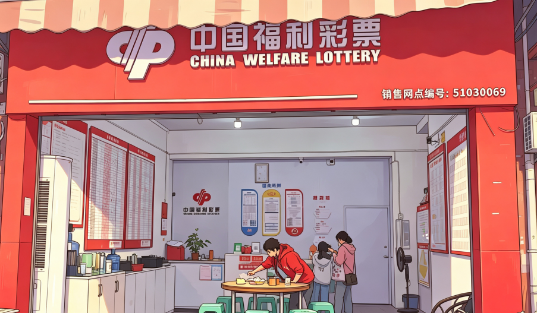

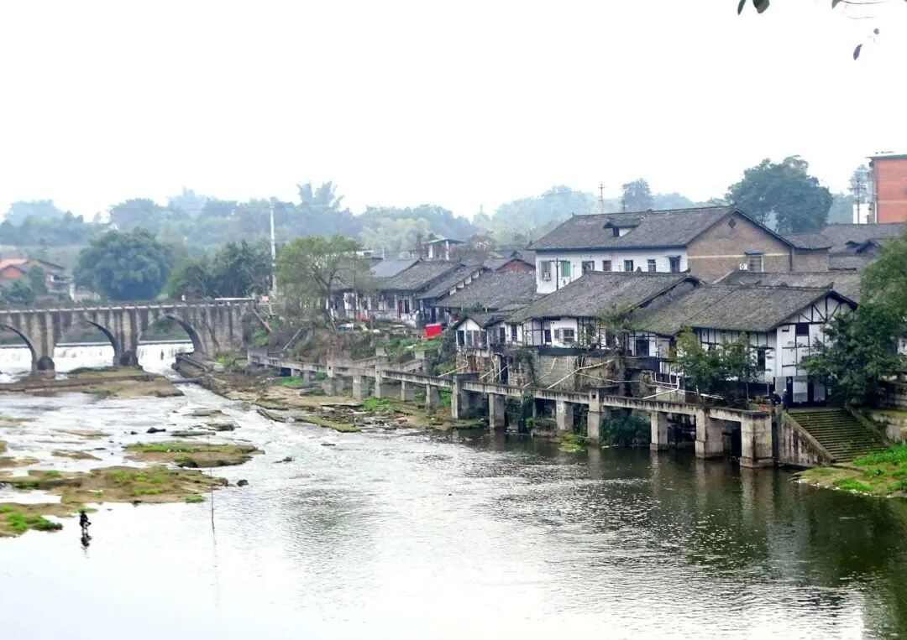

每一次随手购彩，都是一次微公益；每一场旅途邂逅，都是一份小确幸。跟着福彩游自贡，游的是别致风景，品的是千年盐文化，传递的是融融温暖，收获的是满满希望。福彩不只是街边门店的一纸彩票，更是融入城市烟火、浸润百姓日常的温暖公益力量。

文章来源：自贡分中心

