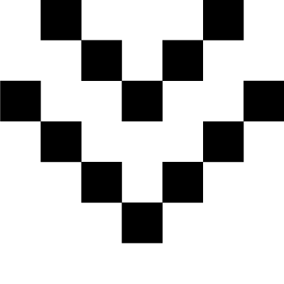
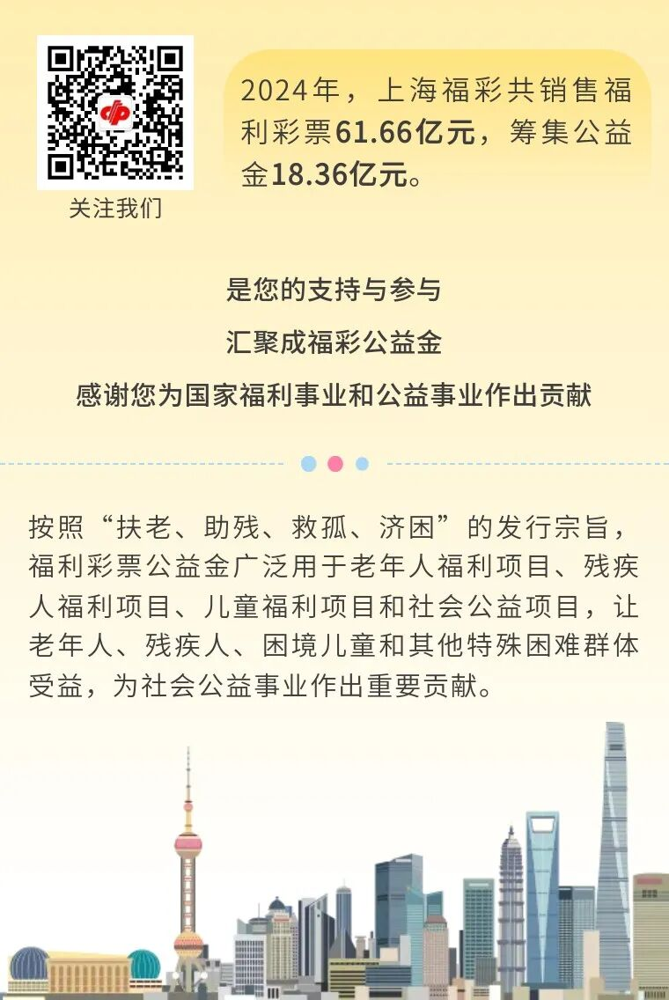

# 送你一朵小红花，双色球主题活动温暖再出发
> 公众号: 上海福彩
> 发布时间: 2025年8月8日 16:03
> 原文链接: https://mp.weixin.qq.com/s/JSH7h9g03aX9md3R59Ktkg

---

**双色球·送你一朵小红花**

**2025年8月8日**

**温暖再出发**

三载同行，温暖相伴

**双色球•送你一朵小红花主题营销活动**

自2022年起

这场公益行动已陪伴我们走过三个盛夏

2025年8月8日

这场一年一度的爱心之约再次启程

邀您一起

让快乐更有温度

**线上育花，抽取好礼，为爱助力**

8月8日-8月22日，购买双色球彩票、登录线上活动平台、扫描双色球票面营销二维码参与活动，根据活动规则获取阳光值助力花开，即可向公益项目赠花，还有机会获得华为耳机、定制行李箱、福彩IP定制玩偶、饿了么超级吃货卡等缤纷好礼，更有机会向公益项目捐赠公益物资，为公益事业助力。

一张小小的双色球彩票

传递着温暖与力量

将万千爱心绽放成花

关注“中国福彩”微信公众号

点击“小红花”菜单栏

或扫描活动海报二维码

参与线上活动

培育温暖之花，助力公益项目

**线下快闪，花开福地，传递爱意**

8月8日-8月14日，“双色球·送你一朵小红花”快闪活动将在黑龙江哈尔滨、江西南昌、河南郑州、西藏拉萨、青海西宁、宁夏银川、新疆伊宁7大城市联动开展。

用户可在快闪店参与购彩抽奖、打卡拍照、分享微信朋友圈/小红书、集赞获礼等互动活动，有机会获得鲜花、定制扇子、贴纸、冰箱贴、双色球彩票、饿了么超级吃货卡等丰富礼品。

点击下方查看快闪店地址

▼

<table style="border-collapse: collapse;box-sizing: border-box;margin-bottom: 10px;"><tbody><tr style="box-sizing: border-box;"><td data-colwidth="23.0000%" width="23.0000%" style="border-width: 0px 1px 0px 0px;border-color: rgb(62, 62, 62) rgb(253, 252, 242) rgb(62, 62, 62) rgb(62, 62, 62);border-style: none solid none none;background-color: rgb(240, 86, 36);box-sizing: border-box;padding: 0px;"><section style="margin: 15px 0%;box-sizing: border-box;"><section style="padding: 0px 5px;color: rgb(255, 255, 255);font-size: 14px;box-sizing: border-box;">
<strong style="box-sizing: border-box;">城市</strong>
</section></section></td><td data-colwidth="49.0000%" width="49.0000%" style="border-width: 0px 1px 0px 0px;border-color: rgb(62, 62, 62) rgb(253, 252, 242) rgb(62, 62, 62) rgb(62, 62, 62);border-style: none solid none none;background-color: rgb(240, 86, 36);box-sizing: border-box;padding: 0px;"><section style="margin: 15px 0%;box-sizing: border-box;"><section style="text-align: center;padding: 0px 5px;color: rgb(255, 255, 255);font-size: 14px;box-sizing: border-box;">
<strong style="box-sizing: border-box;">网点详细地址</strong>
</section></section></td><td data-colwidth="27.0000%" width="27.0000%" style="border-width: 0px 1px 0px 0px;border-color: rgb(62, 62, 62) rgb(253, 252, 242) rgb(62, 62, 62) rgb(62, 62, 62);border-style: none solid none none;background-color: rgb(240, 86, 36);box-sizing: border-box;padding: 0px;"><section style="margin: 15px 0%;box-sizing: border-box;"><section style="text-align: center;padding: 0px 5px;color: rgb(255, 255, 255);font-size: 14px;box-sizing: border-box;">
<strong style="box-sizing: border-box;">网点编号</strong>
</section></section></td></tr><tr style="box-sizing: border-box;"><td data-colwidth="23.0000%" width="23.0000%" style="border-width: 0px;border-color: rgb(62, 62, 62) rgb(122, 175, 231) rgb(122, 175, 231) rgb(62, 62, 62);border-style: solid;background-color: rgb(253, 252, 242);padding: 10px 8px;box-sizing: border-box;"><section style="margin: 5px 0%;box-sizing: border-box;"><section style="padding: 0px;font-size: 14px;letter-spacing: 0.5px;box-sizing: border-box;">
哈尔滨
</section></section></td><td data-colwidth="49.0000%" width="49.0000%" style="border-width: 0px;border-color: rgb(62, 62, 62) rgb(122, 175, 231) rgb(122, 175, 231) rgb(62, 62, 62);border-style: solid;background-color: rgb(253, 252, 242);padding: 10px;box-sizing: border-box;"><section style="margin: 5px 0%;box-sizing: border-box;"><section style="padding: 0px 2px;font-size: 14px;box-sizing: border-box;">
南岗区哈西大街299号西城红场B1MB507
</section></section></td><td data-colwidth="27.0000%" width="27.0000%" style="border-width: 0px;border-color: rgb(62, 62, 62) rgb(122, 175, 231) rgb(122, 175, 231) rgb(62, 62, 62);border-style: solid;background-color: rgb(253, 252, 242);padding: 13px 10px;box-sizing: border-box;"><section style="margin: 5px 0%;box-sizing: border-box;"><section style="text-align: center;padding: 0px 1px;font-size: 14px;box-sizing: border-box;">
23011115
</section></section></td></tr><tr style="box-sizing: border-box;"><td data-colwidth="23.0000%" width="23.0000%" style="border-width: 0px;border-color: rgb(62, 62, 62) rgb(122, 175, 231) rgb(122, 175, 231) rgb(62, 62, 62);border-style: solid;background-color: rgb(253, 252, 242);padding: 10px 13px;box-sizing: border-box;"><section style="margin: 5px 0%;box-sizing: border-box;"><section style="padding: 0px 2px;font-size: 14px;box-sizing: border-box;">
南昌
</section></section></td><td data-colwidth="49.0000%" width="49.0000%" style="border-width: 0px;border-color: rgb(62, 62, 62) rgb(122, 175, 231) rgb(122, 175, 231) rgb(62, 62, 62);border-style: solid;background-color: rgb(253, 252, 242);padding: 10px;box-sizing: border-box;"><section style="margin: 5px 0%;box-sizing: border-box;"><section style="padding: 0px 2px;font-size: 14px;box-sizing: border-box;">
北京东路428号恒茂梦时代广场圆盘
</section></section></td><td data-colwidth="27.0000%" width="27.0000%" style="border-width: 0px;border-color: rgb(62, 62, 62) rgb(122, 175, 231) rgb(122, 175, 231) rgb(62, 62, 62);border-style: solid;background-color: rgb(253, 252, 242);padding: 10px 13px;box-sizing: border-box;"><section style="margin: 5px 0%;box-sizing: border-box;"><section style="text-align: center;padding: 0px 1px;font-size: 14px;box-sizing: border-box;">
36015508
</section></section></td></tr><tr style="box-sizing: border-box;"><td data-colwidth="23.0000%" width="23.0000%" style="border-width: 0px;border-color: rgb(62, 62, 62) rgb(122, 175, 231) rgb(122, 175, 231) rgb(62, 62, 62);border-style: solid;background-color: rgb(253, 252, 242);padding: 10px 13px;box-sizing: border-box;"><section style="margin: 5px 0%;box-sizing: border-box;"><section style="padding: 0px 2px;font-size: 14px;letter-spacing: 0.5px;box-sizing: border-box;">
郑州
</section></section></td><td data-colwidth="49.0000%" width="49.0000%" style="border-width: 0px;border-color: rgb(62, 62, 62) rgb(122, 175, 231) rgb(122, 175, 231) rgb(62, 62, 62);border-style: solid;background-color: rgb(253, 252, 242);padding: 10px 13px;box-sizing: border-box;"><section style="margin: 5px 0%;box-sizing: border-box;"><section style="padding: 0px 2px;font-size: 14px;box-sizing: border-box;">
二七区地铁3号线二七站
</section></section></td><td data-colwidth="27.0000%" width="27.0000%" style="border-width: 0px;border-color: rgb(62, 62, 62) rgb(122, 175, 231) rgb(122, 175, 231) rgb(62, 62, 62);border-style: solid;background-color: rgb(253, 252, 242);padding: 10px 13px;box-sizing: border-box;"><section style="margin: 5px 0%;box-sizing: border-box;"><section style="text-align: center;padding: 0px 5px;font-size: 14px;box-sizing: border-box;">
41014320
</section></section></td></tr><tr style="box-sizing: border-box;"><td data-colwidth="23.0000%" width="23.0000%" style="border-width: 0px;border-color: rgb(62, 62, 62) rgb(122, 175, 231) rgb(122, 175, 231) rgb(62, 62, 62);border-style: solid;background-color: rgb(253, 252, 242);padding: 10px 13px;box-sizing: border-box;"><section style="margin: 5px 0%;box-sizing: border-box;"><section style="padding: 0px 2px;font-size: 14px;letter-spacing: 0.5px;box-sizing: border-box;">
拉萨
</section></section></td><td data-colwidth="49.0000%" width="49.0000%" style="border-width: 0px;border-color: rgb(62, 62, 62) rgb(122, 175, 231) rgb(122, 175, 231) rgb(62, 62, 62);border-style: solid;background-color: rgb(253, 252, 242);padding: 10px;box-sizing: border-box;"><section style="margin: 5px 0%;box-sizing: border-box;"><section style="padding: 0px 2px;font-size: 14px;box-sizing: border-box;">
纳金路城关万达广场2楼
</section></section></td><td data-colwidth="27.0000%" width="27.0000%" style="border-width: 0px;border-color: rgb(62, 62, 62) rgb(122, 175, 231) rgb(122, 175, 231) rgb(62, 62, 62);border-style: solid;background-color: rgb(253, 252, 242);padding: 10px;box-sizing: border-box;"><section style="margin: 5px 0%;box-sizing: border-box;"><section style="text-align: center;padding: 0px 5px;font-size: 14px;box-sizing: border-box;">
54010443
</section></section></td></tr><tr style="box-sizing: border-box;"><td data-colwidth="23.0000%" width="23.0000%" style="border-width: 0px;border-color: rgb(62, 62, 62) rgb(122, 175, 231) rgb(122, 175, 231) rgb(62, 62, 62);border-style: solid;background-color: rgb(253, 252, 242);padding: 10px;box-sizing: border-box;"><section style="margin: 5px 0%;box-sizing: border-box;"><section style="padding: 0px 2px;font-size: 14px;letter-spacing: 0.5px;box-sizing: border-box;">
西宁
</section></section></td><td data-colwidth="49.0000%" width="49.0000%" style="border-width: 0px;border-color: rgb(62, 62, 62) rgb(122, 175, 231) rgb(122, 175, 231) rgb(62, 62, 62);border-style: solid;background-color: rgb(253, 252, 242);padding: 10px;box-sizing: border-box;"><section style="margin: 5px 0%;box-sizing: border-box;"><section style="padding: 0px 2px;font-size: 14px;box-sizing: border-box;">
城东区南山路84号西宁中惠万达广场2F，点位编号JY-BX-205
</section></section></td><td data-colwidth="27.0000%" width="27.0000%" style="border-width: 0px;border-color: rgb(62, 62, 62) rgb(122, 175, 231) rgb(122, 175, 231) rgb(62, 62, 62);border-style: solid;background-color: rgb(253, 252, 242);padding: 10px;box-sizing: border-box;"><section style="margin: 5px 0%;box-sizing: border-box;"><section style="text-align: center;padding: 0px 5px;font-size: 14px;box-sizing: border-box;">
63018175
</section></section></td></tr><tr style="box-sizing: border-box;"><td data-colwidth="23.0000%" width="23.0000%" style="border-width: 0px;border-color: rgb(62, 62, 62) rgb(122, 175, 231) rgb(122, 175, 231) rgb(62, 62, 62);border-style: solid;background-color: rgb(253, 252, 242);padding: 10px;box-sizing: border-box;"><section style="margin: 5px 0%;box-sizing: border-box;"><section style="padding: 0px 2px;font-size: 14px;letter-spacing: 0px;box-sizing: border-box;">
银川
</section></section></td><td data-colwidth="49.0000%" width="49.0000%" style="border-width: 0px;border-color: rgb(62, 62, 62) rgb(122, 175, 231) rgb(122, 175, 231) rgb(62, 62, 62);border-style: solid;background-color: rgb(253, 252, 242);padding: 10px;box-sizing: border-box;"><section style="margin: 5px 0%;box-sizing: border-box;"><section style="padding: 0px 2px;font-size: 14px;box-sizing: border-box;">
阅彩城2号楼6层D608点位
</section></section></td><td data-colwidth="27.0000%" width="27.0000%" style="border-width: 0px;border-color: rgb(62, 62, 62) rgb(122, 175, 231) rgb(122, 175, 231) rgb(62, 62, 62);border-style: solid;background-color: rgb(253, 252, 242);padding: 10px;box-sizing: border-box;"><section style="margin: 5px 0%;box-sizing: border-box;"><section style="text-align: center;padding: 0px 1px;font-size: 14px;box-sizing: border-box;">
6401069100
</section></section></td></tr><tr style="box-sizing: border-box;"><td data-colwidth="23.0000%" width="23.0000%" style="border-width: 0px;border-color: rgb(62, 62, 62) rgb(122, 175, 231) rgb(122, 175, 231) rgb(62, 62, 62);border-style: solid;background-color: rgb(253, 252, 242);padding: 10px;box-sizing: border-box;"><section style="margin: 5px 0%;box-sizing: border-box;"><section style="padding: 0px 2px;letter-spacing: 0.5px;font-size: 14px;box-sizing: border-box;">
伊宁
</section></section></td><td data-colwidth="49.0000%" width="49.0000%" style="border-width: 0px;border-color: rgb(62, 62, 62) rgb(122, 175, 231) rgb(122, 175, 231) rgb(62, 62, 62);border-style: solid;background-color: rgb(253, 252, 242);padding: 10px;box-sizing: border-box;"><section style="margin: 5px 0%;box-sizing: border-box;"><section style="padding: 0px 2px;font-size: 14px;box-sizing: border-box;">
斯大林街3号109商铺
</section></section></td><td data-colwidth="27.0000%" width="27.0000%" style="border-width: 0px;border-color: rgb(62, 62, 62) rgb(122, 175, 231) rgb(122, 175, 231) rgb(62, 62, 62);border-style: solid;background-color: rgb(253, 252, 242);padding: 10px;box-sizing: border-box;"><section style="margin: 5px 0%;box-sizing: border-box;"><section style="text-align: center;padding: 0px 5px;font-size: 14px;box-sizing: border-box;">
65464101
</section></section></td></tr></tbody></table>

**益路同行，践行责任，奉献爱心**

8月25日开始，中国福利彩票将邀请社会公众代表和福彩从业者作为“公益同行者”走访公益项目、观摩双色球开奖，深入了解福利彩票在社会福利和公益事业中做出的积极贡献，见证福利彩票的公益、责任、阳光。

每一张福利彩票

都是一份爱心的传递

您的参与让无数梦想照进现实——

儿童福利院的桌椅

孩子们的书本

残疾儿童的康复器具

……

点滴善意，汇聚成星河

**“双色球·送你一朵小红花”**

这个夏天

让幸运与善意，一起绽放

花开盛夏，温暖同行

 我们不见不散！

来源：中国福彩

