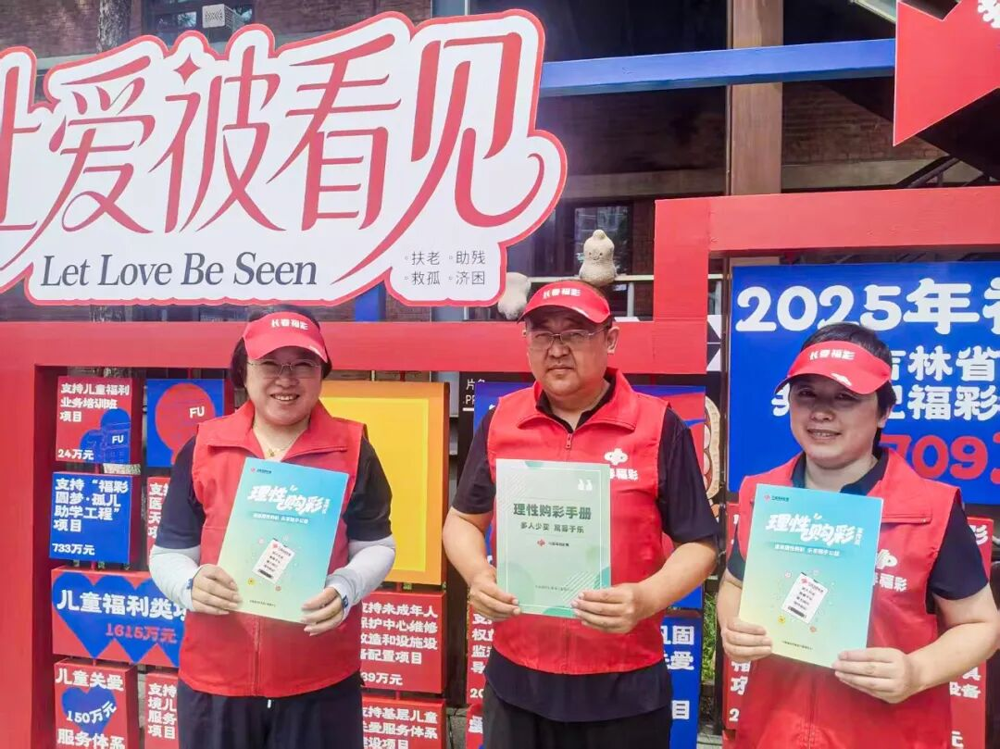
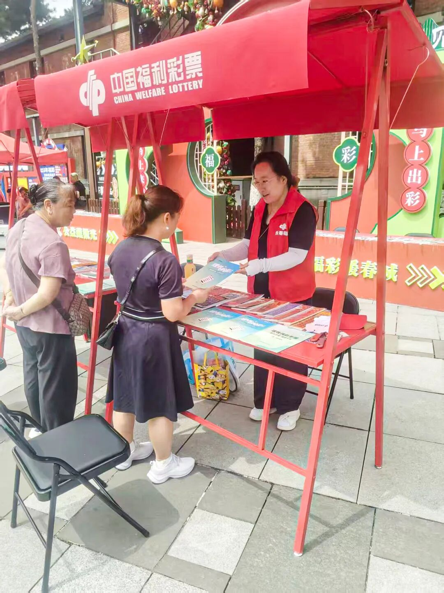
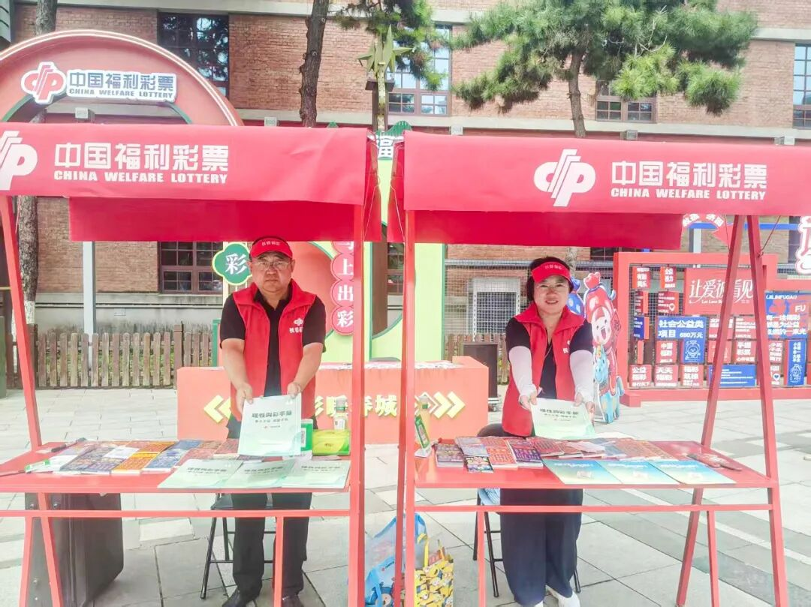
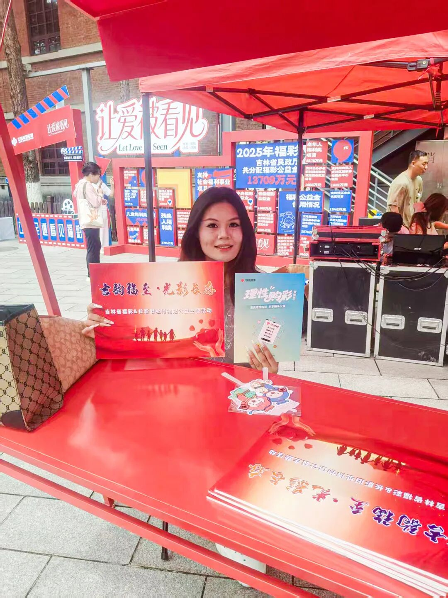
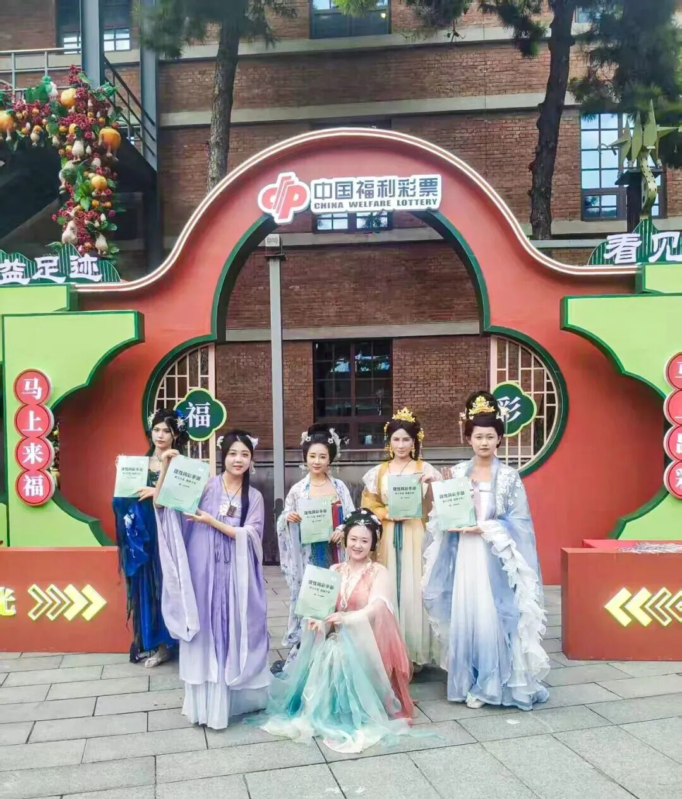
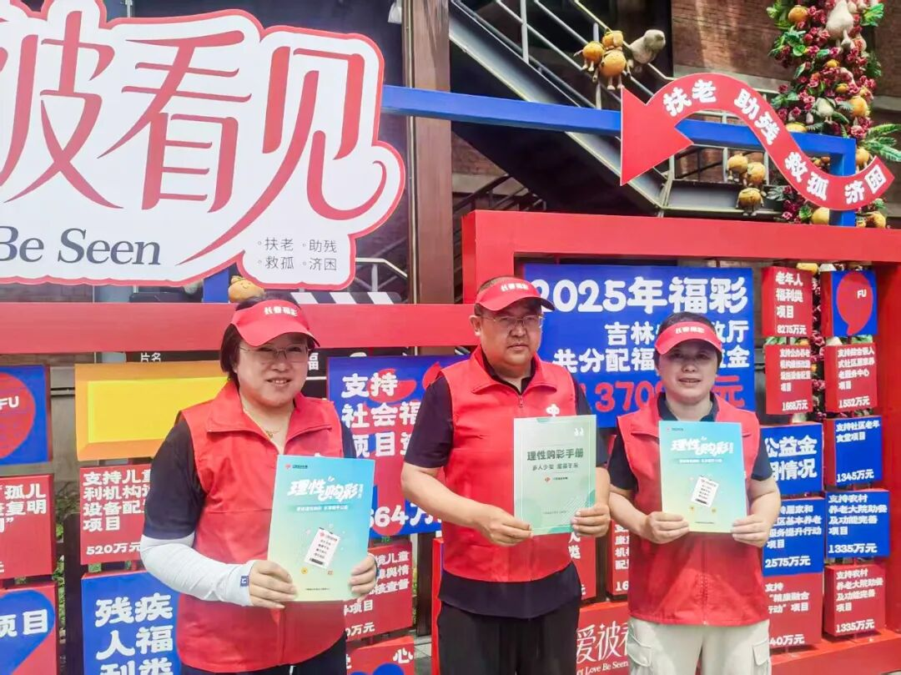

# 长春“公益足迹·看见福彩”责任彩票宣传活动圆满收官
> 公众号: 长春福彩
> 发布时间: 2026年7月30日 16:20
> 原文链接: https://mp.weixin.qq.com/s/C9pfX8gWn_vle98UurN_Ug

---

当“新中国电影摇篮”的厚重光影遇上温暖人心的“福彩红”，一场别开生面的公益之约在长春盛夏的绿荫下正式启幕。7月25日，省市福彩联动，**在****长影旧址博物馆文化街**启动**“公益足迹·看见福彩”责任彩票宣传活动**。

本次活动以**“福彩+文旅+光影”**跨界融合模式，将公益宣传搬进城市文化地标，打造**可看、可玩、可感、可学**的沉浸式体验，让市民在光影氛围中走近福彩、了解福彩。

活动现场人流如织，新中式风格的福彩展区与复古街区相映成趣，甫一亮相便吸引往来游客驻足。**“让爱被看见”“扶老、助残、救孤、济困”**的标语格外醒目，暖红色调与老建筑肌理相融，格外暖心。

10时活动正式启动，长春福彩工作人员在现场既讲述了活动主题、福彩的公益初心与发展历程，更通过一系列互动体验，将公益知识化为市民可触可感的温暖记忆。

**“福彩的使命是什么？”“‘福彩圆梦·孤儿助学工程’属于哪一大类公益项目？”**

**“公益金知多少”****互动问答区**人气火热。市民争先抢答，从福彩使命到公益项目分类，问题话音未落，台下应答声此起彼伏，答对者即可收获一份**精美的礼品**，又在欢声笑语中了解到福彩公益知识。

即开型彩票销售亭前，市民在收获惊喜的同时随手参与了福彩公益；福彩公益心愿墙上，有市民写下对家人的惦念、对生活的期许，攒成一面暖意融融的爱心墙；工作人员同步发放讲解**《理性购彩手册》**，将**“多人少买、寓募于乐、量力而行”**的责任理念，化作温和提醒传递给大家。

**传统服饰巡游****：**身着华服的工作人员沿街区款款而行，衣袂翩跹间与市民互动，随后，琵琶与古筝的悠扬乐声悠然响起，国风雅韵与公益暖意相融，历史建筑与创新宣传相映，引得游客纷纷驻足并拍照留念，成为老街上一道流动的亮丽风景。

**公益金互动翻板区域****：****2025年吉林福彩公益金在社会福利及社会公益事业中落地成效**清晰列明：老年人福利、残疾人福利、儿童福利……一笔笔资金去向透明，一项项成果扎实可感，让**“扶老、助残、救孤、济困”**的福彩发行宗旨变成了看得见的民生实效。

**福彩公益兑换区还设置了联动福利！**凭长影旧址博物馆门票可免费兑换精美小礼品，实现文旅流量与公益传播的双向赋能。

**市民 **赵女士：****

“没想到逛长影旧址博物馆的间隙还能了解到福彩公益知识，这种宣传挺好的，一点也不生硬。之前只模糊知道福彩一直在做公益，今天却清楚地了解了公益金实实在在帮扶了哪些群体，这样的活动有意义又有温度，自己以后也会支持福彩公益。”

这场**“福彩+文旅+光影”**的跨界探索，是长春市福彩中心7月责任彩票宣传月的特色亮点活动，既为长影旧址博物馆这个文旅场景注入了公益内涵，也让福彩借助大规模文旅流量触达更广泛人群，有效延展了福彩的品牌认知度与公益影响力，以沉浸式互动替代单向宣讲，以文化浸润替代刻板说教，让公益理念真正走进大众心间。

未来，长春市福彩中心将持续深耕跨界融合路径，依托我市丰厚的城市文旅资源，搭建更多元、更贴近市民的公益传播阵地，让福彩的公益温度融入城市的光影记忆与街巷烟火。

来源：长春晚报融媒体记者 关丽君 文/图

初审：吴委格

复审：梁爽

终审：臧立